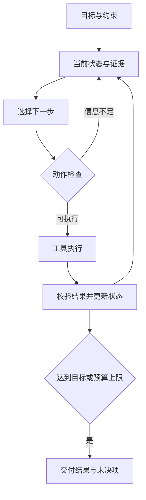

# Python（通用编程语言）—算法—系统—人工智能：整合讲义

版本：2026-09-26 · 56 章 · 从第 0 章开始编号。

先建立能解释的程序，再理解算法、系统资源、学习与行动。英文术语在正文前十次出现附中文解释。配套代码、课程资源和资料处理边界随文提供。

## 总目录

- [00　一个任务如何长出整条计算机科学主线](#chapter-00)
- [01　文件、目录、路径与工作目录](#chapter-01)
- [02　解释器、终端、编辑器与执行过程](#chapter-02)
- [03　包、依赖与虚拟环境](#chapter-03)
- [04　Shell（命令解释器，解析命令并启动程序）、Linux（开源操作系统内核，也常泛指相关操作系统）、远程与版本控制](#chapter-04)
- [05　表达式、语句与代码块](#chapter-05)
- [06　变量、对象、别名与复制](#chapter-06)
- [07　数值、布尔与运算](#chapter-07)
- [08　输入、字符串与输出](#chapter-08)
- [09　分支、循环与不变量的第一步](#chapter-09)
- [10　列表、元组、字典、集合](#chapter-10)
- [11　函数：结果、作用域与调用过程](#chapter-11)
- [12　文件、异常与数据格式](#chapter-12)
- [13　模块、包与程序入口](#chapter-13)
- [14　类、实例与接口](#chapter-14)
- [15　迭代、生成器、闭包与装饰器](#chapter-15)
- [16　标准库：按任务选工具](#chapter-16)
- [17　调试、测试、类型与性能](#chapter-17)
- [18　把题意变成一个可计算的问题](#chapter-18)
- [19　正确性：为什么所有合法输入都成立](#chapter-19)
- [20　时间与空间复杂度](#chapter-20)
- [21　在线评测与调试闭环](#chapter-21)
- [22　枚举、模拟与矩阵](#chapter-22)
- [23　线性结构与哈希](#chapter-23)
- [24　排序与二分：先建立秩序，再排除不可能](#chapter-24)
- [25　前缀和、差分、双指针与单调结构](#chapter-25)
- [26　递归、分治与回溯](#chapter-26)
- [27　树、堆、前缀树与并查集](#chapter-27)
- [28　图：从可达性到最短路](#chapter-28)
- [29　贪心：一次选择为何无需回头](#chapter-29)
- [30　动态规划：保留足够的信息，合并重复的未来](#chapter-30)
- [31　数论与字符串算法](#chapter-31)
- [32　进一步的数据结构与图算法](#chapter-32)
- [33　信息表示：同一串位怎样变成不同的东西](#chapter-33)
- [34　从源代码到执行：每层解决什么问题](#chapter-34)
- [35　内存：地址、局部性和资源生命周期](#chapter-35)
- [36　操作系统与并发：共享机器如何保持有序](#chapter-36)
- [37　网络、数据库与分布式系统](#chapter-37)
- [38　可计算性与复杂性：机器能力的边界](#chapter-38)
- [39　离散数学：结构、计数与证明](#chapter-39)
- [40　线性代数：表示、变换、约束与压缩](#chapter-40)
- [41　微积分与优化：从局部变化到训练规则](#chapter-41)
- [42　概率、统计与信息：从数据到不确定判断](#chapter-42)
- [43　NumPy（数值数组库，提供多维数组与成批数值运算） 与数据处理：把形状当作契约](#chapter-43)
- [44　学习问题：规则不知道，但可以观察结果](#chapter-44)
- [45　评价：什么证据说明学到的规律能用](#chapter-45)
- [46　经典机器学习：不同假设对应不同方法](#chapter-46)
- [47　神经网络：组合可学习的表示](#chapter-47)
- [48　PyTorch（张量计算与自动微分框架，常用于深度学习）：让框架承担机械劳动，保留你的判断](#chapter-48)
- [49　图像、序列、注意力与生成模型](#chapter-49)
- [50　大语言模型：从条件概率到可运行系统](#chapter-50)
- [51　检索增强与智能体：知识来源和行动循环](#chapter-51)
- [52　强化学习：行动改变下一批数据](#chapter-52)
- [53　世界模型：在预测里试行动，再承担预测误差](#chapter-53)
- [54　机器人学习与具身智能：从预测正确到行动可行](#chapter-54)
- [55　从学习者走向研究与工程](#chapter-55)


---

# 从 Python（一种强调可读性的通用编程语言） 到算法、计算机系统与人工智能

> 整合讲义 · 为 Thalya 编写 · 资料核对日期：2026-09-26
>
> 主线：写出能解释的程序，组织足够的信息，推导正确的算法，理解机器的资源限制，再建立能学习、能决策、能与环境交互的系统。

## 阅读约定与范围

本讲义把课程材料重新组织为知识依赖顺序。Python（一种强调可读性的通用编程语言） 与算法是当前学习主线；数学、系统、人工智能各章可在满足前置知识后进入。正文中的程序由浅入深，配套 `labs` 目录提供可直接执行的实验。除特别标注，代码以 Python（一种强调可读性的通用编程语言） 3.11 以上为基线，基础和算法实验只用标准库，数值实验使用 NumPy（数值数组库，提供多维数组与成批数值运算）。

英文专有术语在正文前十次出现时附中文释义。代码标识符、命令、路径、网址保留原样，解释写在代码外，避免破坏可执行性。公式中的符号在就近文字定义。代码中的省略号不代表待实现的核心步骤。

这里的“覆盖”指所列课程核心知识与确认的学习路线。课程行政事项、软件购机清单、整套 C++（支持多种编程范式的系统与应用开发语言） 标准、全部第三方库接口、所有题目的题解不属于正文承诺；附录给出这些材料的去向。商业教材未提供的全文不冒充已读，来源使用程度见附录。正文是独立讲解，不按某一本书逐段改写。

学一个概念时，先预测小例子的结果，再运行，再解释差异。看懂之后关掉代码，写出一个功能相同但输入不同的版本。章节末的思考有明确判断对象，不要求每天打卡。

# 第 0 篇　总地图

<a id="chapter-00"></a>

## 0. 一个任务如何长出整条计算机科学主线

设想你要做一个校园资料检索工具。最初，把三份文档中的词统计出来就够了。文件读写负责取数据，字符串负责切分，字典负责计数。文档变成十万份后，逐篇扫描太慢，需要倒排索引：每个词对应包含它的文档编号。多个用户同时查询时，需要处理请求、持久化数据、管理并发。用户换一种说法也希望找到答案时，可以学习文本的向量表示。用户还希望工具主动查找、比较、核实，才需要加入工具调用和多步控制。

每个阶段都增加了一个可明确描述的困难：表达计算、降低计算代价、可靠地共享资源、从数据学习规律、根据反馈连续行动。不要把最后一步的产品术语当成前面知识的替代品。

| 学习阶段 | 必须能独立完成的事情 | 后续用处 |
|---|---|---|
| 基础编程 | 从空文件写出输入、处理、输出；解释变量怎样变化 | 所有实现的基础 |
| 数据结构与算法 | 证明方案不漏解、不重复，估算时间空间 | 搜索、调度、检索、模型计算 |
| 系统与工程 | 定位错误发生在哪层，保存可复现实验 | 服务器、训练、部署、机器人软件 |
| 数学与学习 | 从目标函数推导更新规则，检查维度和假设 | 模型与优化 |
| 决策与机器人 | 描述观测、隐藏状态、动作、反馈和失败 | 智能体与物理系统 |

三个反复出现的问题会贯穿全书：**当前必须保留什么信息？下一步允许做什么？怎样知道结果可信？** 在程序中它们表现为变量、操作、测试；在算法中表现为状态、转移、证明；在学习系统中表现为表示、策略、评价。结构相似不代表理论完全相同，后文会说明差异。

数学并行推进：离散数学帮助证明和计数；线代帮助表示与变换；微积分帮助优化；概率帮助处理不确定性。Python（一种强调可读性的通用编程语言） 逐步成为实现工具。C/C++（常用于系统软件与高性能程序的两种编程语言） 在内存、系统接口和性能要求出现时引入。

# 第 1 篇　让程序运行起来

<a id="chapter-01"></a>

## 1. 文件、目录、路径与工作目录

文件是有名称的持久数据。目录组织名称。`notes.txt` 是文本，`solve.py` 是存放 Python（一种强调可读性的通用编程语言） 源代码的文本；扩展名提示用途，不能保证内容。把照片改名为 `.py` 不会变成程序。

路径说明怎样找到文件。绝对路径从根位置描述，相对路径从当前工作目录描述。编辑器打开文件所在的目录和程序运行时的工作目录可能不同，这正是“文件明明在旁边却找不到”的常见原因。

```python
from pathlib import Path
print(Path.cwd())
print(Path('data.txt').resolve())
```

`Path.cwd()` 得到当前工作目录；`resolve()` 把相对位置变成绝对位置。若脚本要读自己旁边的文件，可用 `Path(__file__).resolve().parent / 'data.txt'`。交互环境可能没有 `__file__`，此时应明确传入数据路径。

内存存放运行中需要快速访问的数据；磁盘用于较长期保存。`scores = [90, 85]` 尚未把成绩写进文件，结束进程后不能指望变量保留。保存文件也不等于应用程序已经可靠地完成所有写入，见第 36 章。

<a id="chapter-02"></a>

## 2. 解释器、终端、编辑器与执行过程

终端提供文字交互窗口；Shell（命令解释器，解析命令并启动程序） 解释你输入的命令；编辑器修改文件；解释器执行 Python（一种强调可读性的通用编程语言） 程序；IDE（集成开发环境，整合编辑、运行与调试工具） 将编辑、运行、调试等功能放在一起。它们可以分开工作。

把以下内容存为 `hello.py`：

```python
name = input('你的名字：')
print(f'你好，{name}')
```

在该文件所在目录运行 `python hello.py`。Windows（微软的桌面与服务器操作系统系列） 也可能使用 `py hello.py`，macOS（苹果电脑使用的操作系统）/Linux（开源操作系统内核，也常泛指相关操作系统） 通常使用 `python3 hello.py`。先运行 `python --version`，再用以下命令确认真正使用的解释器：

```bash
python -c "import sys; print(sys.executable)"
```

程序首先执行 `input`，等待一行输入并返回字符串；名字绑定给 `name`；随后求出格式化字符串，再交给 `print`。解释器看到文件不是一次性“理解你的意图”，而是按语言规定执行。

交互窗口中的 `>>>` 是提示符，不属于代码。Jupyter（交互式笔记本环境，按单元格执行程序） 的单元格共享一个运行中的解释器：先运行第 7 格再运行第 2 格，会产生屏幕顺序之外的状态。交付前重启内核、从头执行，是检查隐藏依赖的简单办法。

<a id="chapter-03"></a>

## 3. 包、依赖与虚拟环境

假设项目 A 依赖某个库的旧接口，项目 B 需要新版。把所有库安装在同一处，升级可能破坏 A。虚拟环境给不同项目建立各自的包集合；它没有模拟一台新电脑，也不是防恶意代码的安全隔离。

已安装 Python（一种强调可读性的通用编程语言） 时，可以先用标准工具：

```bash
python -m venv .venv
```

| 操作 | macOS（苹果电脑使用的操作系统）/Linux（开源操作系统内核，也常泛指相关操作系统） | Windows（微软的桌面与服务器操作系统系列） PowerShell（微软提供的命令行与脚本环境） |
|---|---|---|
| 激活 | `source .venv/bin/activate` | `.\.venv\Scripts\Activate.ps1` |
| 不激活直接运行 | `.venv/bin/python hello.py` | `.\.venv\Scripts\python.exe hello.py` |
| 安装包 | `python -m pip install numpy` | 同左 |
| 查看包 | `python -m pip show numpy` | 同左 |
| 退出激活 | `deactivate` | 同左 |

使用 `python -m pip` 能减少“给另一个 Python（一种强调可读性的通用编程语言） 装了包”的混淆。激活主要调整命令搜索路径，不是让环境从不存在变为存在；无需为运行脚本降低整个系统的脚本安全设置，直接指定解释器也可。

uv（Python 包、项目与解释器管理工具） 是包与项目管理工具，也能管理 Python（一种强调可读性的通用编程语言） 版本；Conda（环境与包管理工具，也可管理部分非 Python 依赖） 还常用于管理科学计算的非 Python（一种强调可读性的通用编程语言） 依赖。先掌握一种流程。使用 uv（Python 包、项目与解释器管理工具） 的项目可执行：

```bash
uv init my_project
cd my_project
uv add numpy
uv run python -c "import numpy; print(numpy.__version__)"
```

`pyproject.toml` 描述项目与依赖，锁文件记录具体解析结果。把它们纳入版本控制，可以提高复现能力。具体安装方式查 [uv（Python 包、项目与解释器管理工具） 官方项目指南](https://docs.astral.sh/uv/guides/projects/)，不要在讲义里固定一个很快过期的“最新版”。

<a id="chapter-04"></a>

## 4. Shell（命令解释器，解析命令并启动程序）、Linux（开源操作系统内核，也常泛指相关操作系统）、远程与版本控制

命令通常是“程序名 + 参数”。`python solve.py` 中 `python` 是要启动的程序，`solve.py` 是交给它的参数。包含空格的路径要引用，如 `python "my scripts/solve.py"`。

| 目的 | POSIX（类 Unix 系统接口规范，约定常见系统行为） Shell（命令解释器，解析命令并启动程序） 常见命令 | 含义 |
|---|---|---|
| 定位 | `pwd`、`ls`、`cd` | 显示位置、列文件、切换目录 |
| 建立结构 | `mkdir experiment` | 新建目录 |
| 复制移动 | `cp a.py b.py`、`mv old.py new.py` | 复制内容、移动或改名 |
| 查阅 | `cat`、`less`、`head`、`tail` | 不同方式读取文件 |
| 搜索 | `rg 'def ' .`、`rg --files` | 搜文本、列文件 |
| 观察进程 | `ps`、`top` | 找到正在消耗资源的程序 |
| 权限 | `chmod u+x run.sh` | 给属主增加执行权限 |

Linux（开源操作系统内核，也常泛指相关操作系统） 文件的读、写、执行权限分别面向属主、组和其他用户。目录的执行权限表示可穿过目录进行路径查找，不是“运行目录”。`Ctrl+C` 请求前台程序中断，强制终止是后备方案，可能来不及保存结果。

在 bash（常见的 Shell 命令解释器）/zsh（一种可交互使用的 Shell 命令解释器）/cmd（Windows 的传统命令解释器） 中，可用 `python solve.py < input.txt > output.txt` 将文件接到标准输入与标准输出。PowerShell（微软提供的命令行与脚本环境） 不支持相同的 `<` 输入重定向，可用 `Get-Content input.txt | python solve.py`；二进制数据应采用专门的文件接口。`>` 覆盖，`>>` 追加；错误输出与正常输出是两个通道。管道把前一个程序的输出交给后一个程序。

远程连接的基本形式是 `ssh user@host`。公钥可以登记到服务器，私钥保存在本机。虚拟机运行独立的客户操作系统；容器通常共享宿主内核，隔离进程、网络、文件等资源；Python 虚拟环境只处理语言环境。这三种“环境”解决不同层次的问题。交换空间把部分内存页移到磁盘，能缓解部分内存压力，但既不保证永不内存不足，也不等于额外的高速内存。

Git（分布式版本控制工具，保存与比较文件历史） 保存内容版本；GitHub（代码仓库托管与协作平台） 托管仓库并提供协作功能。理解三个区域后再记命令：工作区是正在修改的文件，暂存区是准备提交的版本，提交记录是已保存的历史。

```bash
git init
git status
git add hello.py
git commit -m "Add first program"
git diff
```

`git diff` 比较工作区与暂存区；`git diff --staged` 比较暂存区与上次提交。`main` 是本地分支，`origin/main` 是本地记录的远程分支状态；`fetch` 更新远程记录，`pull` 还会整合到当前分支。冲突意味着同一处有不能自动选择的修改，需要理解双方目的后编辑，不是随便保留一边。

实验：提交一份能运行的程序，再故意引入错误，观察差异并恢复对应行。不要把密钥、大数据集、整个虚拟环境一起提交；`.gitignore` 处理无需跟踪的文件，但无法撤回已经泄露的秘密。

# 第 2 篇　Python 基础

<a id="chapter-05"></a>

## 5. 表达式、语句与代码块

表达式产生一个值，如 `2 + 3`、`len('abc')`。语句执行动作，如赋值、条件判断、返回。`x = 2 + 3` 先计算右边的 5，再让名字 `x` 指向结果。

缩进定义代码块。冒号后通常开始一个块，统一使用四个空格。空行分隔内容，`#` 开始行注释；三引号产生字符串，在函数开头可作为文档字符串，但并非通用“多行注释语法”。

```python
price = 12
count = 3
total = price * count
if total > 30:
    total = total - 5
print(total)  # 31
```

用小表追踪：第一次赋值后 `price=12`；再有 `count=3`；计算得到 `total=36`；条件成立，变为 31。`print` 在条件块外，无论条件是否成立都执行。

命名区分大小写。`sum`、`list` 等不是禁止使用的关键字，但拿它们当普通变量会遮蔽内置函数。`=` 是赋值，`==` 是比较。`a < b < c` 是链式比较，中间表达式只求值一次。

<a id="chapter-06"></a>

## 6. 变量、对象、别名与复制

```python
a = [1, 2]
b = a
b.append(3)
print(a)      # [1, 2, 3]
b = [9]
print(a, b)   # [1, 2, 3] [9]
```

第一次 `b=a` 没有复制列表，两者指向同一对象。`append` 修改该对象。第二次 `b=[9]` 创建另一个列表并重新绑定 `b`，没有改动 `a` 指向的对象。

整数、浮点数、字符串、元组不可原地修改；列表、字典、集合可变。元组的“不可变”指它保存的引用序列不变，元组里引用的列表仍可变化。`==` 比较值，`is` 比较对象身份；判断缺省值常用 `x is None`，不要用 `is` 判断数字相等。

```python
a = [[1], [2]]
b = a.copy()
b[0].append(9)
print(a)             # [[1, 9], [2]]
c = [row[:] for row in a]
c[0].append(8)
print(a)             # [[1, 9], [2]]
```

浅复制只复制最外层容器。逐行复制适用于“行中是不可变值”的二维列表；若行里还有列表，仍可能共享更深对象。`copy.deepcopy` 递归复制可复制的内容，但对文件句柄、外部资源不能想当然。

`[[0]*3]*2` 重复了同一行的引用。正确建立两行独立列表：`[[0]*3 for _ in range(2)]`。它不是神秘语法陷阱，而是前面名称与对象机制的直接结果。

<a id="chapter-07"></a>

## 7. 数值、布尔与运算

| 类型 | 例子 | 要掌握的边界 |
|---|---|---|
| `int` | `3`、`-7`、`10**100` | 任意精度仍受内存限制；大整数运算不是固定代价 |
| `float` | `0.1`、`1e-3` | 有限精度的二进制近似 |
| `bool` | `True`、`False` | 用于真假；也是整数类型的子类 |
| `complex` | `2+3j` | 实部虚部；不支持通常的大小排序 |
| `NoneType` | `None` | 表示缺省或没有结果；不是数字零 |

`/` 普通除法；`//` 向负无穷取整；`%` 求余；`**` 乘方。例：`-7 // 3 == -3`，`-7 % 3 == 2`，仍满足 `a == (a//b)*b + a%b`。`int(-2.9)` 向零截断得到 -2，不等于向下取整。

`0`、空字符串、空容器、`None` 为假，其他常见对象为真。`and`、`or` 会短路，而且返回操作数而非一定返回布尔值：`0 or 5` 为 5，`'ok' and 7` 为 7。`if items and items[0] > 0` 避免空列表索引错误。`not x` 总产生布尔值。

`0.1+0.2` 通常不精确等于 `0.3`。如果问题允许误差，用 `math.isclose` 并根据量纲设相对、绝对容差；接近零时单靠相对容差不足。精确可表示值、离散哨兵值的比较可以使用 `==`，不能机械禁止所有浮点相等判断。金额的精确十进制计算可用 `Decimal('0.1')`，不要先把不精确的浮点数交给它。

位操作面向整数的二进制位：`&` 按位与、`|` 按位或、`^` 按位异或、`~` 按位取反、`<<` 左移、`>>` 右移。Python 的 `~x == -x-1`；模拟固定位宽时要加掩码，如 `x & ((1<<8)-1)`。`n>0 and n&(n-1)==0` 判断正整数是否只有一个二进制 1。

<a id="chapter-08"></a>

## 8. 输入、字符串与输出

```python
line = ' 12  7  '
parts = line.split()
a, b = map(int, parts)
print(a + b)                   # 19
print(f'{a / b:.3f}')           # 1.714
```

步骤不能省略理解：`split()` 得到两个字符串；`map` 建立逐个调用 `int` 的迭代过程；解包取出两个结果。`input()` 返回一行字符串并去掉末尾换行，不会自动转为数字。

字符串索引从 0 开始，`s[-1]` 是最后一个字符。`s[start:stop:step]` 左闭右开，切片越过边界会截断，单个索引越界会报错。`s[::-1]` 反转。字符串不可原地改动，但可通过切片拼接或列表修改后 `join` 得到新字符串。

| 任务 | 表达 | 边界 |
|---|---|---|
| 空白切词 | `s.split()` | 连续空白合并，不保留首尾空项 |
| 指定分隔符 | `'a,,b'.split(',')` | 中间保留空字符串 |
| 连接 | `','.join(['a','b'])` | 元素必须是字符串 |
| 去首尾空白 | `s.strip()` | 不改中间空白；有意义的空格不能随意删除 |
| 找位置 | `s.find('x')` | 未找到为 -1，不能当合法位置继续切片 |
| 判断包含 | `'x' in s` | 得到真假 |
| 替换 | `s.replace('old','new')` | 返回新字符串 |
| 大小写 | `lower`、`upper`、`casefold` | Unicode（统一字符标准，为字符分配码点） 文本不一定一字符变一字符 |
| 前后缀 | `startswith`、`endswith` | 比手写切片更清楚 |

`strip('ab')` 去掉首尾连续出现的字符 a 或 b，不是删除精确的字符串 `ab`。删除精确前缀用 `removeprefix`。

转义 `\n` 是换行，`\t` 是制表符，`\\` 是一个反斜杠。原始字符串 `r'\d+'` 常用于正则表达式。格式化使用 `f'{value:.2f}'` 保留两位小数，`f'{n:04d}'` 用零补到宽度四。格式化不改变原始数值。

`print(*items)` 解包为多个参数；`sep` 控制间隔，`end` 控制结尾。在线评测不要加“请输入数字”一类提示，除非题面要求。

<a id="chapter-09"></a>

## 9. 分支、循环与不变量的第一步

`if/elif/else` 按顺序选第一个成立的分支。多个独立的 `if` 则都可能执行。区间判断先想清端点，例如成绩 `>=90` 是否应包含 90。

`for` 遍历可迭代对象；`while` 在每次进入循环体前重新检查条件。`range(2,8,2)` 产生 2、4、6，不包含 8；步长不能是零。

```python
values = [3, 1, 4]
total = 0
for x in values:
    total += x
print(total)  # 8
```

循环开始前，`total` 是“已处理元素的和”。初始没有处理元素，所以是 0；处理新值时加上它；全部处理后就是整体和。这句始终成立的描述就是循环不变量。

`break` 退出最近一层循环，`continue` 跳过这一轮剩余部分，`pass` 只是什么也不做。循环 `else` 在没有因 `break` 退出时执行：

```python
n = 17
for d in range(2, int(n**0.5) + 1):
    if n % d == 0:
        print('合数')
        break
else:
    print('没有找到因子')
```

此例限定 `n>=2` 且数值规模适合浮点开方；通用整数判素数见第 31 章，使用 `isqrt`。不要把某个例子的前提丢掉后推广。

遍历列表时删除元素会使位置移动。优先构造新列表，或明确从后向前删除。循环终止性也需要理由：`while n>0: n//=10` 中 n 严格下降并有下界；缺少状态更新的 `while` 不会因你“想让它结束”而结束。

Hangover 小实验：不断累加 `1/2,1/3,1/4...`，记录首次超过目标的项数。先说明“计数记录的是纸牌数还是分母”，再写代码，这能避免差一错误。

<a id="chapter-10"></a>

## 10. 列表、元组、字典、集合

列表保存有序元素；元组表达固定组合；字典由键查值；集合处理去重与成员关系。选择依据是操作，不是哪个语法更熟悉。

```python
scores = [84, 91, 84]
scores.append(88)
last = scores.pop()
pair = ('Thalya', 91)
counts = {}
for score in scores:
    counts[score] = counts.get(score, 0) + 1
unique = set(scores)
print(counts, unique)  # 字典 {84: 2, 91: 1}；集合显示顺序不保证
```

列表的 `append` 添加一个对象，`extend` 逐个添加对象中的元素。`remove(x)` 删除第一个相等值，`pop(i)` 按位置删除并返回值。`sort()` 原地排序且返回 `None`；`sorted(x)` 返回新列表。常见错误 `a=a.sort()` 会让 a 变成 `None`。

字典键必须可哈希：其哈希值在生存期稳定，相等对象必须有相同哈希值。包含可变列表的元组也不能当普通字典键。字典保留插入顺序，但并不自动按键排序。`d[k]` 缺失时报错；`d.get(k,default)` 不插入；`setdefault` 在缺失时插入；`items()` 同时遍历键值。

集合交、并、差、对称差分别为 `a & b`、`a | b`、`a - b`、`a ^ b`。空集合是 `set()`，`{}` 是空字典。集合不承诺下标访问和排序。

```python
squares = [x*x for x in range(6) if x % 2 == 0]
index = {word: i for i, word in enumerate(['tree', 'graph'])}
pairs = list(zip([1, 2], ['a', 'b']))
```

推导式先决定遍历，再筛选，再计算元素。`zip` 默认按较短输入停止；要求长度相同可使用 `strict=True`。多层推导式按从左到右的循环嵌套理解，复杂时拆开更容易检查。

<a id="chapter-11"></a>

## 11. 函数：结果、作用域与调用过程

```python
def discount(price, rate=0.9):
    result = price * rate
    return result

paid = discount(100)
print(paid)  # 90.0
```

`def` 执行时创建函数对象，函数体等调用时才执行。调用先求实参，再为形参建立局部绑定，运行函数体，遇到 `return` 结束本次调用并交回值。没有写 `return` 的函数返回 `None`。

`print` 把内容写向输出设备，`return` 把对象交回调用者。一个打印面积的函数不能直接参与加法；返回面积的函数可以被打印、比较、保存或者用于后续计算。先确定函数的输入输出契约，再决定是否打印。

```python
def change(items):
    items.append(7)
    items = [99]

original = [1]
change(original)
print(original)  # [1, 7]
```

传参遵循同一种对象共享机制，不是“整数用一种传法、列表用另一种传法”。局部形参最初指向实参对象；修改该对象可被外部观察；局部重新绑定不改变外部名字。

默认参数在定义函数时求值。因此用 `None` 表示“每次新建”：

```python
def collect(value, bag=None):
    if bag is None:
        bag = []
    bag.append(value)
    return bag
```

参数形式：`f(a, /, b=0, *, c=1)` 中 a 只能按位置传，c 只能按关键字传；`*args` 收集额外位置参数为元组，`**kwargs` 收集额外关键字参数为字典。调用处的 `*seq`、`**mapping` 则展开参数。

作用域查找通常按局部、外层函数、模块全局、内置进行。函数里对名字赋值通常把它判为局部；因此“先读全局 x，再在同一函数赋值 x”可能产生 `UnboundLocalError`。`global` 修改模块绑定，`nonlocal` 修改外层函数绑定。优先用参数和返回值表达依赖，减少隐含共享状态。

返回多个值实际上通常返回一个元组；`a,b=f()` 是解包。递归函数每次调用都有自己的局部状态，详细执行与正确性见第 26 章。

<a id="chapter-12"></a>

## 12. 文件、异常与数据格式

```python
from pathlib import Path
path = Path('example.txt')
with path.open('w', encoding='utf-8') as f:
    f.write('graph tree\ngraph\n')
with path.open(encoding='utf-8') as f:
    for line in f:
        print(line.rstrip('\n'))
```

`r` 读取，`w` 截断后写入，`a` 追加，`x` 仅在不存在时创建，`b` 表示字节模式。`with` 保证退出块时按协议清理资源，包括抛异常的情况。文本解码把字节变成字符，编码反向进行。

读大文件优先逐行处理，`read()` 一次读完会占内存。`readline()` 遇文件尾返回空字符串，空白行则通常是 `'\n'`，二者不同。`input()` 在文件尾抛 `EOFError`。

```python
def parse_count(text):
    try:
        n = int(text)
    except ValueError as exc:
        raise ValueError('数量必须是整数') from exc
    if n < 0:
        raise ValueError('数量不能为负')
    return n
```

只捕获你能处理的异常。`except Exception: pass` 会让真实故障消失。`else` 在 try 块未抛异常时执行；`finally` 用于清理，但其中的 `return` 会遮蔽原来的返回或异常，应避免。

CSV（逗号分隔的表格文本格式，字段可带引号） 不能简单按逗号切，因为带引号的字段可包含逗号；使用 `csv`。JSON（常用的数据交换格式，可表示对象、数组与基本值） 表示跨程序交换的数据，用 `json.loads` 解析，`json.dumps` 序列化。XML（使用标签表达层级数据的标记语言） 表达有层级的标记结构；TOML（一种适合项目配置的文本格式）/YAML（一种常用于配置和数据序列化的文本格式） 常用于配置，使用对应解析器。二进制对象序列化格式如 `pickle` 不应加载不可信输入，因为反序列化可能执行代码。

`eval` 执行 Python 表达式，不是普通数字解析器；用户输入数字用 `int/float`，字面量结构可按需求使用 `ast.literal_eval`，也要约束输入大小。解析格式、执行代码、校验业务规则是三件不同的事。

# 第 3 篇　Python 进阶与可靠编程

<a id="chapter-13"></a>

## 13. 模块、包与程序入口

把函数写进 `algorithms.py`，在另一个文件用 `from algorithms import lower_bound`。模块首次导入会执行其顶层语句，通常缓存于当前解释器；因此顶层不应无条件启动耗时训练或读取交互输入。

```python
def main():
    print('程序入口')

if __name__ == '__main__':
    main()
```

直接执行文件时 `__name__` 为 `'__main__'`；被导入时为模块名。这让同一文件能作为脚本或被复用。不要把自己的文件命名为 `random.py`、`json.py`，否则可能遮蔽标准库。

包把相关模块分组。相对导入依赖包上下文，需要时使用 `python -m package.module`。导入失败先检查解释器、当前目录、文件命名和依赖是否安装，不要一上来改系统路径。

项目至少区分源代码、测试、输入数据、实验输出和配置。关键参数写进配置或命令行，固定随机种子，记录依赖版本和代码提交，这使“我这里能跑”变成可复现的描述。

<a id="chapter-14"></a>

## 14. 类、实例与接口

如果只处理一个函数的输入输出，普通函数足够。当多次操作需要共同维护状态时，类把状态与操作组织在一起。

```python
class RunningMean:
    def __init__(self):
        self.total = 0.0
        self.count = 0

    def add(self, x):
        self.total += x
        self.count += 1

    @property
    def value(self):
        if self.count == 0:
            raise ValueError('还没有数据')
        return self.total / self.count

m = RunningMean()
m.add(2)
m.add(4)
print(m.value)  # 3.0
```

`self` 是本次操作的实例。`m.add(2)` 将 m 交给方法。实例属性各自保存，类属性由类及实例查找共享；不要把每个实例应独有的列表写成可变类属性。

继承表达“可以作为父类使用”，不是为了少写几行就继承。组合表达“内部持有另一个对象”，通常更容易保持边界。例如检索器持有索引，智能体持有检索器，未必需要层层继承。

`__len__` 支持 `len(x)`，`__iter__` 支持遍历，`__repr__` 提供开发者可读表示。属性查找和方法调用通过协议协作，因此文件、列表、自定义对象可以都被 `for` 使用。`dataclass` 适合数据记录，会生成常用初始化与比较等方法，但不会自动保证业务不变量。

<a id="chapter-15"></a>

## 15. 迭代、生成器、闭包与装饰器

可迭代对象能产生迭代器；迭代器保存当前位置，`next` 每次取一个，结束抛 `StopIteration`。列表可反复重新遍历；一个已耗尽的迭代器不会自动重来。

```python
def running_totals(values):
    total = 0
    for x in values:
        total += x
        yield total

it = running_totals([2, 3, 5])
print(next(it))  # 2
print(list(it))  # [5, 10]
print(list(it))  # []
```

`yield` 暂停函数并保存状态，下次继续；`return` 结束。生成器适合流式处理，但若下一步又转成列表，整体仍可能占大量内存。

函数是对象，可以放入容器、作为参数或结果。`lambda x:x[1]` 表达短小函数，不意味着执行更快。闭包让返回的函数保留外层绑定；循环创建闭包可能都看到最后一个循环变量，需要用参数固定值或建立独立作用域。

```python
from functools import wraps

def announce(func):
    @wraps(func)
    def wrapped(*args, **kwargs):
        print('开始调用')
        return func(*args, **kwargs)
    return wrapped

@announce
def add(a, b):
    return a + b
```

装饰器语法大致等价于 `add=announce(add)`。缓存、计时、权限检查都可在函数周围增加行为。缓存要求输入能识别、结果适合复用；缓存读取时间、随机数或外部可变文件，可能产生错误。

上下文管理器通过进入与退出协议处理资源。它与生成器、装饰器可以组合，但初学阶段先学清“由谁保证退出时清理”，无需把语法技巧堆在一起。

<a id="chapter-16"></a>

## 16. 标准库：按任务选工具

| 任务 | 工具 | 使用判断 |
|---|---|---|
| 数学 | `math.isqrt/gcd/lcm/isclose`、`statistics` | 精确整数开方与近似浮点比较分开 |
| 计数分组 | `Counter`、`defaultdict` | 不必每次手写缺失键判断 |
| 队列 | `deque` | 两端操作快，中间索引不是常数时间 |
| 优先级 | `heapq` | 反复取最小；详见第 27 章 |
| 有序边界 | `bisect_left/right` | 查找快不代表插入快 |
| 组合遍历 | `itertools.product/permutations/combinations` | 惰性产生不等于输出总量小 |
| 函数缓存 | `functools.cache/lru_cache` | 状态可哈希，注意缓存规模 |
| 系统与路径 | `sys`、`pathlib`、`os` | 区分解释器、进程环境和文件 |
| 时间 | `datetime`、`time.perf_counter` | 日历时间与测量耗时分开 |
| 文本匹配 | `re` | 匹配结构化模式，不代替所有解析器 |
| 日志与命令行 | `logging`、`argparse` | 程序运行证据与可配置入口 |
| 子进程 | `subprocess.run` | 优先传参数列表；不把任意用户文本拼进 Shell（命令解释器，解析命令并启动程序） |

正则例：`re.findall(r'\b[A-Za-z]+\b', text.lower())` 提取一组简单英文词；它不适用于通用中文分词，也会把缩写和所有格拆开。先明确文本规则，再选工具。

`random.Random(seed)` 用于可重复实验；密码学随机用途选 `secrets`。安全哈希与字典的 `hash()` 也不是同一工具：前者用于完整性等任务，后者服务运行中的哈希表。

<a id="chapter-17"></a>

## 17. 调试、测试、类型与性能

错误有三种不同层次：语法不合法、执行遇异常、执行完成但结果不满足问题。先读异常类型，再沿调用链找自己代码的相关行。把失败输入缩成最小实例；每次只检验一个解释。

测试应覆盖正常、空、最小、重复、极端、非法输入。随机对拍把优化算法和可信的小规模穷举比较，可以发现遗漏，但不能代替数学证明。样例通过只排除这些样例上的错误。

类型注解如 `def square(x: int) -> int:` 帮助阅读和静态检查，不会默认在运行时阻止传字符串。`assert` 适合内部不变量，不能作为不可信输入的唯一校验，因为优化运行可能关闭断言。

测性能用 `perf_counter` 或 `timeit`，多次测量，说明数据规模、解释器和硬件。`sys.getsizeof` 常只给对象自身的浅大小，不会自动加上其引用的全部对象。先改善复杂度，再测真正瓶颈，不能承诺某写法“永远快十倍”。

阶段实验：写一个词频统计程序，输入路径可配置，明确分词规则，输出按频次降序、同频按词序排列。用空文件、重复词、大小写、标点各测一次。配套 `lab01_foundations.py` 展示可预测的状态变化和文件处理，不需要网络。

### 17.1 其余语法怎样归入已经理解的机制

赋值解包允许 `first,*middle,last=values`，星号收集中间元素；右边数量不符合要求会报错。赋值表达式 `:=` 在表达式中保存结果，适合避免重复计算，但复杂条件应拆开。条件表达式 `a if condition else b` 只计算被选中的一边。

结构化模式匹配 `match/case` 自 Python 3.10 起提供，它按结构分解数据，不只是另一种字符串比较。裸名字通常是捕获变量，想匹配常量要使用字面量或限定名称。

```python
def describe(command):
    match command:
        case ['move', int(dx), int(dy)]:
            return dx, dy
        case ['stop']:
            return 0, 0
        case _:
            raise ValueError('不支持的命令结构')
```

`del a[i]` 删除容器元素，`del name` 删除名字绑定，不保证对象立即消失。`in` 的代价由容器决定，列表通常线性扫描，集合通常用哈希；同一运算符语法不意味着同一复杂度。

实例方法接收实例，类方法通过 `@classmethod` 接收类，常用于其他构造入口；静态方法通过 `@staticmethod` 不自动接收实例或类，只是放在类命名空间里的函数。`super()` 按方法解析顺序继续查找，不应简单理解成“固定找直接父类”。属性访问可通过描述符协议定制，`property` 就是常见实例；元类和复杂多继承先作为语言机制索引，实际需要时再深入，避免用技巧增加维护成本。

异步函数由 `async def` 定义，调用通常先产生协程对象，需交给事件循环执行。`await` 在可等待对象完成前让出执行权；同步耗时计算不会自动变成后台任务。异步迭代和异步上下文管理分别对应 `async for`、`async with`，系统语义见第 36 章。

海龟绘图可以作为循环、函数与坐标的可视实验。正 n 边形每次前进后转 `360/n` 度；递归画树时，返回分支后必须恢复位置和朝向，这与回溯恢复状态是同一个程序要求。图形库需要桌面图形环境，服务器上不能把窗口无法打开误判为算法错误。


---

# 第 4 篇　从程序走向算法

<a id="chapter-18"></a>

## 18. 把题意变成一个可计算的问题

算法的第一步是确定对象、合法操作、约束与目标。比如“安排尽可能多的会议”：每个会议有开始与结束时间，一间会议室不能同时容纳重叠会议，目标是数量最大。若目标改成收益最大，原来的选择策略可能失效。程序再漂亮，也不能修复一个建错的问题。

输入规模与数据分布同样属于问题。十个会议可以枚举子集，一百万个会议不行；区间端点是否允许相接决定比较使用 `<` 还是 `<=`。先写一份契约：输入是什么，输出是什么，哪些输入不在讨论范围，最小规模怎么处理。

建模四步可以用于实际项目：把文件检索变成“词到文档集合”的映射；把地铁变成有权图；把预算分配变成资源约束优化；把机器人当前位置变成带不确定性的状态估计。简化需要保留影响目标的因素，不能为了套算法删除关键条件。

<a id="chapter-19"></a>

## 19. 正确性：为什么所有合法输入都成立

测试检查具体输入，证明解释一类输入。常见证明方式是循环不变量、数学归纳、交换论证、反证和穷尽分类。

求列表最大值时，维护“已经读过的元素中的最大值”。初始取首元素，读到新元素时取两者较大值，循环结束就覆盖全部元素。初始设为 0 会在全负数时破坏不变量。空输入没有最大值，应拒绝或定义专门结果。

二分搜索不仅需要找到目标，还需要证明每轮排除的区域确实不可能包含答案。递归不仅需要问题变小，还要说明子问题结果怎样组成父问题结果。贪心不仅需要直觉合理，还要证明某个最优解可以采用这一步选择。

一个可检查的完整论证包含：初始成立、每步保持、终止后推出结论，以及算法确实终止。后面每个核心算法都围绕自己的不变量展开，不把“套模板”当成证明。

<a id="chapter-20"></a>

## 20. 时间与空间复杂度

设输入规模为 n。复杂度描述规模增长时资源如何增长，忽略固定机器常数；实际运行仍受常数、缓存、解释器与数据影响。

| 增长 | n=1000 时的量级示意 | 常见来源 |
|---|---:|---|
| O(1) | 1 | 固定次数数组索引 |
| O(log n) | 约 10 | 每步区间减半 |
| O(n) | 1000 | 单次扫描 |
| O(n log n) | 约 10000 | 比较排序 |
| O(n²) | 1000000 | 枚举所有数对 |
| O(2ⁿ) | 无法直接穷举 | 枚举子集 |
| O(n!) | 更快爆炸 | 枚举排列 |

大 O 是渐近上界，不自动等于精确增长率；Θ 表示上下界同阶，Ω 表示下界。最坏、平均、期望、均摊是不同的分析条件。列表尾部添加通常均摊 O(1)，扩容的某一次可能 O(n)；哈希表查询通常期望 O(1)，碰撞严重时不能保证。

两层循环不必是 O(n²)：若内层总共只前进 n 次，总成本仍是 O(n)。反之，写成一行的 `sum(a[l:r])` 包含切片和求和，成本随区间长度增长。长度 n 的排列即使使用惰性迭代器，产生全部排列仍需至少与输出总量相当的时间。

递归复杂度要数“节点数 × 每节点工作”。归并排序满足 T(n)=2T(n/2)+O(n)，共有 O(log n) 层，每层 O(n)，合为 O(n log n)。斐波那契直接递归反复求相同子问题，调用树近似指数增长。

空间包含数据、辅助结构和调用栈。百万个 Python 整数的列表远不止百万个机器整数的字节数，因为列表保存引用、整数本身也是对象。不要只用题面 n 猜内存，必要时实际测量。大整数乘法、字符串比较的成本还取决于位数或长度。

<a id="chapter-21"></a>

## 21. 在线评测与调试闭环

在线评测先执行程序，再比较输出，并限制时间与内存。错误答案、运行错误、超时、超内存对应不同调查方向。样例只帮助理解格式，不是充分测试。

```python
import sys

def solve(text):
    nums = list(map(int, text.split()))
    if not nums:
        return ''
    n = nums[0]
    if len(nums) != n + 1:
        raise ValueError('输入数量与 n 不一致')
    return str(sum(nums[1:]))

if __name__ == '__main__':
    print(solve(sys.stdin.read()))
```

这只是“首项给数量，后面给整数”的一种格式，不能套给逐行有语义的题目。文件很大时应流式读取。批量拼接输出能降低频繁输出的开销，但也要控制内存。

失败后依次问：读错了吗？建模错了吗？不变量错了吗？实现偏离证明了吗？还是资源不够？构造最小反例，例如把十万项缩成两项仍能触发问题。随机对拍应保存种子与失败输入，否则错误难以重现。

<a id="chapter-22"></a>

## 22. 枚举、模拟与矩阵

枚举必须回答范围是否完整、同一解会不会重复、每个候选怎么验证。两数之和可以枚举所有 i<j，O(n²)；也可以扫描时记录已见数字，查询 target-x，期望 O(n)。先查后插保证不能把当前元素用两次。

模拟则忠实维护过程状态。矩阵旋转的核心是坐标映射：原 n×m 矩阵的 `(r,c)` 顺时针转到 `(c,n-1-r)`，输出大小 m×n。检查四个角比盯着复杂例子更有效。

```python
def rotate_clockwise(a):
    if not a:
        return []
    n, m = len(a), len(a[0])
    if any(len(row) != m for row in a):
        raise ValueError('矩阵每行长度必须相同')
    out = [[0] * n for _ in range(m)]
    for r in range(n):
        for c in range(m):
            out[c][n - 1 - r] = a[r][c]
    return out
```

网格遍历把位置与移动方向分开。先产生邻居 `(r+dr,c+dc)`，再检查边界与障碍。蛇形填数、螺旋矩阵、棋盘攻击范围都可用“坐标、方向、终止条件”建模，不能靠越来越多的特殊分支补洞。

# 第 5 篇　组织数据与控制搜索

<a id="chapter-23"></a>

## 23. 线性结构与哈希

连续数组按下标直接定位，适合随机访问。链表用节点连接，已知节点后的插入可为 O(1)，但找到位置通常 O(n)，并有指针与缓存代价。Python 的 `list` 是动态引用数组，不是链表；`deque` 适合两端操作。

栈后进先出，用来保存尚未完成的工作：括号匹配、表达式求值、深度优先搜索。队列先进先出，用来按到达顺序处理：任务缓冲、广度优先搜索。

```python
def brackets_ok(text):
    stack = []
    closing = {')': '(', ']': '[', '}': '{'}
    for ch in text:
        if ch in '([{':
            stack.append(ch)
        elif ch in closing:
            if not stack or stack.pop() != closing[ch]:
                return False
    return not stack
```

栈中始终是尚未匹配的左括号，栈顶是最近那个。只比较左右括号数量无法区分 `([)]`。扫描 O(n)，最坏辅助空间 O(n)。

哈希表先用哈希函数把键映射到候选位置，再用相等比较处理碰撞。因此哈希相同不代表键相同。用于计数、去重、缓存、反向索引时要明确键的语义。把用户姓名当唯一键会合并同名者，属于建模错误。

后缀表达式求值遇数字压栈，遇运算符取出右操作数 b，再取左操作数 a，计算 a op b 后压回。`{'/': a/b, '+': a+b}[op]` 会先计算两个值，即便 op 是加号也可能除零；应使用条件分支或存放函数。减法、除法尤其能检验取数顺序。

<a id="chapter-24"></a>

## 24. 排序与二分：先建立秩序，再排除不可能

选择排序反复选择最小值，O(n²)，普通交换版本不稳定。插入排序维护有序前缀，把新元素插入合适位置，最坏 O(n²)，接近有序时可很快。归并排序递归排序左右部分再合并，O(n log n)，额外空间通常 O(n)。快速排序按基准划分，平均 O(n log n)，糟糕划分可达 O(n²)。堆排序最坏 O(n log n)，通常不稳定。

稳定意味着相等排序键的记录维持原相对顺序。Python 排序稳定，`key` 描述比较依据，如 `sorted(records,key=lambda x:(-x.score,x.name))`。比较排序的 Ω(n log n) 下界来自区分 n! 种次序所需的决策信息；计数排序利用有限整数值域，已经改变模型，因此不违反下界。

```python
def lower_bound(a, target):
    lo, hi = 0, len(a)
    while lo < hi:
        mid = (lo + hi) // 2
        if a[mid] < target:
            lo = mid + 1
        else:
            hi = mid
    return lo
```

前提：a 非降序。始终有 `[0,lo)` 小于 target，`[hi,n)` 大于等于 target，答案在 `[lo,hi]`。当中点小于目标，它及左侧不能是第一个合格位置；否则中点可能就是答案，不能跳过。区间严格缩短，终止时 lo=hi。空数组、全部小于目标、重复目标都被同一逻辑处理。

上界搜索找第一个严格大于目标的位置，把条件改为 `a[mid] <= target`。查找 O(log n)，往列表中间插入仍需 O(n)。

二分答案需要单调可行性。例如把非负工作量依序分给最多 k 人，给定最大负载 C，贪心从左往右装到不能再装才换人，可判断是否不超过 k 组。C 增大只会更容易可行，于是在 `[max(a),sum(a)]` 搜最小可行值。若工作量允许负数，原检查与单调分组直觉须重审。整数二分可精确终止，实数二分应按误差或迭代次数终止。

<a id="chapter-25"></a>

## 25. 前缀和、差分、双指针与单调结构

前缀和把“重复求区间总和”变成“两次累计之差”。定义 p[0]=0，p[i+1]=p[i]+a[i]，半开区间 `[l,r)` 的和为 p[r]-p[l]。预处理 O(n)，每次查询 O(1)。二维前缀和用包含排除：右下大矩形减两条外侧，再加回被减两次的角落。

差分反向解决“多次区间增加，最后统一查看”：d[l]+=v，d[r]-=v，最后前缀累加恢复数组。适用于批量更新；要求更新后立刻查询区间和时，应考虑第 32 章的树状数组或线段树。

滑动窗口维护连续区间与其性质。对于非负数组，求和至少为 S 的最短子数组：右端加入使和不减，满足条件后尽量移左端。若有负数，扩张与收缩不再有这一单调性。例如 `[1,-1,5]` 会让朴素做法在和不足时停止缩左，漏掉长度一的 `[5]`。

双指针本质是两个位置借助顺序约束消除搜索。已排序两数和从两端出发：和小就增左，和大就减右。去重、合并有序序列、快慢指针检测链表环也使用两个指针，但正确性理由不同。

单调栈保存尚未找到答案的候选。例如找右侧第一个更大值：

```python
def next_greater(a):
    answer = [-1] * len(a)
    stack = []
    for i, x in enumerate(a):
        while stack and a[stack[-1]] < x:
            answer[stack.pop()] = i
        stack.append(i)
    return answer
```

栈内值非增。被 x 弹出的 j 在此前没有遇到更大值，现在首次遇到，答案确定。每个下标入栈一次出栈至多一次，所以嵌套循环总 O(n)。寻找“大于等于”时比较条件要调整，重复值是关键反例。

单调队列用于窗口最大值：队首淘汰过期下标，队尾淘汰不优于新值的候选，队首就是当前最大值。淘汰队尾的理由是新值至少同样大、并且更晚过期；这个“以后永远不会更优”的证明比记代码重要。

<a id="chapter-26"></a>

## 26. 递归、分治与回溯

递归把当前问题交给更小的同类问题。每次调用有自己的参数和局部变量。定义必须有可达的基例，以及严格推进到基例的量。归并排序按规模减半；树遍历按子树；不能只写“最后总会结束”。

分治由独立子问题求解后合并。归并的两部分各自有序，比较两边最小未输出元素，每次输出整体最小者。若大量子问题重叠，分治可能浪费，应考虑记忆化。

回溯在选择树上试探：作出选择、探索后续、撤销选择。它不是遇错才“倒退”的补丁，而是系统枚举分支的方法。

```python
def subsets(a):
    out, path = [], []
    def dfs(i):
        if i == len(a):
            out.append(path.copy())
            return
        dfs(i + 1)
        path.append(a[i])
        dfs(i + 1)
        path.pop()
    dfs(0)
    return out
```

每个位置有选与不选两种分支，一条根到叶路径唯一对应一个下标子集，因此不漏不重。保存 `path` 本身会共享同一个可变列表，必须复制。输出需要 Θ(n2ⁿ) 级别的总存储，不能说“递归栈只有 n，所以空间 O(n)”而忽略结果。

排列去重先排序，在同一层跳过相同未使用值；组合去重与排列去重的规则不能混用。N 皇后维护列、两种对角线集合，把“每次检查全棋盘”降为集合查询。剪枝只应丢弃能证明没有合法解或不可能优于当前解的分支。若上界估计偏低，分支限界会剪掉真正最优解。

Python 不保证尾递归优化。深链图应用显式栈，不应仅把递归深度限制调到极高。递归与迭代可以表达相同的遍历，但显式栈仍需保存未完成的工作。

<a id="chapter-27"></a>

## 27. 树、堆、前缀树与并查集

树是连通无环的无向图；有根树还指定父子方向。二叉树最多两个孩子，不等于二叉搜索树。搜索树要求左侧键小、右侧键大（重复规则另定）；任意插入可能退化为链，不能保证查询 O(log n)。平衡树通过维护高度或颜色条件避免退化。

前序先根，中序左根右，后序左右根，层序按深度。表达式树后序天然适合求值：先求子表达式再应用运算符。树的递归定义让归纳证明与程序结构吻合。

堆只保证父节点不大于孩子，不保证整体有序。数组下标 i 的孩子为 2i+1、2i+2。插入沿祖先调整，删除根后把末元素移到根并向下调整，均 O(log n)；自底向上建堆 O(n)，因为大部分节点离叶子很近。

```python
import heapq

def largest_k(values, k):
    if k <= 0:
        return []
    heap = []
    for x in values:
        if len(heap) < k:
            heapq.heappush(heap, x)
        elif x > heap[0]:
            heapq.heapreplace(heap, x)
    return sorted(heap, reverse=True)
```

小顶堆保存目前最大的 k 个，堆顶是其中最容易被淘汰的。时间 O(n log k)，空间 O(k)。优先队列中若优先级相同而任务对象不能比较，可加入递增序号作为第二排序键。

前缀树按字符走边，共同前缀共享路径。查询单词或前缀用 O(L) 次边查找，L 是字符串长度；必须额外记录“此处是完整单词”，否则无法区分 `app` 与 `apple`。稀疏字典节点较灵活，密集字符数组可能更快但更耗空间。中文词、大小写和 Unicode（统一字符标准，为字符分配码点） 规范化应在建索引前统一规则。

并查集维护元素所属连通分量，不维护具体路径。

```python
class DSU:
    def __init__(self, n):
        self.parent = list(range(n))
        self.size = [1] * n

    def find(self, x):
        while x != self.parent[x]:
            self.parent[x] = self.parent[self.parent[x]]
            x = self.parent[x]
        return x

    def union(self, a, b):
        a, b = self.find(a), self.find(b)
        if a == b:
            return False
        if self.size[a] < self.size[b]:
            a, b = b, a
        self.parent[b] = a
        self.size[a] += self.size[b]
        return True
```

代表元相同当且仅当已知连接关系能连通。按大小合并与路径压缩共同使一系列操作均摊接近常数，严格界涉及反阿克曼函数。适合动态加边连通性、等价类、最小生成树；普通版本不能高效支持删边，也不能回答两点最短路径。

<a id="chapter-28"></a>

## 28. 图：从可达性到最短路

先分清有向/无向、有权/无权、是否允许重复边、自环与负权。邻接表空间 O(V+E)，邻接矩阵 O(V²) 但查某条边直接。状态搜索中图可以隐式存在：网格位置或棋盘配置就是节点，合法动作产生边。

广度优先搜索按距离层次扩展。无权或每条边代价相同，第一次发现节点时已找到最短步数。

```python
from collections import deque

def bfs_path(graph, start, goal):
    parent = {start: None}
    q = deque([start])
    while q:
        u = q.popleft()
        if u == goal:
            path = []
            while u is not None:
                path.append(u)
                u = parent[u]
            return path[::-1]
        for v in graph.get(u, []):
            if v not in parent:
                parent[v] = u
                q.append(v)
    return None
```

入队时标记，避免同一节点被重复加入。深度优先搜索先沿分支深入，适合连通分量、回溯与遍历顺序，但首次抵达不保证最短路。若状态是“位置+剩余穿墙次数”，只记录位置访问过会错误合并能力不同的状态。

带非负权的最短路用 Dijkstra（迪杰斯特拉算法，求非负边权图中的最短路）：维护暂定距离，每次取最小者，其距离可以确定。因为尚未走过的边都非负，绕经更远未确定节点不能带来更短路径。

```python
import heapq
from math import inf

def dijkstra(graph, source):
    dist = [inf] * len(graph)
    dist[source] = 0
    heap = [(0, source)]
    while heap:
        du, u = heapq.heappop(heap)
        if du != dist[u]:
            continue
        for v, w in graph[u]:
            if w < 0:
                raise ValueError('Dijkstra 要求非负边权')
            nd = du + w
            if nd < dist[v]:
                dist[v] = nd
                heapq.heappush(heap, (nd, v))
    return dist
```

旧堆条目不删除而在弹出时跳过，常见复杂度 O((V+E)log V)（简单图情形），多重图可按 log E 计。负权用 Bellman–Ford（贝尔曼—福特算法，通过反复松弛求最短路）：反复松弛所有边，至多 V-1 轮覆盖简单路径；再可改进说明存在从源可达的负环。Floyd（弗洛伊德算法，用动态规划求所有点对最短路） 用 `d[i][j]=min(d[i][j],d[i][k]+d[k][j])` 依次允许经过前 k 个中间点，O(V³)，k 必须是外层。

0–1 权图可用双端队列，零权边放前、一权边放后；一般权图不能照搬。A* 用实际代价 g 与启发估计 h 排序；一致启发配合正确的关闭策略能保证最优性，不满足条件时需要重新打开节点或重新分析。

拓扑排序处理有向无环依赖：反复取入度零节点并删除其出边，若最终未处理全部节点就存在环。它给出了动态规划计算顺序，也能安排构建任务。关键路径求的是依赖约束下最早/最晚时间，不是普通无权最短路。

最小生成树连通全部顶点并最小化总边权，不是从某个源到各点距离最短。Kruskal（克鲁斯卡尔算法，按边权排序构造最小生成树） 按边权从小到大，只有连接不同分量才加入，用并查集判环；割性质保证存在包含该最轻跨割边的最优树。Prim（普里姆算法，从已连接集合逐步扩展最小生成树） 从一个已连接集合出发，反复加入最轻出边。图不连通时得到森林。

<a id="chapter-29"></a>

## 29. 贪心：一次选择为何无需回头

最多不重叠区间按结束时间排序，取与已选兼容的最早结束者。证明：任取一个最优方案的第一个区间，把它换成最早结束区间，不会压缩后续可用时间，因此不会减少可选数量；对子问题重复论证。

按最短长度、最早开始通常都不能保证。例如长区间很早开始会挡住许多短区间。带权区间收益最大时，最早结束也不充分，应转为动态规划。

最优合并文件每次合并两份最小文件，用堆实现。每个元素的总费用等于权重乘在合并树中的深度；最小权重可安排为最深的兄弟叶子，合并成新权重后缩为同类问题。这也是 Huffman（赫夫曼方法，通过合并最小权重构造前缀编码树） 编码的核心结构。

分数背包允许切割物品，按价值/重量排序有效；0/1 背包不能切，局部最高比值可能妨碍组合最优。硬币面额为 1、3、4，凑 6，贪心 4+1+1 不如 3+3。是否正确由问题结构决定，不由题目里是否出现“最少”决定。

<a id="chapter-30"></a>

## 30. 动态规划：保留足够的信息，合并重复的未来

同一子问题被重复求解时，可以计算一次保存。关键不是写一个二维数组，而是定义状态，使后续决策只需要这个状态，不需要已经被丢弃的历史。若两段历史合并后未来可选动作或收益不同，状态就不够。

先以爬楼梯建立计数：每次走 1 或 2 级，令 f[n] 为恰好到第 n 级的走法。最后一步来自 n-1 或 n-2，两类互斥且覆盖全部，所以 f[n]=f[n-1]+f[n-2]。f[0]=1 代表“不走”的唯一方案，是递推的组合基例，而不是随意设数。

最大连续子数组令 end[i] 为“必须在 i 结束”的最大和，end[i]=max(a[i],end[i-1]+a[i])。选择只有重新开始或延续。最终答案是所有 end 的最大值，而非最后一项。全负数时不能初始为 0，除非允许空子数组。

0/1 背包令 dp[c] 为容量不超过 c 时当前已处理物品能达到的最大价值：

```python
def knapsack01(items, capacity):
    dp = [0] * (capacity + 1)
    for weight, value in items:
        if weight <= 0:
            raise ValueError('此实现要求正重量')
        for c in range(capacity, weight - 1, -1):
            dp[c] = max(dp[c], dp[c - weight] + value)
    return dp[capacity]
```

倒序使右侧仍是“没处理当前物品前”的状态，因此每件只用一次。正序会读到本轮刚更新的值，允许重复使用，恰好对应完全背包的另一种语义。要求恰好装满时，除 dp[0]=0 外其他位置应设负无穷，不能继续全零。统计方案时还要分组合/排列、物品可区分与否；“只改循环方向就解决所有背包”是错误概括。

最长公共子序列令 d[i][j] 表示两个前缀的答案，相等字符可由 d[i-1][j-1]+1 延伸，否则取跳过任一末字符的最大值。子序列不要求连续；最长公共子串需要不相等时清零，状态意义不同。编辑距离再增加插入、删除、替换三类最后操作，边界是空串与另一串长度。

最长递增子序列的 O(n²) 状态是“以 i 结尾的最长长度”。O(n log n) 优化维护每个长度能达到的最小尾值，用二分替换；这个数组不一定就是某条真实子序列，需要额外前驱恢复答案。

严格递增与不下降要区分：前者扩展要求 `a[j]<a[i]`，后者允许相等。维护最小尾值时，前者找第一个大于等于当前值的位置，后者找第一个严格大于的位置。输入 `[2,2,2]` 的答案分别是 1 和 3。《算法笔记》相应章节讨论不下降版本，阅读不同教材时不能只依据同一个英文缩写套比较符号。

区间动态规划由小区间到大区间。矩阵链乘法令 d[l][r] 为连乘 l..r 的最少标量乘法数，枚举最后一次切分 k，把左右成本与合并成本相加。若不记录矩阵维度，单靠“左边矩阵数量”无法确定代价。

树形动态规划把父子关系作为依赖。例如树上最大权独立集维护选/不选当前节点：选则孩子都不能选，不选则孩子各取较优。状态压缩动态规划用位集合表示已经访问哪些节点，旅行商状态 `(mask,last)` 保存终点信息；只有 mask 不足以确定下一条边代价。

记忆化递归与表格填充解决同一个状态系统：前者按需求计算，后者显式安排顺序。滚动数组只在旧状态不再需要时覆盖；要恢复完整方案，另存选择或重新计算。对一般有环依赖，不能直接当成无环递推，需要不动点、迭代或其他理论，例如第 52 章的折扣价值迭代。

<a id="chapter-31"></a>

## 31. 数论与字符串算法

欧几里得算法利用 gcd(a,b)=gcd(b,a mod b)。因为同时整除 a、b 的数，也整除 a-qb；反方向同样成立。余数严格变小，因此终止。最小公倍数可用 `abs(a//gcd(a,b)*b)`，先除再乘，零值另处理。

判素数只需试除到整数平方根：若 n=ab，a、b 不可能都大于 √n。`math.isqrt` 避免浮点舍入导致边界误判。埃氏筛从 p² 开始标记，因为更小倍数已有较小素因子；筛至 N 的常见时间 O(N log log N)，空间 O(N)。

快速幂将指数按二进制分解，每轮平方底数并检查最低位，O(log e) 次乘法。取模幂用 `pow(a,e,m)`。只有满足互素等前提才存在模逆元，不能把普通除法随意放进模运算。组合数用递推或 `math.comb`；模数为素数的阶乘逆元方法还要考虑 n 是否跨过模数。

字符串朴素匹配最坏 O(nm)。KMP（利用模式前后缀信息避免重复比较的字符串匹配算法） 用模式自身的前后缀结构避免反复比较已知相等部分。定义 pi[i] 为模式前缀 `p[:i+1]` 的最长真前缀与后缀相同的长度：

```python
def kmp_positions(text, pattern):
    if not pattern:
        return list(range(len(text) + 1))
    pi = [0] * len(pattern)
    j = 0
    for i in range(1, len(pattern)):
        while j and pattern[i] != pattern[j]:
            j = pi[j - 1]
        if pattern[i] == pattern[j]:
            j += 1
        pi[i] = j
    out, j = [], 0
    for i, ch in enumerate(text):
        while j and ch != pattern[j]:
            j = pi[j - 1]
        if ch == pattern[j]:
            j += 1
        if j == len(pattern):
            out.append(i - j + 1)
            j = pi[j - 1]
    return out
```

失配时，已匹配前缀的后缀只有那些同时是模式前缀的长度值得保留，因此沿 pi 回退。j 增长总量 O(n+m)，回退总量不会超过增长总量，总时间 O(n+m)。滚动哈希也可快速比较子串，但必须考虑碰撞；双哈希降低概率，不构成绝对无碰撞证明。

<a id="chapter-32"></a>

## 32. 进一步的数据结构与图算法

这些方法各自解决明确的操作瓶颈。先实现基本方案并发现成本，再升级结构。

### 32.1 树状数组：动态前缀和

令 `lowbit(i)=i&-i`。下标从 1 开始的节点 i 保存长度 lowbit(i)、以 i 结束的区间和。查询时不断减 lowbit，拼成互不重叠的前缀；更新时不断加 lowbit，找到所有包含该点的节点。

```python
class Fenwick:
    def __init__(self, n):
        self.n = n
        self.tree = [0] * (n + 1)

    def add(self, i, delta):
        if not 1 <= i <= self.n:
            raise IndexError(i)
        while i <= self.n:
            self.tree[i] += delta
            i += i & -i

    def prefix(self, i):
        if not 0 <= i <= self.n:
            raise IndexError(i)
        total = 0
        while i:
            total += self.tree[i]
            i -= i & -i
        return total
```

单点加、前缀和均 O(log n)，区间 `[l,r]` 用 prefix(r)-prefix(l-1)。不能把 i=0 传给更新，否则 lowbit 为零会死循环。离散化把大坐标换为排序秩，保留顺序而不保留实际距离，适合频次统计和逆序对。

### 32.2 线段树与稀疏表

线段树把区间二分，每个节点保存子区间摘要；区间和、最小值、最大值有可结合的合并规则。查询把目标区间分成 O(log n) 个树节点，单点修改沿祖先更新。惰性标记暂存整段操作；区间加 v 时，和增加 `v×区间长度`，向下访问前把标记传给孩子。加法与赋值两种标记混用要明确先后复合顺序，否则覆盖关系会错。

稀疏表适合静态查询：st[k][i] 表示从 i 开始长度 2ᵏ 的摘要。区间最小值可用两个允许重叠的块合并，因为 min(x,x)=x；区间和不能用同样重叠方法，因为重叠元素会重复计算。预处理 O(n log n)，最小值查询 O(1)，动态修改不是它的优势。

### 32.3 强连通分量、网络流与匹配

有向图中互相可达的节点形成强连通分量。Kosaraju（通过两次图遍历寻找强连通分量的算法） 先按原图深度优先搜索的完成时间排序，再在反图按逆完成顺序搜索，每次搜索得到一个分量，O(V+E)。把每个分量缩成一个点后得到有向无环图，便于分析依赖环和进行动态规划。

最大流为每条边规定容量，除源汇外流入等于流出。残量图同时允许沿正向增加流、沿反向撤销以前选择，这使局部决定可以修正。反复寻找增广路并增加路径瓶颈容量；没有增广路时，从源可达集与其余节点构成割，流值等于该割容量，给出最优性证据。Edmonds–Karp（用广度优先搜索寻找增广路的最大流算法） 每次用广度优先搜索，O(VE²)；Dinic（用层次图和阻塞流推进的最大流算法） 使用层次图与阻塞流提高效率。

二分图匹配可转最大流：源连左点，左点连允许匹配的右点，右点连汇，容量均为 1。反向边对应重新安排已有匹配。用于课程—时段、人员—任务分配；带收益时需要费用流或专门的带权匹配算法，普通最大流只优化数量。

### 32.4 贯穿实验与掌握判据

完成三类项目：带最短路径恢复的校园路线图；支持单点更新与区间查询的统计器；比较穷举、贪心、动态规划的预算分配器。每个项目必须有一个故意违反算法前提的反例，并解释为何失败。

不要求背完每种算法后才写项目。可以从 O(n²) 正确版本开始，用实际规模推动优化。达到“能说明状态、证明转移、算出复杂度、恢复结果、构造反例”才算掌握核心方法。

### 32.5 从教材补齐的几个关键分支

**最长回文子串。** 令 d[l][r] 表示闭区间是否回文，条件是两端字符相同且内部回文；长度为 1、2 时单独处理内部为空的情况。按长度递增填表，O(n²) 时间空间。中心扩展分别从字符中心与间隙中心出发，O(n²) 时间、O(1) 辅助空间，不会漏掉偶数长度回文。更快的 Manacher（利用回文对称性在线性时间计算回文范围的算法） 算法复用已知回文关于中心的对称信息，但只有超出已知右边界的部分能贡献新的扩展工作。

**扩展欧几里得。** 除了最大公约数 g，还求整数 x、y 使 ax+by=g。若递归已得 `b*x1+(a%b)*y1=g`，代入 `a%b=a-(a//b)*b`，得到 `x=y1,y=x1-(a//b)*y1`。这直接支持线性丢番图方程与模逆元：ax≡1 mod m 有解当且仅当 gcd(a,m)=1。

**分数与大整数。** 分数用互素的分子分母表示并统一分母正号，运算后约分。Python 的 `fractions.Fraction` 和 `int` 已实现常用精确运算；仍应理解手工大整数按位加法的进位不变量，以及位数如何改变复杂度，而无需为了沿用 C++（支持多种编程范式的系统与应用开发语言） 教材而重复实现所有容器。

**AVL（按子树高度差保持平衡的二叉搜索树） 平衡树。** 每个节点左右子树高度差不超过 1。插入后沿祖先检查失衡，通过左旋、右旋或双旋恢复平衡。旋转保持中序键顺序，却改变局部高度，因此可以同时保留搜索树语义和对数高度。实现必须在旋转后更新高度，删除也可能沿途多次失衡。Python 的 `dict` 不是平衡搜索树，不能拿哈希查询代替有序区间查询。

**分块。** 把长度 n 数组分成大小约 √n 的块，块内保留原数据，块外保存摘要。区间查询处理两端零散元素及中间整块，O(√n)；更新维护对应块。它比线段树更容易实现，在操作形式不便合并成简单树节点时也有用。块大小是成本平衡结果，可以按查询和更新比例调整，不是神秘常数。

**SPFA（以队列调度松弛的最短路算法，最坏性能仍可能较差）。** 用队列只处理可能继续引起松弛的节点，是 Bellman–Ford（贝尔曼—福特算法，通过反复松弛求最短路） 的调度变体。某些实例很快，最坏仍可达 O(VE)，不能把它当所有带负权最短路的稳定快速解。对抗数据、负环检查和入队次数的语义都需要验证。

**集合覆盖与近似。** 每次选择覆盖最多尚未覆盖元素的集合，是常见贪心近似，不保证精确最优。设尚有 r 个元素，最优解用 k 个集合，则其中至少一个覆盖不少于 r/k 个，贪心不会比这个局部进展更差；累计分析得到对数级近似保证。带权版本按单位新增覆盖成本选择，证明和实现都需相应调整。

**布隆过滤器与基数估计。** 布隆过滤器把键映射到多个位，全部为 1 只能说“可能出现过”，有任一位为 0 才能确定未出现；常规插入版本有假阳性而无假阴性，直接清位删除会破坏这个保证。HyperLogLog（用少量存储估计不同元素数量的概率算法） 用哈希模式的统计量估计不同元素数量，节省内存但返回估计值。二者适合规模很大且允许特定误差的场景，不替代要求精确结果的集合。

**傅里叶变换与快速卷积。** 将信号表示为不同频率成分后，卷积可转成逐频率相乘；快速傅里叶变换利用偶数与奇数下标分解，将直接 O(n²) 计算降为 O(n log n)。这连接多项式乘法、信号处理与图像运算。浮点实现需分析舍入，整数精确卷积可采用满足条件的数论变换。

**局部敏感哈希。** 普通哈希希望把键分散，局部敏感哈希希望相近对象更可能落入相同桶，用候选召回换取近似最近邻速度。必须说明相似度、碰撞概率和召回率，不能与用于密码安全的哈希混同。它与后文向量检索相接，但当前向量数据库也可能采用图索引等不同方法。


---

# 第 6 篇　程序为什么能在机器上运行

<a id="chapter-33"></a>

## 33. 信息表示：同一串位怎样变成不同的东西

内存里的位本身没有“整数”“文字”“图片”的标签，解释规则赋予它意义。字节 `01000001` 按 ASCII（早期字符编码标准，定义基本拉丁字符等编码） 是字符 A，按无符号整数是 65。文件扩展名、协议、类型、编码声明共同帮助程序决定如何解释数据；解释错了就会出现乱码或错误数值。

### 33.1 进位制与补码

二进制位从右向左权重是 1、2、4、8。十进制 13=8+4+1，因此写成 1101。十六进制每一位对应四个二进制位，方便阅读地址与字节。进位制转换改变表示，不改变数值。

无符号 w 位整数范围为 0 到 2ʷ-1。补码把最高位权重定义成 -2ʷ⁻¹，其余仍是正权重，所以范围为 -2ʷ⁻¹ 到 2ʷ⁻¹-1。例如八位 11111101 表示 -128+64+32+16+8+4+1=-3。补码的加法与模 2ʷ 加法一致，硬件可以复用加法器；溢出后的数学含义取决于语言规则，不能把 C 有符号溢出等同于 Python 整数行为。

大小端决定多字节数据的字节排列。数值 0x12345678 在小端存储中低地址先放 0x78，在大端中先放 0x12。网络协议、二进制文件和跨平台数据交换必须约定。Python 可用 `(305419896).to_bytes(4,'little')` 观察。

### 33.2 浮点数不是带小数点的无限精度整数

规范化二进制浮点数大致写为 `(-1)^s × (1.f) × 2^e`。符号、指数和尾数都占有限位数。指数决定尺度，尾数决定该尺度下的分辨率。数值越大，相邻可表示数的绝对间距通常越大，因此可能有 `x+1 == x`。

0.1 的二进制展开不终止，保存的是邻近值；这与十进制无法有限写出 1/3 类似，但具体误差由格式决定。相近数相减可能放大相对误差，连加顺序也影响结果。需要区分表示误差、算法误差、模型误差。`math.fsum` 改善求和误差，不能让所有输入恢复无限精度。

IEEE 754（规定浮点格式与相关运算行为的标准） 还规定正负零、无穷、非数与次正规数。NaN（非数标记，表示某些无效浮点运算结果） 不等于自身，因此检查它用 `math.isnan`。模型训练中的 NaN（非数标记，表示某些无效浮点运算结果） 常来自非法运算或溢出，应追查首次发生的位置，而不是统一替换成零掩盖问题。

### 33.3 字符、多媒体与压缩

Unicode（统一字符标准，为字符分配码点） 为字符分配码点，UTF-8（将 Unicode 码点编码为可变长字节序列的规则） 把码点编码成字节序列。一个用户眼中的字符可能由多个码点组成，例如带组合附加符号的字母。`len(text)`、字节长度和屏幕显示宽度不一定相同。文本文件的换行、编码与规范化都会影响比较和哈希。

位图按像素采样颜色，分辨率、通道数、每通道位数决定原始体积；矢量图存几何描述。音频在时间上采样振幅，采样率和量化精度决定可保留的细节；视频还需要帧率和跨帧压缩。容器格式组织音视频轨、字幕与时间戳，编码格式决定信号怎样压缩，二者不可混同。

无损压缩允许完全恢复原数据。重复串可以用字典替换，频繁符号可以用较短前缀码。Huffman（赫夫曼方法，通过合并最小权重构造前缀编码树） 每次合并最小频次节点，生成无需分隔符也能解码的前缀树。有损压缩舍弃部分信息以换取体积下降，应依据任务评价损失：人眼看不出的误差，可能改变测量或机器视觉结果。

不可能把所有长度 n 的位串都无损压缩成不足 n 位：短字符串总数不足以与所有输入一一对应。压缩利用输入分布的不均匀性，不能对任意数据都保证变小。

错误检测与纠正则反过来增加受控冗余。奇偶校验可检测奇数个位翻转，但不能定位哪位出错，也可能漏掉偶数个位翻转。纠错码让合法码字之间保持足够距离：最小汉明距离 d 的码可检测至多 d-1 位错误，并纠正至多 ⌊(d-1)/2⌋ 位错误。压缩减少冗余，纠错增加有结构的冗余，目标不同。

<a id="chapter-34"></a>

## 34. 从源代码到执行：每层解决什么问题

### 34.1 逻辑电路与处理器

布尔运算把输入位映射到输出位。与门、或门、非门可以组合成加法器；寄存器保存状态；时钟协调状态更新。组合电路输出由当前输入决定，时序电路还取决于先前状态。这是“只做一次计算”与“按步骤运行程序”的区别。

处理器根据程序计数器取指令、解码、读取操作数、计算并写回，再决定下一条指令。分支改变执行位置；函数调用还需保存返回位置及必要上下文。指令集是软件可见的契约，流水线和乱序执行属于实现方式；不同处理器可以执行同一指令集而有不同性能。

流水线重叠不同指令的阶段，提升吞吐不等于每条指令的延迟同比下降。数据依赖、分支预测失败、缓存未命中都会造成等待。GPU（图形处理器，也用于大量并行数值计算） 适合大量结构相近的并行工作，分支发散和数据搬运可能削弱收益，不是任意 Python 循环搬上去就快。

如果原总耗时中比例 p 可以加速 k 倍，总加速比是 `1/((1-p)+p/k)`，这就是 Amdahl（阿姆达尔定律，用可优化时间占比估算整体加速上限） 定律。原本占 80% 的部分即使无限快，整体也最多加速 5 倍；若要整体加速 2 倍，需满足 `0.2+0.8/k=0.5`，得到 k=8/3。它解释为什么优化很显眼却不占主要时间的代码，整体收益很小。

并行还可发生在多线程、指令级与数据级。SIMD（单指令多数据，同一指令并行处理多个数据元素） 用一条指令处理多个数据元素，适合成批数值运算；同时多线程让同一核心交错利用多个控制流的资源，不能把两个逻辑线程等同于两个完整独立核心。

### 34.2 编译、链接与解释

以 C 为例，预处理展开宏和头文件，编译把语义转成较低层表示，汇编生成目标文件，链接解析不同文件及库之间的符号，形成可执行文件。运行前加载器安排地址空间与依赖。编译通过只说明满足部分静态规则，不保证业务正确或无越界。

编译器内部通常经历词法分析、语法分析、语义检查、中间表示、优化、代码生成。`a+b*c` 的语法树需要体现乘法优先级；不能只把字符从左向右相加。常量折叠、死代码消除与寄存器分配分别减少不必要计算、删除无效路径、管理有限寄存器。

CPython（主要以 C 语言实现的 Python 解释器） 通常把源码编译为字节码再由解释器执行。可用 `dis.dis(function)` 看操作序列；字节码随版本变化，不是跨版本稳定的机器指令。其他实现可能使用即时编译，所以“Python 是解释型、C 是编译型”只能作为常见实现描述，不能当语言本质定理。

```python
import dis

def square_plus_one(x):
    return x * x + 1

dis.dis(square_plus_one)
```

观察加载 x、乘法、加法、返回分别如何表示。随后比较调用内置数组运算的函数：Python 层操作少，不代表总运算量少，而是工作被交给底层实现。

<a id="chapter-35"></a>

## 35. 内存：地址、局部性和资源生命周期

### 35.1 虚拟地址为什么必要

若所有程序直接使用物理地址，一个程序容易改坏另一个程序的数据，加载位置也必须协调。虚拟内存为进程提供自己的地址空间，由页表把虚拟页映射到物理页，并检查读写执行权限。

因此不同进程可以使用相同的虚拟地址而对应不同物理位置；同一物理页也可被多个进程有意共享。地址翻译缓存 TLB（地址翻译缓存，缓存虚拟页到物理页的映射） 减少重复查页表的成本。缺页表示当前访问不能直接由现有映射满足，可能需要分配、加载磁盘页或报告非法访问，不等于每次都“内存不够”。

调用栈保存函数调用相关信息，堆用于动态分配对象。这是常见进程组织方式；Python 局部变量名指向对象，不能简单说“所有局部对象都存在 C 栈上”。对象身份、语言可见地址、底层物理地址更不能混为一谈。

### 35.2 缓存与局部性

寄存器、处理器缓存、主存、磁盘在容量与访问延迟之间做不同取舍。时间局部性指近期用过的数据可能再用；空间局部性指附近数据可能一起用。缓存通常按行搬运，即便只读取一个字节，也会带入附近字节。

矩阵运算分块让同一小块多次计算时尽量留在快速存储中。算法的大 O 没变，实际数据搬运量可能显著下降。模型推理中，有时瓶颈是算术量，有时是读取参数或缓存；优化前应先测而不是默认“算力不足”。

### 35.3 所有权与释放

动态内存必须有生命周期规则。C 程序可能忘记释放、重复释放或在释放后继续使用。垃圾回收减轻手工管理，但不能保证程序没有资源泄漏：只要某个长期容器仍引用不用的数据，它就仍然可达。

CPython（主要以 C 语言实现的 Python 解释器） 的引用计数和循环垃圾回收是实现机制；语言层不保证所有实现都立即释放对象。文件、锁、网络连接用上下文管理器明确退出，避免依赖对象何时被回收。缓存应设容量或过期策略，否则一次性能优化可能变成长期内存增长。

<a id="chapter-36"></a>

## 36. 操作系统与并发：共享机器如何保持有序

### 36.1 进程、线程与系统调用

操作系统负责资源分配与隔离，提供文件、进程、虚拟内存和网络接口。应用通过系统调用请求受控服务。用户态到内核态的切换有成本，因此批量读写往往比逐字节请求更有效。

进程拥有地址空间等资源，线程是其中的执行活动。多个线程通常共享堆与全局数据，各有执行栈。并发是多个任务在一段时间内交错推进，并行是同一时刻实际同时执行。单核也能并发。

调度器在任务之间切换，保存与恢复寄存器等上下文。等待输入输出的任务可以让出处理器。线程、进程、异步不是按“高级程度”排序的工具：应根据计算密集、等待密集、隔离、数据共享与生态支持选择。

### 36.2 一次加一为何会丢失

共享计数 x 初始为 0。线程 A 读到 0，线程 B 也读到 0；两者都计算 1，再分别写回，最终是 1 而非 2。关键是“读—改—写”整体不是自动不可分割的操作。

锁保护临界区，保证相关读写作为一个互斥区域。必须保护所有遵守同一不变量的操作；只给写入加锁、读取仍在外面，可能仍错。条件变量用于等待某个条件成立，等待后应重新检查条件。线程安全队列把交接规则封装起来，常比到处加锁更清楚。

死锁的经典必要条件为互斥、占有并等待、不可抢占、循环等待。统一加锁顺序可破坏循环等待。超时能帮助恢复，但不能代替正确性设计。尽量缩短持锁时间，避免持锁执行不可控的网络请求。

### 36.3 Python 并发的版本边界

常规启用 GIL（全局解释器锁，影响 CPython 线程执行方式） 的 CPython（主要以 C 语言实现的 Python 解释器） 构建限制多个线程同时执行 Python 字节码，但等待输入输出与某些释放锁的本地库仍可重叠或并行。Python 3.13 起另有可选的自由线程构建；包兼容性和运行时设置仍影响行为。因此不能笼统写“Python 线程永远不能多核”。现状查 [官方说明](https://docs.python.org/3/howto/free-threading-python.html)。

`asyncio` 让协程在等待时主动让出执行权，适合大量等待任务。`await` 不会把任意计算自动移到另一个核心；在事件循环里运行长时间阻塞计算仍会卡住其他任务。多进程能隔离解释器，但序列化与传输大量数据也有成本。

### 36.4 文件保存与可靠性

文件描述符是进程操作已打开资源的句柄，不等于文件内容。写入可能先进入用户态缓冲、内核缓存，随后才到设备。`flush` 与持久化到存储不是同一承诺；关键数据需要理解 `fsync`、原子替换以及文件系统提供的保证。

稳妥更新配置的常见方式是先写同目录临时文件，再原子替换旧路径，必要时同步数据与目录。跨文件系统移动未必保持同样的原子性。并发写文件、断电恢复和事务边界都是系统语义，而不是多调用一次 `write` 就能解决。

<a id="chapter-37"></a>

## 37. 网络、数据库与分布式系统

### 37.1 一次网页请求的分层

浏览器先识别网址，域名解析把名称映射到地址，网络层负责跨网络寻址，传输层提供端到端通信，上层协议定义请求响应。HTTPS（通过加密连接承载 HTTP 的通信方式） 还需要加密连接与证书验证。缓存可能让其中某些步骤不必每次重做。

IP（网际协议，负责跨网络的分组寻址与传送） 尽力交付分组，不承诺每个分组都到达且有序。TCP（传输控制协议，提供可靠有序的字节流） 用序号、确认、重传和流量/拥塞控制提供有序字节流，但没有应用消息边界：一次发送可能被分次读取，多个发送也可能合并读取。协议必须用长度、分隔符或其他规则划分消息。UDP（用户数据报协议，传送独立数据报） 保留数据报边界，但应用需自行面对丢失等情况。

HTTP（超文本传输协议，规定请求与响应的格式和语义） 描述方法、路径、头与正文；状态码只是服务器报告的状态，不能替代业务检查。超时后不知道请求是否已经执行，是现实系统的常见不确定性。付款、创建订单这类操作重试需要幂等键：同一业务请求的重复提交只产生一次效果。

### 37.2 从文件到数据库

多个程序同时改同一个 CSV（逗号分隔的表格文本格式，字段可带引号），很难保证一致查询、约束和故障恢复。关系数据库把数据组织为表，用主键识别记录、外键表达关系，以声明式查询描述想要的结果。

```sql
SELECT c.name, COUNT(*) AS n
FROM courses AS c
JOIN enrollments AS e ON c.id = e.course_id
GROUP BY c.id, c.name
HAVING COUNT(*) >= 10
ORDER BY n DESC;
```

`WHERE` 筛选分组前的行，`HAVING` 筛选分组结果。连接会按匹配关系产生行，重复键可能造成行数膨胀；在数据分析与机器学习中，这会悄悄改变样本权重。

索引维护额外结构以减少查找成本，也增加写入与存储成本。B+ 树将大量键放在一个页中，减少外存访问层数，叶子有序便于范围查询。哈希索引擅长等值查找，不直接支持有序范围。查询优化器在不同连接顺序和访问路径中估算成本，声明式 SQL（结构化查询语言，用于定义和操作关系数据库） 不意味着执行代价固定。

### 37.3 事务与复制

银行转账必须扣款和入账共同成功或共同不发生，不能只保存半个结果。事务的原子性、一致性、隔离性、持久性对应四类承诺；一致性还依赖正确的业务约束，并非数据库能自动知道“什么是合理余额”。不同隔离级别允许不同并发现象，串行化通常比“每条语句单独正确”更强。

日志记录更新，支持崩溃恢复；预写日志要求相关日志先可靠保存，再允许对应数据页落盘。复制提升可用性，但副本延迟可能让用户刚写完又读到旧值。强一致、延迟、分区期间可用性存在取舍；CAP（讨论网络分区下特定一致性与可用性取舍的定理） 讨论的是网络分区情形下的特定一致性和可用性定义，不是所有系统日常“任意三选二”。

分布式计算需处理部分失败：一台机器失联，其他机器仍运行。超时不能准确区分节点故障与网络变慢。把大任务切分到多台机器之前，先算清通信、协调和重试成本。MapReduce（把批处理组织为映射和聚合的分布式计算模型） 适合可分解为映射与聚合的批处理，但低延迟交互和强状态依赖可能需要不同设计。

### 37.4 安全、压缩与社会影响的归位

认证回答“你是谁”，授权回答“你能做什么”。哈希用于摘要，带密钥认证码验证完整性与来源，数字签名用私钥签署、公钥验证，加密隐藏内容；这些目标不能互换。密码保存要用专门的慢哈希及随机盐，不能直接套书中用普通 SHA（安全哈希算法家族，用于生成消息摘要） 比较文件的示例。

软件供应链包括依赖包、构建脚本和更新通道。锁定版本改善复现，却不等于没有漏洞；验证来源与控制执行权限同样重要。社交平台推荐、模型训练数据与自动化决策涉及隐私、偏差、知识产权、劳动与可申诉性。技术指标提高不自动推出社会收益提高，需要明确谁受益、谁承担误差成本。

<a id="chapter-38"></a>

## 38. 可计算性与复杂性：机器能力的边界

### 38.1 图灵机与停机问题

图灵机由有限控制、读写头与可扩展纸带组成，用明确规则描述计算。它是数学模型，纸带无界不代表现实计算机有无限内存。讨论算法可计算性时抽象掉固定资源上限，讨论现实运行则必须把资源加回来。

假设存在程序 H，能判断任何程序 P 在输入 x 上是否停机。构造 D(P)：若 H(P,P) 说会停机，就永远循环；否则立刻停机。把 D 自己作为输入：若 H 说它停，它按定义不停；若说不停，它反而停。两种都矛盾，所以这样的通用 H 不存在。

这不意味着无法判断任何具体程序是否结束，也不意味着工具无法检测大量错误；它否定的是对所有程序都正确并总能给答案的通用判定器。Church–Turing（丘奇—图灵论题，关联有效计算与图灵可计算性） 论题不是形式系统内部已经证明的普通定理，不应把教材中的“论题”改写为无条件物理定律。

### 38.2 P、NP（非确定性多项式时间类，其肯定答案有可高效验证的证据） 与归约

P 中的判定问题可在输入长度的多项式时间内求解。NP（非确定性多项式时间类，其肯定答案有可高效验证的证据） 中的“是”答案有多项式长度证据，能在多项式时间内验证。NP（非确定性多项式时间类，其肯定答案有可高效验证的证据） 不是“不多项式”，P 是否等于 NP（非确定性多项式时间类，其肯定答案有可高效验证的证据） 仍是未解决问题。

若问题 A 能多项式时间转成 B，解决 B 就能解决 A。证明 B 很难，需要从已知难问题 A 归约到 B，方向不能倒。NP（非确定性多项式时间类，其肯定答案有可高效验证的证据） 完全同时要求属于 NP（非确定性多项式时间类，其肯定答案有可高效验证的证据） 且所有 NP（非确定性多项式时间类，其肯定答案有可高效验证的证据） 问题可归约到它；NP（非确定性多项式时间类，其肯定答案有可高效验证的证据） 难不一定属于 NP（非确定性多项式时间类，其肯定答案有可高效验证的证据）。旅行商的“是否存在长度不超过 K 的路线”是判定版，最短路线是优化版，要区分表述。

困难不等于实际实例都不能做。小规模可穷举，特殊结构可精确解，近似算法给质量保证，启发式求可用解但未必保证最优。随机算法把概率纳入承诺，需要说明错误概率或期望时间。

### 38.3 系统实践

完成一个本地 SQLite（可嵌入应用程序的轻量关系数据库） 文档索引：读取文件，保存文件标识与词频，支持查询和重复导入，事务中更新相关表。故意在导入中途抛异常，检查是否留下半份记录。再用不同数据规模比较无索引与有索引查询。

观察程序的 CPU（中央处理器，执行通用程序指令）、内存、磁盘与网络等待，判断瓶颈在哪层。你应能解释为什么换一个更快算法有时无效：若时间都花在网络等待，优化本地几次加法不会明显改善响应。


---

# 第 7 篇　把数学变成可用的计算语言

这一篇与数学分析、线性代数课程并行。它建立进入机器学习所需的联系与推导，不替代完整数学课程的证明训练。每个符号都应能回答“描述什么对象、维度多大、参与什么运算”。

<a id="chapter-39"></a>

## 39. 离散数学：结构、计数与证明

集合描述对象范围，关系描述对象怎样关联，函数为每个输入指定唯一输出。等价关系满足自反、对称、传递，把集合划分为互不相交的等价类；并查集就是维护这种划分。偏序不要求每对元素都可比较，课程先修关系就是例子；拓扑排序给出与偏序兼容的线性顺序。

逻辑中的“若 A 则 B”只承诺 A 成立时 B 成立，其逆命题不自动成立；逆否命题与原命题等价。证明一个算法正确要区分存在性与任意性：“有一个输入成功”不能推出“所有输入成功”。反例只需一个，但必须满足原命题全部前提。

乘法原理用于连续选择，加法原理用于互斥分类。选择 k 个不计顺序的对象用组合数，排列还区分顺序。包含排除纠正重叠计数，鸽巢原理从数量推出必有重复。哈希碰撞的可能性、状态空间大小和数据压缩的边界都依赖这些基本计数。

数学归纳先证明基例，再由 n 的命题推出 n+1；强归纳可使用所有更小规模结论，适合递归算法。结构归纳沿表达式、树或语法的构造方式证明。递推式与生成函数可描述计数规律，但从“观察前十项”猜公式后仍需证明。

实验：枚举 n≤8 的子集，验证每个元素出现 2ⁿ⁻¹ 次；再不用枚举证明。两种证据的角色不同：程序帮你发现规律与反例，证明解释全部 n。

<a id="chapter-40"></a>

## 40. 线性代数：表示、变换、约束与压缩

### 40.1 同一个 Ax 的两种读法

设 A 是 m×n 矩阵，x 是 n 维列向量。按行看，Ax 的第 i 项是第 i 行与 x 的点积；按列看，Ax 是 A 各列以 x 各分量为系数的线性组合。前者解释每个输出怎样计算，后者解释哪些输出能产生。

例：两种原料对两种营养的贡献为列向量 a₁=(1,2)、a₂=(2,1)。用量 x₁、x₂ 产生营养 b=x₁a₁+x₂a₂。解 Ax=b 就是寻找混合比例。若还要求用量非负，那是额外约束，普通线性方程的可解性不能保证可实施。

线性变换满足 T(αx+βy)=αT(x)+βT(y)。矩阵列给出了基向量的像，因而确定整个变换。AB 表示先 B 后 A，维度相容才可相乘；一般 AB≠BA，因为改变操作顺序会改变结果。

### 40.2 解、秩与消元

Ax=b 有解当且仅当 b 属于 A 的列空间。零空间包含所有被映为零的输入。若 x₀ 是一个解，全部解为 x₀+ker(A)，因为两个解相减被映为零。

初等行变换相当于左乘可逆矩阵 E，因此不改变 Ax=0 的解集，也不改变列之间的线性关系系数。由阶梯形矩阵的主元位置可以选择**原矩阵**对应列作为列空间的一组基；不能把化简后的列直接当原列空间的基，因为行变换一般改变列空间在原坐标中的位置。

秩是独立列数量，也等于独立行数量；秩-零化度公式为 rank(A)+dim ker(A)=n。方阵可逆意味着每个输出有唯一输入，等价于满秩、零空间只有零、行列式非零。数值计算中“非常接近奇异”也会造成严重误差，不能只问行列式是否恰好为零。

### 40.3 投影与最小二乘

当测量方程过多且含噪声，Ax=b 可能无解。最小二乘选择 x 使 ||Ax-b||² 最小。对 x 求导得 2Aᵀ(Ax-b)=0，因此残差与所有列正交：无法被模型表示的部分不再沿列空间有分量。

正规方程 AᵀAx=Aᵀb 提供理论解释，但实际求解不宜显式计算逆矩阵；AᵀA 会平方条件数，QR（把矩阵分解为正交因子与上三角因子的方法） 或奇异值分解通常更稳健。正规方程有唯一解需要列满秩；不满秩时还要选择最小范数解或加正则化。

### 40.4 特征值、奇异值与主成分

特征向量满足 Av=λv，方向不变而尺度改变，适用于方阵的某些方向。并非每个实矩阵都有完整实特征向量基；实对称矩阵具有正交特征分解。

奇异值分解 A=UΣVᵀ 对一般矩阵也适用，可理解为先转到输入的正交方向，按奇异值缩放，再转到输出方向。小奇异值表示某方向几乎被压扁，逆问题会放大该方向的噪声。

主成分分析先中心化数据，再寻找方差最大的正交方向。取最大的 k 个奇异方向得到低秩近似，能以最小平方重构误差压缩数据。大方差不自动等于最有预测价值：决定标签的因素可能方差很小。因此降维要用下游任务验证，而不是只看解释方差比。

矩阵用于数据表示时须固定样本轴。若 X∈Rⁿˣᵈ，每行一个样本，w∈Rᵈ，则 Xw 有 n 个预测；若改为每列样本，所有转置位置都要相应变化。

<a id="chapter-41"></a>

## 41. 微积分与优化：从局部变化到训练规则

### 41.1 导数和梯度描述什么

导数用局部线性变化率描述函数。多元函数 f(x) 在小扰动 Δx 下有

$$
f(x+\Delta x)\approx f(x)+\nabla f(x)^\top\Delta x.
$$

在欧氏长度固定时，朝负梯度方向使一阶近似下降最多，这来自柯西–施瓦茨不等式。这里的“最快”是局部、一阶、特定度量下的结论，不表示沿此方向走任意远都更好。

梯度下降 xₜ₊₁=xₜ-η∇f(xₜ) 用步长 η 控制移动。对 f(x)=x²，更新为 xₜ₊₁=(1-2η)xₜ；只有 0<η<1 才收敛到零。η=1 来回振荡，η>1 发散。这个例子解释了为什么有正确梯度仍可能训练失败。

### 41.2 链式法则与自动微分

设 z=wx+b，ŷ=σ(z)，L=(ŷ-y)²，则

$$
\frac{\partial L}{\partial w}
=2(\hat y-y)\,\sigma'(z)\,x.
$$

每一项对应计算链上一段局部变化率。多条路径影响同一变量时，各路径贡献相加。自动微分沿实际计算图组合局部导数，不是用微小扰动反复试算的数值差分，也不是把整个表达式展开成巨大符号公式。

反向模式从一个标量损失向大量参数传播，特别适合神经网络。必须保存或重算反向需要的中间值；激活检查点用额外计算换取内存。反向传播复用了共享子表达式，但不能因此把它与最优化动态规划的全部前提等同。

### 41.3 二阶信息、凸性与约束

Hessian（海森矩阵，记录函数的二阶偏导数） 是二阶偏导矩阵，描述梯度怎样变化。牛顿法解 HΔx=-∇f，利用曲率选步；它需要处理矩阵成本、非正定性与数值稳定性。大模型常用一阶或近似方法，不是因为二阶数学“不重要”，而是精度与资源取舍不同。

凸函数满足线段上的函数值不高于端点值的线性插值。在凸可微问题中，零梯度点是全局最优；非凸问题的零梯度也可能是鞍点或局部最大。神经网络训练不能无条件承诺找到全局最优。

带约束优化先明确可行域。投影梯度先沿梯度走，再投回集合；拉格朗日乘子将约束写入目标，最优性条件还需相应正则性前提。凸优化、线性规划与运筹学连接资源配置、路径规划、控制和金融组合，而不仅是训练网络。

### 41.4 数值验证导数

中心差分 `[f(x+h)-f(x-h)]/(2h)` 可检查手推梯度。h 太大截断误差大，太小浮点相减误差大，应试一段尺度。在不可导点附近，两边差分未必对应框架采用的次梯度。检查梯度时用小数组和较高精度，先排除广播与维度错误。

<a id="chapter-42"></a>

## 42. 概率、统计与信息：从数据到不确定判断

### 42.1 条件概率不是因果关系

P(A|B)=P(A∩B)/P(B)，要求 P(B)>0。贝叶斯公式将 P(B|A) 与先验 P(A) 转成后验 P(A|B)。检测准确不能直接等同于阳性者患病概率，因为还要考虑基率。

独立要求联合分布分解，零相关只排除线性相关，通常更弱。随机变量是把结果映射为数值的函数；概率密度某点的数值不是该点概率，连续变量区间概率需积分。

期望可线性相加而不要求独立；方差相加一般还需考虑协方差。大数定律描述样本均值在条件下接近期望，中心极限定理描述适当标准化后的分布极限；都不保证少量或强依赖样本立即表现良好。

### 42.2 估计与验证

参数估计从有限数据推断分布。最大似然选择使观测数据最可能的参数；最大后验再加入先验。对独立高斯噪声回归，负对数似然除常数外对应平方误差；对分类分布，对应交叉熵。损失函数因此带有噪声与分布假设，不能只当可替换的按钮。

置信区间描述重复抽样程序的覆盖率，贝叶斯可信区间描述给定数据和先验后的参数概率，两者解释不同。比较两个模型要考虑相同样本上的配对、随机种子、样本数量与评估污染。只报告最好一次通常会高估效果。

因果推断问干预会怎样，不只是同时出现什么。观察到学习时间与成绩相关，可能受原基础和任务难度共同影响。随机实验、调整混杂、工具变量各有前提；模型能预测不代表它识别了可干预的机制。

### 42.3 熵、交叉熵与相对熵

离散分布 p 的熵 H(p)=-Σpᵢlog pᵢ 衡量平均不确定性。若用 q 描述实际服从 p 的数据，交叉熵 H(p,q)=-Σpᵢlog qᵢ，比最理想编码多出的量为 KL（相对熵，用于衡量两个概率分布的特定差异）(p||q)=Σpᵢlog(pᵢ/qᵢ)。它非负，但不对称，不是满足所有距离公理的普通距离。

分类标签为真实类别 y 时，单样本交叉熵是 -log q_y。把真实类别概率从 0.1 提到 0.9 会降低损失，而不仅要求类别排名第一。对真实 p 求期望后，最优 q=p；有限数据、模型限制与优化误差会阻止完全达到。

### 42.4 通向后续数学

马尔可夫链研究状态随机转移，连接强化学习与采样；随机过程处理时间依赖；凸优化处理目标和约束；博弈论处理多个目标不同的决策者；最优控制处理动态系统里的动作序列。学习触发点应来自具体问题：独立样本假设失效时补时间序列，资源竞争出现时补博弈，而不是无限收集先修课。

<a id="chapter-43"></a>

## 43. NumPy（数值数组库，提供多维数组与成批数值运算） 与数据处理：把形状当作契约

### 43.1 数组、轴与广播

NumPy（数值数组库，提供多维数组与成批数值运算） 数组有统一数据类型、形状和步长。切片经常得到共享内存的视图，高级索引通常生成副本；修改前应确认语义。与 Python 嵌套列表相比，数组更适合连续数值运算，但非连续视图也很常见。

```python
import numpy as np

X = np.array([[1., 2.], [3., 4.], [5., 6.]])
mean = X.mean(axis=0, keepdims=True)
centered = X - mean
w = np.array([2., -1.])
prediction = X @ w
print(X.shape, mean.shape, prediction.shape)  # (3,2) (1,2) (3,)
```

广播从尾部对齐维度：每对维度相等，或其中一个为 1，才兼容。它通常避免显式复制输入，但最终输出仍需相应空间。`(n,1)` 与 `(n,)` 相减会得到 `(n,n)`，这是一种能运行却语义错误的常见训练故障。

`*` 逐元素相乘，`@` 做矩阵乘法。`axis=0` 消去第零轴，对各列聚合；`axis=1` 对每行聚合。不要只背“0是列1是行”，高维数组应直接想“哪个轴被聚合掉”。

### 43.2 稳定计算

直接 `exp(logits)` 可能溢出。Softmax（将一组分数归一化为概率分布的函数） 先减去每行最大值，再指数归一化；因为分子分母共同乘一个尺度，不改变结果。对数求和指数用相同平移思想。解线性方程优先 `np.linalg.solve`，最小二乘优先 `np.linalg.lstsq`，不要为了“公式漂亮”显式求逆。

随机数使用 `np.random.default_rng(seed)` 并记录种子；完全复现还受库版本、硬件和并行运算影响。固定种子便于诊断，不等于单一种子可以代表算法性能。

### 43.3 pandas（面向带标签表格数据的 Python 分析库）：表的语义比函数名称重要

表格每行代表什么实体、主键是什么、缺失值意味着什么，必须先说清。按标签选择用 `.loc`，按位置用 `.iloc`；两张表相加可能按标签自动对齐，顺序相同不是唯一条件。

合并前检查键是否唯一，可用 `merge(...,validate='many_to_one')` 表达预期关系。缺失值不能一律填零：未测量温度与温度为零不同。时间数据应固定时区、排序与采样粒度。标准化参数只在训练集拟合，然后用于验证与测试，避免信息泄漏。

实验：生成已知线性规律与噪声的数据，自己用梯度下降拟合，再与最小二乘比较。改变特征尺度，观察收敛；加入近线性相关列，观察参数稳定性。这里同时检验数组语义、微积分和线性代数。


---

# 第 8 篇　机器怎样从数据学习

<a id="chapter-44"></a>

## 44. 学习问题：规则不知道，但可以观察结果

算法题通常把规则明确给出。识别手写数字时，逐条写出“哪些像素组合是 3”很困难，但可以收集图片和标签，让模型在一组可调函数中寻找合适的函数。学习没有取消算法：数据读取、模型计算、参数更新和评价仍是算法。

把输入记为 x，标签记为 y，参数记为 θ，预测为 fθ(x)。训练在有限样本上减小平均损失：

$$
\hat R(\theta)=\frac1n\sum_{i=1}^n\ell(f_\theta(x_i),y_i).
$$

真正关心的是未来分布上的期望风险 R(θ)，两者之间有差距。训练误差很低可能意味着规律学得好，也可能是记住样本、泄漏标签或评价方式有漏洞。

监督学习用标签训练；无监督学习研究无标签数据结构；自监督学习从数据构造监督目标，如预测被遮住的内容；强化学习通过行动影响后续数据，再根据奖励学习。区分依据是数据和反馈机制，不是模型是否使用神经网络。

归纳偏置是模型与训练方法对可能解的偏好。线性模型偏好线性关系，卷积偏好局部共享模式。没有偏好，有限样本无法唯一决定未见输入的输出；“完全不做假设”不是可实现的学习方法。

项目开始先定义目标、数据来源、部署场景和误差代价。预测设备是否损坏，漏报与误报的成本不同；推荐点击率与长期满意度也不是同一目标。最难的错误可能发生在选损失函数之前。

<a id="chapter-45"></a>

## 45. 评价：什么证据说明学到的规律能用

### 45.1 数据划分与泄漏

训练集用来更新参数，验证集用于模型选择，测试集用于最终估计。反复查看测试结果并据此改模型，实际上也在对测试集优化。来自同一人的相似记录应考虑按人划分；时间预测按过去训练、未来测试，不能随机把未来信息混入过去。

标准化、特征筛选、缺失值填补、数据增强策略的拟合范围同样属于划分的一部分。先在全数据算均值再划分，已经让测试分布信息影响训练。重复或近重复样本跨集合，会给出过于乐观的表现。

### 45.2 指标随问题改变

二分类以真正例 TP（实际为正且判为正）、假正例 FP（实际为负却判为正）、真负例 TN（实际为负且判为负）、假负例 FN（实际为正却判为负）形成混淆矩阵。精确率为 `TP/(TP+FP)`，召回率为 `TP/(TP+FN)`。少量阳性任务里，总预测阴性也可能获得很高准确率。F1（精确率与召回率的调和平均指标） 是精确率和召回率的调和平均，仍不直接体现全部业务成本。

改变阈值会改变错误取舍。概率为 0.8 的样本若长期只有一半为阳性，模型未良好校准。排名能力、概率校准、决策收益是三个相关但不同的目标。回归可用均方误差、平均绝对误差与业务指标；极端异常值会强烈影响平方误差。

### 45.3 过拟合与分布变化

模型容量不足可能欠拟合；容量大、数据少、训练过久可能过拟合。正则化、数据增强、早停和更多有效数据通过不同机制改变这一取舍。训练集与验证集都差，应先检查数据与优化；训练好验证差，再调查泛化与泄漏。

分布变化包括输入比例变了、标签比例变了、输入到标签的关系变了。模型在某医院、设备或季节上有效，不自动保证另一个环境。报告均值之外还应分组分析与展示失败例子，避免总指标掩盖特定人群或场景的系统性错误。

### 45.4 最低可用实验

先做简单基线，例如多数类、均值预测、线性模型；再增加复杂度。每次改变一个主要因素，记录数据版本、划分、超参数、种子、耗时和指标。消融实验移除一个组成部分，检验贡献；若同时改数据、模型和训练量，无法把收益归因于某个模块。

<a id="chapter-46"></a>

## 46. 经典机器学习：不同假设对应不同方法

### 46.1 线性回归与正则化

预测 ŷ=Xw+b，以平方损失训练。若损失取 `(1/2n)||Xw-y||²`，梯度为 `Xᵀ(Xw-y)/n`。加入 `λ||w||²/2`，梯度再加 λw，使参数避免无谓变大。岭回归可缓解共线性，套索的 L1（一阶范数，此处以参数绝对值之和构造惩罚） 惩罚倾向产生零系数，但它们不自动确定因果变量。

特征缩放影响优化与惩罚：一个特征以米计，另一个以毫米计，相同系数罚值代表不同函数变化。截距是否惩罚、损失是否除样本数都应明确，否则同名 λ 不可直接比较。

### 46.2 逻辑回归

二分类先算 z=wᵀx+b，再用 σ(z)=1/(1+e⁻ᶻ) 得到概率。负对数似然为 `-y log p-(1-y)log(1-p)`。对 z 求导得到 p-y，因此权重梯度是 `(p-y)x`：预测过高就沿输入方向减小分数，过低则增加。

名称含“回归”，任务却常是分类，因为拟合的是对数几率。边界在线性特征空间中是超平面；加入非线性特征可弯曲原空间边界。概率输出不会自动校准，数据分布与训练方式仍重要。

### 46.3 近邻、朴素贝叶斯与支持向量机

K 最近邻保存训练样本，用距离最近的 k 个投票或平均。它训练轻、查询可能重，对特征尺度和距离定义敏感；高维空间中距离可能变得难区分。把文本、类别和连续值直接混在欧氏距离里，通常缺乏合理语义。

朴素贝叶斯假设给定类别后特征条件独立，结合先验与似然分类。假设经常不完全真实，但仍可能形成有效基线。词频分类要做平滑，避免没见过的词把某类概率直接乘成零；实际计算用对数避免连乘下溢。

支持向量机寻找较大间隔的分类边界，以间隔损失容许部分违反约束。核函数以满足条件的相似度隐式表示高维特征内积；不是任意相似度都能作为合法正定核。核方法适合某些中小规模任务，样本量大时训练与存储可能昂贵。

### 46.4 树与集成

决策树按特征条件划分空间，每次选择能降低不纯度或误差的切分。解释性来自路径规则，但过深树会记住噪声。限制深度、叶子最小样本数和剪枝控制复杂度。

随机森林通过样本与特征随机化训练多棵树，再平均降低方差。梯度提升顺序添加模型，拟合当前目标对预测的负梯度；平方损失下就是拟合残差。两种集成不能只用“多树投票”统一解释。表格任务中这些方法是重要基线，深度网络并非默认更优。

### 46.5 聚类与降维

K-means（K 均值聚类，交替分配样本和更新簇中心） 交替把样本分配给最近中心，再把中心改为簇均值，使平方距离目标不增。它可能收敛到局部最优，对初始化、尺度和簇形状敏感；指定 k 并不证明世界真实存在 k 类。密度聚类用密度连通关系处理不规则簇，也需要选择尺度与最小密度。

主成分是线性压缩，非线性嵌入可展示复杂结构，但二维图中的距离和簇间空隙可能受可视化参数影响。可视化是探索证据，不应直接作为分类真实性的证明。

<a id="chapter-47"></a>

## 47. 神经网络：组合可学习的表示

### 47.1 为什么需要非线性

若每层只做线性或仿射变换，W₂(W₁x+b₁)+b₂ 仍是一个仿射变换，多叠层并未增加函数种类。激活函数在层之间引入非线性，让组合能划分更复杂的输入空间。

ReLU（修正线性激活，取输入与零的较大值） 为 max(0,z)，正侧梯度为 1，负侧为 0；长期落在负侧的单元可能停止更新。Sigmoid（S 形函数，常把实数分数映射到零与一之间） 有界但两端容易饱和，梯度小。激活函数不是装饰，每种选择都改变表达、梯度与计算性质。

异或的四个点不能用一条直线分开，但可以先构造多个不同线性分区，再组合。隐层因此可学习任务需要的中间表示，而不是直接从原输入一次得出答案。

### 47.2 完整的一次前向与反向

设一批输入 X 为 n×d，隐藏宽度 h，二分类网络：

$$
Z_1=XW_1+b_1,\quad H=\tanh Z_1,\quad
Z_2=HW_2+b_2,\quad P=\sigma(Z_2).
$$

W₁ 为 d×h，b₁ 为 1×h，W₂ 为 h×1，b₂ 为 1×1。交叉熵按 n 个样本平均后：

$$
G_2=(P-Y)/n,\quad
\nabla W_2=H^\top G_2,\quad
G_1=(G_2W_2^\top)\odot(1-H^2),\quad
\nabla W_1=X^\top G_1.
$$

偏置梯度沿样本轴求和。每个矩阵形状都能检查：`H.T @ G2` 为 h×1，正好匹配 W₂。先用旧权重算完全部梯度，再同时更新；若提前更新 W₂ 再用它反传 G₁，就不再是同一个前向函数的梯度。

配套实验以 NumPy（数值数组库，提供多维数组与成批数值运算） 手写这套网络学习异或，并用中心差分检查部分参数。这里的意义不是异或本身多难，而是把“训练”拆成可检查的矩阵计算。

### 47.3 优化器与训练稳定性

随机梯度下降使用小批量估计全数据梯度，计算便宜但有噪声。动量累计近期方向，抑制部分来回震荡。Adam（依据梯度一阶与二阶矩估计调整步长的优化器） 维护一阶和二阶矩估计并做偏差修正，自适应调整各维步长；它不保证总是优于其他方法。

学习率预热让训练初期逐渐增大步长，调度在后期改变步长。梯度裁剪限制梯度范数，能缓解爆炸但不能修复错误损失。初始化要避免所有隐藏单元完全相同，否则它们会保持对称、学到重复功能。

残差连接 y=x+F(x) 为梯度提供直通路径，使深层网络更易优化，但不能保证任意深度都无困难。批归一化依赖批统计与训练/推理状态，层归一化通常在单个样本的特征维归一化，适用于不同场景。

Dropout（训练时随机屏蔽部分单元的正则化方法） 在训练中随机屏蔽部分单元，推理时按框架约定调整；它不是在部署时随意丢数据。权重衰减与向损失加 L2（二阶范数，此处以参数平方和构造惩罚） 在某些优化器下等价，在自适应优化器下不能无条件等同。

<a id="chapter-48"></a>

## 48. PyTorch（张量计算与自动微分框架，常用于深度学习）：让框架承担机械劳动，保留你的判断

### 48.1 张量与梯度记录

张量携带形状、数据类型、设备和是否需要梯度的信息。`.backward()` 把梯度累加到叶子参数，所以下一批通常先清零。`.detach()` 切断梯度关系；若在损失途中误用，就会让参数无法从该路径得到学习信号。

```python
import torch
from torch import nn

torch.manual_seed(7)
X = torch.tensor([[0., 0.], [0., 1.], [1., 0.], [1., 1.]])
y = torch.tensor([[0.], [1.], [1.], [0.]])
model = nn.Sequential(nn.Linear(2, 8), nn.Tanh(), nn.Linear(8, 1))
loss_fn = nn.BCEWithLogitsLoss()
optimizer = torch.optim.Adam(model.parameters(), lr=0.03)

for step in range(1500):
    model.train()
    optimizer.zero_grad(set_to_none=True)
    logits = model(X)
    loss = loss_fn(logits, y)
    loss.backward()
    optimizer.step()

model.eval()
with torch.no_grad():
    print(torch.sigmoid(model(X)))
```

输出层不先做 Sigmoid（S 形函数，常把实数分数映射到零与一之间），因为此损失内部以稳定形式组合概率变换和对数。多分类的 `CrossEntropyLoss` 同样接收原始分数；整数类别标签与软标签有不同形状约定，要查接口而不是盲目复制。

本环境未安装 PyTorch（张量计算与自动微分框架，常用于深度学习），以上作为官方接口对应的可运行范例提供，未在本次环境实跑；同一原理的 NumPy（数值数组库，提供多维数组与成批数值运算） 实验已单独验证。安装按 [官方指南](https://pytorch.org/get-started/locally/) 选择硬件与平台，不把某个 CUDA（英伟达 GPU 的并行计算平台与相关编程接口） 命令当通用安装命令。

### 48.2 真实训练循环还需要什么

数据集负责取样本，加载器负责成批、打乱和并行读取。训练模式与验证模式应显式切换，验证使用无梯度上下文。`eval()` 不自动关闭梯度，`no_grad()` 也不自动切换 Dropout（训练时随机屏蔽部分单元的正则化方法） 或归一化行为，两者承担不同职责。

训练集指标用样本数量加权累计，不能让小尾批与大批权重相同。保存检查点应包含参数、优化器、调度器、步数、配置和必要随机状态；只保存模型参数可以用于推理，却未必能精确继续训练。

设备不一致会报错，精度不一致可能带来隐蔽性能或数值问题。混合精度节省内存和计算，但某些运算仍需较高精度，部分格式需要损失缩放。分布式训练中，梯度同步、数据划分和有效批量共同决定训练语义。

### 48.3 诊断顺序

先让模型拟合一个极小训练集，检查损失是否下降；检查标签与输入是否对齐；打印关键张量形状和范围；确认梯度存在且有限；然后才扩大数据与调参。一个连四个样本都拟合不了的实现，不应直接花大量算力训练。

<a id="chapter-49"></a>

## 49. 图像、序列、注意力与生成模型

### 49.1 卷积：利用空间结构共享参数

卷积层用同一组局部权重滑过不同位置。单个输出由局部输入与核权重相乘求和，多输入通道还要跨通道求和。输出尺寸取决于输入、核、步长、填充和膨胀率，必须逐项计算，不能凭直觉猜。

共享参数使同一检测模式能用于不同位置，建立平移等变性；边界、步长与具体实现会影响严格成立范围。等变是输入平移导致输出相应平移，不等于输出完全不变。池化和全局聚合可增加某些不变性，也可能丢掉精确位置。

图像分类输出整图类别，检测输出目标类别和框，分割输出像素级标签。类别不平衡、标注误差和数据增强应根据任务设计。机器人抓取需要位置、几何与可达性，单纯“知道有杯子”还远远不够。

### 49.2 循环网络与记忆

循环神经网络按 `h_t=f(W_x x_t+W_h h_{t-1}+b)` 更新隐藏状态，把历史压成有限向量。沿时间反向传播反复乘局部雅可比，可能导致梯度消失或爆炸。长短期记忆网络和门控循环单元用门控制保留、写入与输出，改善信息传播，但仍受容量和训练限制。

序列到序列系统先编码输入，再逐步解码输出。把长输入全压进一个固定向量会形成瓶颈；注意力让每次输出按需访问不同输入位置，减少这种压缩压力。

### 49.3 注意力：用内容决定读取权重

查询 Q 表示当前需要什么，键 K 表示各位置可如何被匹配，值 V 表示实际取回的信息。缩放点积注意力为

$$
A=\operatorname{softmax}(QK^\top/\sqrt{d_k}+M),\qquad O=AV.
$$

掩码 M 在禁止位置放负无穷，使其权重为零。每行 Softmax（将一组分数归一化为概率分布的函数） 决定一个查询从所有可见位置读取的比例。缩放减轻高维点积尺度变大的问题，多头允许同时学习不同匹配与读取子空间。

若 Q、K 为 n×d、V 为 n×dᵥ，分数矩阵是 n×n，输出为 n×dᵥ。这揭示长序列的时间和内存成本。更高效的实现可以避免把完整分数矩阵长久存储在慢内存，却不自动取消所有二次计算。

自注意力从同一序列生成 Q、K、V；交叉注意力的查询来自一侧，键值来自另一侧。仅靠内容操作缺少顺序信息，必须引入位置表示或相对位置机制。因果掩码防止预测下一个词时偷看未来。

Transformer（以注意力和前馈层组织序列表示的神经网络架构） 还包含前馈网络、残差连接与归一化。注意力负责位置之间的信息交换，前馈网络在每个位置加工特征。注意力权重可以帮助检查信息流，但不能直接当完整因果解释。

### 49.4 自编码器与变分自编码器

自编码器把 x 编为 z，再解码重构 x。若容量过大且无约束，可能仅学复制，表示不一定有用。变分自编码器引入潜变量概率模型 pθ(x,z)，使用 qφ(z|x) 近似难计算的后验，最大化证据下界：

$$
\mathbb E_{q_\phi(z|x)}[\log p_\theta(x|z)]
-D_{KL}(q_\phi(z|x)\|p(z)).
$$

第一项鼓励重构，第二项约束潜变量分布。高斯重参数化 `z=μ+σ⊙ε`，ε 来自标准正态，把随机性与可学习参数分开以便求梯度。重构损失与正则的平衡会影响信息保留，不能只说“把维度降下来”。

### 49.5 对抗生成

生成器试图产生逼真样本，判别器区分真实与生成。双方交替优化形成博弈，而不是普通单目标下降。模式坍塌指生成器只覆盖少数样本模式；看几张漂亮图片无法判断是否覆盖真实分布。评价还要考虑多样性、条件一致性与训练数据记忆。

### 49.6 扩散与流匹配

扩散模型先定义逐步加噪过程，如 `x_t=√ᾱ_t x_0+√(1-ᾱ_t)ε`，再训练模型在给定噪声等级下预测噪声、原样本或其他等价参数化。生成从噪声出发多步去噪。模型学习的是条件分布关系，不是在噪声里“找回唯一原图”。

流匹配选择连接简单分布与数据分布的概率路径，训练速度场 vθ(x,t)。生成时积分 `dx/dt=vθ(x,t)`，把初始噪声推向数据。路径、时间采样与目标速度的选择都会影响训练；“一步生成”若采用蒸馏，还需区分原训练与后续加速。

条件生成可以加入文本、图像或状态。机器人动作分布可能有多个合理模式：绕障碍左走和右走的平均动作可能直撞障碍。能表示多模态的生成策略因此具有实际意义，但生成动作仍必须满足控制与安全约束。

### 49.7 学习阶段的贯穿实验

先用手写线性回归理解损失和梯度，再用异或网络理解表示，再实现小型注意力检查遮罩与形状。每个实验都应有“关掉一个必要部分”的失败版本：去掉非线性、打乱标签、允许看未来、用测试集拟合标准化。观察不是为了展示曲线，而是检验因果解释。


---

# 第 9 篇　语言、行动与世界模型

前沿资料核验日期：2026-09-26。这里先建立能够推导和实现的机制，再连接论文与当前课程。最新发布、最好结果、最值得学是三个不同判断；新工作只有给出问题、证据与限制，才进入知识体系。资源链接与访问情况见文末及资源附录。

<a id="chapter-50"></a>

## 50. 大语言模型：从条件概率到可运行系统

### 50.1 预测目标怎样产生语言模型

把文本编码为离散词元序列 x₁,…,xₜ。链式法则给出

$$
p(x_{1:T})=\prod_{t=1}^{T}p(x_t\mid x_{<t}).
$$

自回归语言模型参数化每一步条件分布，训练最小化 `-Σ log pθ(x_t|x_<t)`。训练通常同时计算多个位置的损失，因果掩码保证各位置只读过去；生成则先采样或选择下一个词元，把它加回上下文，再继续。

这个目标要求模型利用统计规律降低预测误差。数据中包含语法、事实、推理片段与社会互动，模型可能学到有用表示和能力，但训练目标并未直接保证回答真实、规划可靠或符合用户目的。这解释了为什么预训练之后仍需要后训练、检索、工具与评价。

### 50.2 分词、表示与上下文

词元不一定是自然语言单词，可能是字符、字节片段或子词。词表与分词规则影响序列长度、罕见词处理和多语言成本。字节对编码通过反复合并常见相邻单元构建子词表；不同具体实现还涉及预切分、特殊标记与字节处理。

嵌入表把词元编号映射为向量，但编号自身的大小没有语义距离。Transformer（以注意力和前馈层组织序列表示的神经网络架构） 根据上下文更新每个位置的表示，使同一词在不同语境中具有不同向量。长上下文只说明可接收较长输入，不保证模型会准确利用每一处信息。

位置机制决定模型如何感知顺序与相对距离。超出训练长度后的外推质量需要实测，不能由窗口上限直接推出。文档检索、内容去重、摘要和记忆仍有价值，因为它们同时影响成本、噪声与可追溯性。

### 50.3 从经典论文看问题如何变化

| 工作 | 解决的核心问题 | 应读出的区别 |
|---|---|---|
| Transformer（以注意力和前馈层组织序列表示的神经网络架构），2017 | 用注意力组织序列计算 | 原论文包含编码器与解码器，并非只讨论今天的聊天模型 |
| BERT（通过双向遮盖预测学习语言表示的模型），2018 | 利用双向上下文学习语言表示 | 遮盖预测与因果生成的可见信息不同 |
| GPT（生成式预训练语言模型系列，采用自回归预测） 路线 | 自回归预训练与任务迁移 | 规模、数据、后训练和系统共同影响结果 |
| LLaMA（Meta 发布的语言模型研究系列），2023 起 | 可研究的大模型训练与开放模型生态 | 不同版本的数据、授权、架构和能力不能混为一谈 |
| 稀疏专家模型 | 增加总容量而控制每词元激活计算 | 总参数、激活参数、通信和路由负载都影响成本 |

稀疏专家模型把部分层的输入路由到少数专家。路由器必须避免所有输入挤向少数专家，还要处理跨设备通信。激活参数少不意味着显存只需要那一部分，因为权重存储与执行调度另有成本。

### 50.4 后训练：三种信号不能混用解释

监督微调用高质量输入输出示例，让模型学习期望的任务形式与行为。它依赖示例覆盖，不能保证面对分布外输入仍遵循同样逻辑。

人类反馈强化学习通常先由偏好数据训练奖励模型，再优化策略，同时限制偏离参考模型过远。奖励是代理信号，策略可能利用奖励模型漏洞。验证器反馈强化学习则使用可检查的结果，例如数学答案或代码测试；检查器本身也可能不完整，过拟合测试并不等于程序普遍正确。

直接偏好优化以偏好对构造损失。设 y⁺ 是偏好答案、y⁻ 是较差答案，参考策略为 πref，一种标准目标为

$$
-\log\sigma\left(\beta\left[
\log\frac{\pi_\theta(y^+|x)}{\pi_{ref}(y^+|x)}-
\log\frac{\pi_\theta(y^-|x)}{\pi_{ref}(y^-|x)}
\right]\right).
$$

它提高偏好答案相对参考策略的优势，同时降低另一答案的相对优势。这里省去了显式在线奖励模型训练环节，但没有消除偏好数据噪声、分布偏移或评价困难。相关推导依赖特定偏好模型与正则化目标，不能说它与任意强化学习过程都相同。

### 50.5 推理成本与系统优化

生成通常分预填充与逐词元解码。预填充处理已有上下文；解码反复追加词元。键值缓存保存过去位置的键和值，避免每一步全部重算，但缓存体积随层数、序列长度、批量与数据精度增长。

量化以较低精度存储或计算参数，减少内存与带宽，但需评估不同层与任务对误差的敏感性。低秩适配把部分权重更新写成 ΔW=BA，用较少可训练参数适配任务；它减少的是适配参数与相关优化状态，不代表基础模型权重凭空消失。

批处理提高吞吐，可能增加等待时间；投机解码用小模型提出候选、大模型验证，在正确的接受规则下可保持目标采样分布；效果取决于候选接受率和硬件。长推理、工具调用与搜索增加测试时计算预算，比较模型时必须把预算一起报告。

### 50.6 一个能完成的语言模型项目

在公开许可的小文本上训练字符级语言模型，完成数据划分、因果预测、损失计算、采样和检查点。先用上下文计数基线，再加入小型神经网络。比较困惑度和实际生成，明确训练集记忆与未见组合。

下一步再进入 [Stanford CS336 2026](https://cs336.stanford.edu/)：其课程将分词、模型、训练系统、数据、规模规律与后训练放在同一实现链条中。不要一开始照着工业模型的参数规模追赶，先做到每个张量与目标都能解释。

<a id="chapter-51"></a>

## 51. 检索增强与智能体：知识来源和行动循环

### 51.1 检索增强为什么存在

参数知识更新昂贵，来源难追踪，私有文件也不应全部重新训练进模型。检索增强生成先寻找与问题有关的外部材料，再让模型在这些材料条件下回答。它把“存储知识”与“组织答案”部分分开。

完整流程包括读取、清洗、切分、索引、查询、召回、重排、上下文组合、生成与证据校验。切分必须保留标题、来源、页码和跨段指代，不能只按固定字符数机械切断论证。

倒排索引按词找文档，适合精确术语；向量检索按学习到的相似度找候选，适合表达不同但意思接近的查询。混合检索结合两者。向量内积高不是事实支持关系，重排器与生成模型也可能误判。

### 51.2 怎样定位检索系统的失败

把评估拆开：目标证据是否进入候选？重排后是否保留？模型是否正确使用？最终结论是否超出证据？若正确文件根本没召回，换更强生成模型未必有效；若已召回但引用错位，要修上下文组织与证据校验。

一个最小本地项目先用词集合或 TF-IDF（词频与逆文档频率加权，用于表示文本词项重要性） 检索十份文档，为每条结果返回文件名和片段位置。人工标注十个问题所需证据，分别测试同义改写、精确编号、无答案、相互矛盾来源。无答案时应允许明确拒绝推断，而不是每次都生成确定答案。

知识图谱把实体与关系显式表示，适合某些关系查询。但在无向图找到从“甲”到“乙”的路径，只能说明存在某种连接，不能证明任何自然语言命题。关系类型、方向、量词、时间与逻辑规则都影响推理有效性。

符号推理把规则也明确写出。例如事实“甲是哺乳动物”，规则“所有哺乳动物都是恒温动物”，可经变量匹配推出“甲是恒温动物”。前向链从已有事实不断应用规则，后向链从目标寻找能支持它的规则前提。系统没有记录某事实，不等于该事实为假，除非明确采用封闭世界假设。专家系统将领域规则与推理过程分开，优势是规则可追查，难点是规则获取、冲突处理与开放世界的不确定性。这条路线与学习方法可以组合，而非只能二选一。

### 51.3 智能体的最小闭环

智能体接收观测，选择动作，执行后读取反馈，再决定下一步。语言模型可以充当动作选择的一部分，外部程序负责执行、保存状态、限制权限和检查终止。工具调用输出的是请求，只有工具真的执行成功并返回证据，才算完成动作。



状态至少包括目标、已知事实、已做动作、结果、未解决问题与剩余预算。把全部聊天原样塞回模型不等于维护了可靠状态；压缩记忆也可能丢失约束。持久状态要能区分用户指令、检索数据、猜测和已验证事实。

### 51.4 可靠执行比多轮对话更难

工具需要明确输入输出结构、参数校验、错误类型与权限。给模型任意命令执行权并不能替代文件路径验证。网页与文档里可能包含诱导模型改变目标的文字，这些属于待处理数据，不应获得指令权限。

多步任务会累积错误。若每步成功率 0.95，且独立且每步都必须成功，20 步全成功概率只有约 0.36；现实错误还可能相关。需要中间检查、可恢复操作、重试上限、重复动作识别与人工介入点。扩大模型只能解决其中一部分。

规划可以先分解任务，但必须允许基于反馈修订。搜索多个方案能提高质量，也增加成本。多智能体只有在工作可拆分、沟通成本可控、结果可独立验证时才可能有优势；相互同意并不构成独立证据。

### 51.5 实验与当前课程

先做一个不接外网的文档助理：只允许检索、读指定文件、计算和生成回答四类动作，限制步数，并记录每步输入、输出与检查结果。构造失败工具、空检索结果、重复请求和文档中的伪指令，观察是否正确停止或恢复。

进一步学习 [CMU 11-768 AI（人工智能，研究感知、学习、推理与决策等能力） Agents（智能体，依据观测选择行动并利用反馈继续决策的系统）](https://www.cmu-agents.com/)。本次上传的第一讲由 Daniel Fried、Graham Neubig 讲授，已纳入工具接口、环境反馈和自主权限的教学映射；课程网站仍应按实际已发布内容获取，不能把教学计划视为完整可下载课程。

<a id="chapter-52"></a>

## 52. 强化学习：行动改变下一批数据

### 52.1 从路径规划到未知环境

已知图上最短路直接计算最佳路径；未知环境中，行动一方面争取收益，一方面收集信息。只选当前看起来最好的动作可能永远不知道另一条路更好，这就是探索与利用的冲突。

有限马尔可夫决策过程由状态 s、动作 a、转移概率 P(s'|s,a)、奖励 r 和折扣 γ 组成。马尔可夫性要求给定当前状态与动作后，下一步分布不再依赖更早历史。观测未必是状态：单张图片看不出速度，必须保留历史或估计隐藏状态。

回报 `G_t=Σ_{k≥0}γ^k r_{t+k}`，策略 π(a|s) 给出动作分布。奖励是每步信号，回报是跨时间累计，价值是给定状态或动作的期望回报；三者不可互换。

### 52.2 贝尔曼方程为何成立

把累计回报拆成第一步奖励与之后回报：Gₜ=rₜ+γGₜ₊₁。因此策略价值满足

$$
V^\pi(s)=\sum_a\pi(a|s)\sum_{s'}P(s'|s,a)
[r(s,a,s')+\gamma V^\pi(s')].
$$

最优价值将对动作的策略平均替换为最大值。状态充分且模型正确时，未来问题由下一个状态重新开始，这给出了动态规划结构。

在有限状态、有限奖励、0≤γ<1 下，贝尔曼最优算子在最大范数下满足 `||TV-TW||∞≤γ||V-W||∞`，是收缩映射。因此反复更新收敛到唯一不动点。γ=1 的一般无限时长任务不能直接沿用该结论，要增加终止或其他条件。

### 52.3 无模型价值学习

不知道 P 时，可用样本 `(s,a,r,s')` 更新

$$
Q(s,a)\leftarrow Q(s,a)+\alpha
[r+\gamma\max_{a'}Q(s',a')-Q(s,a)].
$$

终止状态不再加未来价值。括号内是当前估计与一步自举目标的差。表格 Q 学习在充分访问与合适步长等条件下有收敛结论，不能直接推广到任意深度网络、经验分布和有限训练预算。

深度 Q 网络用神经网络近似 Q，经验回放减轻相邻样本相关性，目标网络缓和目标随参数同时剧变。函数近似、自举和离策略学习结合可能不稳定，这是实现与理论都必须面对的问题。

### 52.4 策略梯度与连续动作

连续控制不便枚举每个动作。直接参数化 πθ，用高回报轨迹提高其动作概率。对轨迹分布求导并用 `∇p=p∇log p`，得到形如

$$
\nabla J(\theta)=\mathbb E[\sum_t\nabla\log\pi_\theta(a_t|s_t)\,G_t]
$$

的估计。减去不依赖当前动作的基线可以降低方差而不改变期望；优势函数 A=Q-V 描述该动作比状态下平均水平好多少。

行动者—评论者方法由策略选择动作，价值模型估计回报或优势。PPO（近端策略优化，用受约束的更新目标训练策略） 用新旧策略概率比与裁剪目标限制过大更新倾向，但裁剪不等于所有情形下都有严格信赖域保证。SAC（软行动者—评论者方法，结合收益与熵训练策略） 在最大化收益外加入熵奖励，鼓励策略保留随机性，常用于连续控制；奖励尺度与温度选择会影响行为。

### 52.5 离线数据、模仿学习与奖励设计

行为克隆用专家 `(观测,动作)` 做监督学习，简单有效，但策略偏离专家轨迹后可能进入训练集没覆盖的状态，误差逐步累积。收集策略实际遇到状态上的专家反馈可以缓解分布偏移，不过会引入交互成本。

离线强化学习只能使用固定数据，策略可能偏好数据中未出现、价值被高估的动作。保守估计或约束策略靠近数据支持范围是重要思路。在线试错可纠正错误估计，但真实机器人试错昂贵，甚至会损坏设备。

奖励设计必须检查目标是否被钻空子。奖励“距离杯子更近”，可能鼓励碰撞而不是抓起；奖励“任务快速结束”，可能诱导提前报完成。应检查实际任务成功、违规动作、恢复能力与不同初始状态表现。

### 52.6 一个可验证的实验

配套实验在五格链环境中做价值迭代，先由已知模型得到最优策略，再用表格 Q 学习从交互采样近似它。改变步长、探索概率、奖励和终止定义，比较学到的动作。你应能解释每个差异来自目标变化、采样不足还是实现错误。

进一步主修 [Berkeley CS285](https://rail.eecs.berkeley.edu/deeprlcourse/)，配合 Sutton 与 Barto 的公开教材。研究型课程中的神经网络方法应建立在你能独立写出贝尔曼更新之后。

<a id="chapter-53"></a>

## 53. 世界模型：在预测里试行动，再承担预测误差

### 53.1 什么模型才对决策有用

世界模型预测行动后会发生什么，可以建模下一状态、观测、奖励、终止或潜在表示。最简单例子是小车动力学 `x_{t+1}=Ax_t+Bu_t`。复杂环境可学习 `pθ(z_{t+1}|z_t,a_t)`，再预测奖励和观测。

只生成视觉连贯的视频，不足以说明模型能帮助控制。决策需要区分不同动作的后果、保持与任务有关的隐藏变量，并在关键罕见事件上足够准确。图像误差很小，也可能把接触位置或速度预测错，导致行动失败。

### 53.2 部分可观测与信念状态

机器人看见杯子，可能不知道杯子多重；屏幕截图也未必显示任务是否已在后台完成。需要根据历史观测与动作推断隐藏状态。概率信念 bₜ(s) 表示当前对状态的分布，更新分为动作后的预测与新观测后的校正。

学习潜在状态时，可以用循环确定性状态保存历史，再用随机潜变量表示不确定性。先验依据过去预测当前潜变量，后验再结合当前观测修正。训练约束重构、奖励预测与先验后验分布的关系，防止潜变量只记与任务无关的像素细节。

### 53.3 PlaNet（在学习到的潜在动力学中规划动作的世界模型方法） 与 Dreamer（基于世界模型想象轨迹进行策略学习的方法系列） 的分界

[PlaNet（在学习到的潜在动力学中规划动作的世界模型方法）](https://arxiv.org/abs/1811.04551) 在潜在动力学中评估候选动作序列，用规划选择动作。[DreamerV3（利用世界模型中的想象轨迹学习策略的方法）](https://arxiv.org/abs/2301.04104) 则在学习到的模型中产生想象轨迹，训练行动策略与价值估计。一个主要在模型里搜行动序列，一个还在模型里学习可直接执行的策略；两者都依赖模型能保留影响决策的信息。

这不意味着模型准确后策略自然正确。模型可能只在训练数据覆盖的区域准确，策略优化却主动寻找模型高估的区域。仿真中的高收益可能只是模型漏洞，必须返回真实环境验证。

### 53.4 模型预测控制的完整逻辑

在当前估计状态下，优化未来 H 步动作序列，使预测成本最小；只执行第一个动作；读取新观测；重新估计与规划。这是模型预测控制。反复反馈能修正预测偏差，比一次规划后盲走到底稳健，但计算必须赶上控制周期。

设系统 `x_{t+1}=x_t+u_t`，目标 x*=0，成本 `Σ(x_t²+λu_t²)`，动作限制 |u|≤1。当前位置 x=3 时，规划应逐步靠近目标，同时避免过大控制代价。若模型误以为动作效力是现实的两倍，每次预测都会过于乐观；每步重规划可以部分修正，长期盲执行则偏差更大。

候选序列可以穷举、随机采样、用交叉熵法迭代集中候选分布，或在可微模型上优化。随机射击法最简单但高维长时域效率低；梯度法受局部极值与模型可微性限制。缩短规划时域减轻模型误差，却可能看不到长期收益。

### 53.5 误差、分布与不确定性

一步误差不直接决定多步误差。若动力学对状态扰动放大，递推误差可能迅速增长。认知不确定性来自数据不足，偶然不确定性来自环境随机性；集成模型分歧可作为前者的一种近似，但不是完美置信度。

评估至少比较一步预测、多步滚动、不同动作下的预测、任务收益和真实环境迁移。与无模型基线比较时，要计入真实交互次数、计算预算和数据。漂亮视频、单个任务成功和广泛可控预测之间存在明显证据差距。

### 53.6 当前前沿怎样读

Google 于 2026 年发布的 [Project Genie（交互式环境生成的研究实验项目） 介绍](https://deepmind.google/blog/project-genie-experimenting-with-infinite-interactive-worlds/) 展示交互式环境生成的产品实验。它可用于观察行动条件生成、持续性与交互延迟问题；官方演示本身不能证明精确物理建模或机器人迁移成功。

前沿阅读应围绕可检验问题：模型记住哪些状态？动作条件是否真正影响结果？滚动多久后失真？是否给出代码和可重复评估？与更简单模型相比，任务收益是否值得额外计算？把这些问题写进实验表，才能避免只记模型名字。

<a id="chapter-54"></a>

## 54. 机器人学习与具身智能：从预测正确到行动可行

### 54.1 控制链条不能省略

一个机器人系统要感知环境、估计自身与物体状态、规划路径或动作、控制执行器，再用传感器检查结果。语言理解只覆盖其中一部分。动作必须符合关节限制、速度、力矩、碰撞、时延和接触条件。

坐标系是首要契约。相机看到的点、机器人基座中的点和夹爪局部坐标不同，需要旋转和平移变换。齐次矩阵 T 把旋转 R 和平移 t 组合，连续变换通过矩阵乘法连接；顺序错了，数值仍可能看起来合理，但动作会落在错误位置。

### 54.2 运动学、动力学与反馈

正运动学由关节角 q 计算末端位置 x=f(q)，逆运动学反求能达到目标的 q，可能多解、无解或接近奇异。雅可比 J(q) 连接小变化 `Δx≈JΔq`，也连接关节速度与末端速度。奇异附近某方向难以实现，不能盲目求逆。

动力学还考虑质量、惯量、重力与接触。常见形式 `M(q)q̈+C(q,q̇)q̇+g(q)=τ+外力项`。运动学路径可行不代表动力学可执行。高层每秒更新几次的计划，需要低层更快反馈控制来处理扰动。

比例控制 `u=k(x*-x)` 根据误差行动；比例过大在有时延和惯性的系统中可能振荡。积分补偿稳态偏差，但可能累积饱和；微分抑制变化但易受噪声影响。控制器稳定性与学习策略性能应共同检查。

### 54.3 模仿学习与多模态动作分布

遥操作数据包含图像、状态、动作及时间同步信息。一个图像对应什么时间的动作、控制频率是多少、动作是绝对位置还是增量，都决定训练语义。不同机器人数据直接拼接前，需处理动作空间、坐标系与执行频率差异。

动作分块一次预测未来一段动作，减少逐步调用开销并表达短期协调；执行时可采用滚动窗口与重叠动作融合。但块太长会降低反馈频率，环境变化后可能继续执行过时计划。

[Diffusion Policy（扩散策略，用条件去噪过程生成机器人动作）](https://arxiv.org/abs/2303.04137) 把动作生成作为条件去噪过程，可表示多个合理动作模式。它的价值不是“用了扩散所以先进”，而是避免单一均值回归在多峰动作分布中给出不合理折中；代价是采样与部署延迟需要优化。

### 54.4 视觉—语言—动作模型

VLA（视觉—语言—动作模型，将观测与语言目标关联到动作） 将视觉、语言目标与动作联系起来。视觉语言预训练提供物体与语义表示，机器人数据教模型怎样把这些表示转成可执行动作。输出动作可以离散化为词元，也可由连续动作头或生成过程给出。

[RT-2（研究视觉语言知识向机器人动作迁移的模型）](https://arxiv.org/abs/2307.15818) 研究视觉语言知识向机器人行动迁移；[OpenVLA（面向机器人操作的开放视觉语言动作模型项目）](https://arxiv.org/abs/2406.09246) 提供开放的视觉语言动作研究路径；[openpi（Physical Intelligence 发布的机器人策略代码项目）](https://github.com/Physical-Intelligence/openpi) 与 [LeRobot（用于机器人学习、数据采集与策略实践的开源工具）](https://github.com/huggingface/lerobot) 提供可检查实现与实践工具。不同项目的代码、权重和训练数据公开程度不同，要逐项看授权和说明。

Gato（探索同一序列模型处理多种任务的通用智能体研究） 探索同一序列模型处理多类任务，它提供通用表示的研究视角，却不能直接推出任意机器人无需适配即可工作。跨具身泛化需要面对不同运动学、动作尺度和传感器，语言一致不代表物理接口一致。

### 54.5 泛化到底指什么

应分别测试新物体、新位置、新背景、新任务组合、新机器人与新动力学。随机重新排列训练场景中的杯子，与换到新家庭、新夹爪和未知易碎物体，难度不同。只报一个平均成功率会掩盖这些维度。

仿真随机化改变质量、摩擦、光照和传感器噪声，帮助策略适应变化，但随机范围不覆盖真实关键因素时仍会失败。离线数据覆盖、在线适应、触觉与力反馈、失败恢复和长期记忆都是值得深入的方向。

Physical Intelligence 的 2026 年新页面在本次检索中出现了精细操作在线学习与更近期策略方向，但全文访问受限；资源附录保留入口并标“待全文复核”，这里不据搜索摘要编写性能结论。正式研究应优先选择能读完整论文、检查实验条件、获取代码的工作。

### 54.6 可执行的入门项目

先在二维模拟中控制一个点到达目标并避障：最初用已知动力学规划，再加入噪声和延迟，最后用数据拟合动力学并重规划。记录成功率、碰撞率、控制成本和规划耗时，而不是只画成功轨迹。

第二步在开源仿真里完成一个简单机械臂任务，比较固定脚本、行为克隆和学习策略；第三步再考虑真实硬件。每一步都保留简单基线与失败录像，区分感知错误、规划错误、控制错误和硬件问题。

对力学背景，运动学、稳定性、系统辨识与最优控制是进入机器人研究的直接连接点；不必先把全部电子硬件课程学完，软件与控制实验就能开始形成研究能力。

<a id="chapter-55"></a>

## 55. 从学习者走向研究与工程

### 55.1 让问题决定下一步知识

选一个贯穿项目，例如“可追溯的课程资料助手”或“有反馈的小车规划器”。先定义一个能验证的小目标，再按暴露的瓶颈补知识：查询太慢补索引，训练不稳定补优化，状态不充分补估计，任务长程失败补记忆与规划。

基础主线负责积累可迁移能力，前沿支线负责提出值得学习的问题。前沿阅读可以早开始，但不要求早期读者已经掌握所有推导；应明确哪些部分现在能验证，哪些要等前置知识到位再回读。

### 55.2 论文阅读要留下可验证的产物

第一次读，明确作者解决什么问题，与已有方法的差别是什么。第二次检查定义、目标、关键推导和算法。第三次查实验：数据划分、基线强度、预算、消融、方差、失败场景。第四次运行最小复现或独立构造反例。

读后写一页记录：问题与假设、机制、证据、限制、可以复现的部分、仍不理解的地方，以及它连接到本讲义哪几章。不要用“效果显著、具有潜力”代替具体指标与实验条件。综述用于建立地图，原论文用于判断具体证据，官方代码用于核对实现。

### 55.3 工程质量也是知识的一部分

一个可复现实验应提供入口命令、依赖、数据获取方法、配置、种子、日志与输出解释。资源有限时缩小模型和数据，但保留核心对照；不能只减少实验到剩下一个成功案例。

发布代码前明确数据与代码许可、隐藏密钥、记录已知限制。性能优化先测瓶颈，再选择数据布局、批处理、编译、并行或算法改进。系统设计应支持失败恢复与观察，不能依赖作者记住所有隐含状态。

### 55.4 阶段成果，而非按日打卡

| 阶段 | 可交付成果 | 独立验收 |
|---|---|---|
| Python | 命令行词频与文件统计器 | 换路径、空输入、坏编码时行为明确 |
| 算法 | 路径规划与预算分配 | 小规模对拍、复杂度、反例与结果恢复 |
| 系统 | SQLite（可嵌入应用程序的轻量关系数据库） 检索服务 | 重复导入、中途失败、索引效果可检查 |
| 数学与学习 | 回归与小神经网络 | 手推梯度、数值检验、训练/测试分离 |
| 语言与工具 | 可追溯资料助手 | 引用可回查、无答案可识别、动作有记录 |
| 决策与控制 | 模型预测控制实验 | 噪声、延迟、模型误差下仍有评价 |
| 研究 | 一个可复现的小问题 | 基线、消融、失败分析、适用边界完整 |

你真正要积累的是把“我觉得它应该能行”变成“在这些条件下，它为什么能行；条件变了，我怎样发现并修正”的能力。每个阶段都可以形成小而真实的成果，下一阶段再回过头来改善它。


---

# 配套练习：用反例和实验检验理解

建议先独立预测、推导或实现，再看提示。答案部分只解释关键机制，完整程序见 `labs`。每次无需完成全部练习，选当前章节对应的一项即可。

## 一、Python：同一机制的三种表象

**题 1。** 运行前预测：

```python
a = [[0]] * 3
a[0][0] = 7
b = a[:]
b[1] = [9]
print(a, b)
```

提示：先画出两个外层列表和内层对象的引用关系，不按变量名猜。

答案：a 为 `[[7],[7],[7]]`，b 为 `[[7],[9],[7]]`。最初 a 三个位置共享同一个内层列表；b 是新的外层列表；`b[1]=[9]` 改的是 b 的一个槽位，而非修改原内层列表。修改对象与重新绑定是两种动作。

**题 2。** `def f(x, bag=[]): bag.append(x); return bag` 连续调用两次会怎样？改成 None 默认值后，又为什么不会共享？

答案：默认列表在定义函数时创建，后续省略参数的调用复用它。None 只是缺省标记，在每次函数体执行时新建列表，创建时机改变了。

**题 3。** 文件中一行是 `'  answer  \n'`，要求保留首尾空格，只移除换行。为什么 `strip()` 不合适？

答案：它删去首尾所有空白。若文本模式已统一换行，可用 `removesuffix('\n')`；若直接处理原始字节，还需明确 CRLF（回车加换行，常见的文本行结束表示） 等格式。这里的正确性取决于输入契约。

## 二、算法：从具体过程建立证明

**题 4。二分边界。** 在 `[1,2,2,2,5]` 中找第一个不小于 2 的位置，写出每轮 `[lo,hi)`。

答案：`[0,5)` 中 mid=2，值等于目标，hi=2；`[0,2)` 中 mid=1，hi=1；`[0,1)` 中 mid=0，值小于目标，lo=1。终止答案 1。若相等时也设 `lo=mid+1`，求的是另一个边界。

**题 5。背包状态到底是什么。** 三件物品 `(重量,价值)` 为 `(3,4),(4,5),(2,3)`，容量 6，每件至多选一次。

| 已处理物品 | 容量 0 | 1 | 2 | 3 | 4 | 5 | 6 |
|---|---:|---:|---:|---:|---:|---:|---:|
| 无 | 0 | 0 | 0 | 0 | 0 | 0 | 0 |
| (3,4) | 0 | 0 | 0 | 4 | 4 | 4 | 4 |
| 再加 (4,5) | 0 | 0 | 0 | 4 | 5 | 5 | 5 |
| 再加 (2,3) | 0 | 0 | 3 | 4 | 5 | 7 | 8 |

最后容量 6 的比较为“不选第三件的 5”和“前两件在容量 4 的最优值 5，加第三件价值 3”，得到 8，对应第二和第三件。倒序压缩保证读取的是上一行。若正序处理第一件，容量 6 会从本轮容量 3 的 4 再加 4，非法重复使用同一件。

恢复方案时从最后一行最后一列倒查：若与上一行相同，可以不选当前件；否则选当前件，容量减其重量，再向上一行走。存在多种最优方案时，这个规则恢复其中一种，未必是字典序最小方案。

**题 6。状态不够。** 迷宫允许破墙一次。能否用 `visited[row][col]`？

答案：不能。到同一位置但仍保留破墙机会，与已用掉机会，未来可行动作不同。可记录 `(row,col,used)`。若进一步压缩状态，必须证明被保留状态支配被丢弃状态，不能只是希望它们等价。

**题 7。负数破坏什么。** 用滑动窗口寻找和至少 5 的最短区间，输入 `[1,-1,5]`。

答案：读完后和为 5，记录长度 3；移走 1 后和为 4，朴素逻辑停止缩左，漏掉再移走 -1 后得到的单元素 5。失败原因是“移左端只会减小和”不成立。

**题 8。KMP（利用模式前后缀信息避免重复比较的字符串匹配算法） 回退。** 模式 `ababaca` 的前缀函数是 `[0,0,1,2,3,0,1]`。读到第六个字符 c 时，为什么不能保留长度 3 的匹配？

答案：已知 `ababa` 的长边界是 `aba`，下一期望字符为 b，与 c 不同；退到 `a` 后下一期望仍为 b，再不符，最终退到 0。回退遍历的是合法边界链，不是逐个尝试所有文本起点。

## 三、系统与数学：检查被忽略的前提

**题 9。** 线程 A 和 B 各做一万次加一，结果是否必然两万？

答案：取决于共享操作与同步语义，不能只凭源码“一行”判断原子性。应保护整个读改写不变量，也不能依赖某次运行恰好正确来证明不存在竞争。

**题 10。** 行化简之后，能否直接取化简矩阵的主元列作为原矩阵列空间的基？

答案：主元的列编号可用，但应回到原矩阵取列。行变换保存列间关系，却一般改变列向量在原空间中的位置。

**题 11。** 对 f(x)=x² 做梯度下降，η=0.1、0.5、1.1 分别会怎样？

答案：乘子分别是 0.8、0、-1.2。第一种逐步趋零，第二种一步到零，第三种符号交替且绝对值增大。这个特殊二次函数的最佳步长不能直接搬给其他问题。

## 四、学习与决策：区分运行成功和结论成立

**题 12。** 训练准确率 100%，测试准确率 55%。先调查什么？

答案：标签和划分、样本量、重复数据、训练测试分布、模型容量及训练过程。不能从这两个数唯一断定“只需要更强正则化”。应通过缩小数据、检查样本和对照基线逐项排查。

**题 13。** 注意力里修改最后一个词元，前面位置的输出也变化，可能意味着什么？

答案：在严格因果、逐位置运算正确且没有其他跨位置泄漏的模型中不应如此。检查因果掩码、归一化轴、是否误用整序列统计。双向编码器允许读未来，则并非错误；先确认任务定义。

**题 14。** 检索到了正确文档，回答仍然错，能否宣布检索系统正常？

答案：只能说明这一例的某一召回环节成功。可能正确段落被截掉、重排丢失、上下文冲突、生成误读、引用错位。完整系统需要分阶段评价。

**题 15。** 世界模型的一步像素误差更低，控制任务成功率却下降，矛盾吗？

答案：不矛盾。平均像素误差可能被背景主导，而决策依赖细微接触、速度与罕见失败；滚动误差也可能放大。模型训练目标与控制目标不完全一致，需要任务相关评价。

**题 16。** 控制实验停在 x=0.2，为什么不是代码一定写错？

答案：配套实验动作只允许 `{-1,-0.5,0,0.5,1}`，真实动作增益为 0.8，最小非零位移为 0.4。从 0.2 可以跳到 -0.2，却无法恰好到 0；加上控制代价，保持原地可能更优。离散动作集合改变了可达状态和最优目标值。把动作细化为 0.1 的倍数，再比较结果。

## 五、实践入口

在解压后的目录运行：

```bash
python labs/lab01_foundations.py
python labs/lab02_algorithms.py
python -m pip install numpy
python labs/lab03_learning.py
python labs/lab04_decision_control.py
python labs/lab05_retrieval_system.py
```

只有第三个实验依赖 NumPy（数值数组库，提供多维数组与成批数值运算），其余只用标准库。实验使用临时目录或内存数据库，不需要账户、付费接口或真实机器人。示例为了观察机制选择小规模数据；扩大到真实任务还要补数据、评价与工程约束。


---

# 课程、论文与代码资源

核验日期：2026-09-26。以下以原作者、大学课程主页和官方文档为主。链接可访问不代表所有视频、作业评分服务、数据和算力都免费开放；课程主页的公开讲义与作业通常是自学入口，在校提交系统可能需要身份。尚未开完的当期课程可搭配往年公开版本。

## 一、怎样用资源，避免重复上课

每个阶段选一门主课，另一份材料只补当前不懂的点。本讲义负责建立依赖关系和可运行的最小机制；教材和课程提供更多证明、习题及项目深度。读到链接时，不需要暂停主线把整门课立即学完。

| 阶段 | 主资源与入口 | 现在去看什么 | 先修条件 |
|---|---|---|---|
| Python 起步 | [Harvard CS50P](https://cs50.harvard.edu/python/) | 视频、笔记、函数与异常练习 | 从零可开始 |
| Python 查证 | [官方教程](https://docs.python.org/3/tutorial/)；[菜鸟教程](https://www.runoob.com/python3/python3-tutorial.html) | 语法、容器、作用域；以官方语义纠正简化说明 | 跟随第 5—17 章 |
| 当前课程 | [北大 2026fall-cs101 课件](https://github.com/GMyhf/2026fall-cs101/tree/main/courseware) | 第 1—16 周知识与训练；与本讲义按知识点交叉查阅 | 跟随当前课堂 |
| 工程工具 | [MIT Missing Semester，2026](https://missing.csail.mit.edu/) | 命令行、调试、版本控制、工程工作流 | 能运行简单程序 |
| 算法主课 | [MIT 6.006，2020](https://ocw.mit.edu/courses/6-006-introduction-to-algorithms-spring-2020/) | 讲义、视频、习题；重点证明与复杂度 | 基本编程与离散数学 |
| 线性代数 | [MIT 18.06](https://ocw.mit.edu/courses/18-06-linear-algebra-spring-2010/) | 子空间、投影、分解；做习题而非只看视频 | 与校内线代并行 |
| 计算机系统 | [CMU 15-213](https://www.cs.cmu.edu/~213/)；[CS:APP 学生资源](https://csapp.cs.cmu.edu/3e/students.html) | 从程序执行、内存到配套实验 | 先补 C、指针与基本汇编 |
| 操作系统 | [MIT 6.1810](https://pdos.csail.mit.edu/6.1810/) | 教学操作系统与实验 | C 与系统基础 |
| 网络 | [Stanford CS144](https://cs144.github.io/) | 协议分层、可靠传输与实现项目 | 系统与 C++（支持多种编程范式的系统与应用开发语言） 基础 |
| 数据库 | [CMU 15-445，2026 秋](https://15445.courses.cs.cmu.edu/fall2026/) | 存储、索引、事务；当期未发布部分看往年 | 数据结构、C++（支持多种编程范式的系统与应用开发语言）、系统 |
| 编译原理 | [Stanford CS143](https://web.stanford.edu/class/cs143/) | 语法、语义、代码生成 | 树、图、语言基础 |
| 经典机器学习 | [Stanford CS229](https://cs229.stanford.edu/)；[统计学习导论](https://www.statlearning.com/) | 线性模型、概率、泛化与实验 | 线代、微积分、概率 |
| 深度学习 | [动手学深度学习](https://d2l.ai/)；[PyTorch（张量计算与自动微分框架，常用于深度学习） 入门](https://docs.pytorch.org/tutorials/beginner/basics/quickstart_tutorial.html) | 张量、梯度、训练循环；做小数据实验 | 第 40—47 章 |
| 计算机视觉 | [Stanford CS231n](https://cs231n.stanford.edu/) | 图像表示、视觉网络、训练实践 | 深度学习基础 |
| 语言模型工程 | [Stanford CS336，2026](https://cs336.stanford.edu/)；[课程代码](https://github.com/stanford-cs336/lectures) | 分词、模型、系统、数据与后训练 | 熟练 Python、深度学习、系统 |
| 智能体 | [CMU 11-768](https://www.cmu-agents.com/) | 上传的第一讲可先读；后续按公开发布进度获取 | 语言模型、工具接口、评价 |
| 强化学习 | [Berkeley CS285](https://rail.eecs.berkeley.edu/deeprlcourse/) | 从马尔可夫决策过程到深度强化学习 | 概率、优化、神经网络 |
| 控制与机器人 | [MIT Underactuated Robotics](https://underactuated.mit.edu/) | 动力学、稳定性、最优控制与规划 | 力学、线代、微分方程 |

课程编号与版本以具体主页为准。上表中旧年份的经典课程是有意保留：线性代数与算法的核心不会因年份旧而失效；模型能力、软件接口和前沿实验则需要持续重新核验。

## 二、官方文档：用于解决具体实现疑问

| 疑问 | 入口 | 应核对的内容 |
|---|---|---|
| 项目与依赖如何管理 | [uv（Python 包、项目与解释器管理工具） 项目指南](https://docs.astral.sh/uv/guides/projects/) | 项目创建、依赖、锁文件、解释器 |
| 数组为何广播成错误形状 | [NumPy（数值数组库，提供多维数组与成批数值运算） 广播](https://numpy.org/doc/stable/user/basics.broadcasting.html) | 尾部维度对齐规则 |
| 训练测试为什么发生泄漏 | [scikit-learn（提供经典机器学习算法与评估工具的 Python 库） 常见陷阱](https://scikit-learn.org/stable/common_pitfalls.html) | 预处理拟合范围与一致流程 |
| 深度学习环境怎样安装 | [PyTorch（张量计算与自动微分框架，常用于深度学习） 安装入口](https://pytorch.org/get-started/locally/) | 平台、硬件、驱动、版本兼容 |
| Python 线程是否能并行 | [自由线程官方说明](https://docs.python.org/3/howto/free-threading-python.html) | 构建类型、扩展模块、同步限制 |

## 三、论文主线：每篇带一个要回答的问题

以下是建立机制的经典文献，不被标作“2026 最新论文”。从其中一个问题出发阅读，比按名气下载一整堆论文有效。

| 文献 | 年份与入口 | 阅读时必须回答 |
|---|---|---|
| Attention Is All You Need | [2017](https://arxiv.org/abs/1706.03762) | 注意力怎样交互信息，位置从哪里来，计算代价是什么？ |
| BERT（通过双向遮盖预测学习语言表示的模型） | [2018](https://arxiv.org/abs/1810.04805) | 双向遮盖目标与因果预测在哪些位置可见性上不同？ |
| LLaMA（Meta 发布的语言模型研究系列） | [2023](https://arxiv.org/abs/2302.13971) | 数据、模型大小、训练预算怎样共同决定结果？ |
| Mixtral of Experts | [2024](https://arxiv.org/abs/2401.04088) | 总参数与激活参数如何影响容量、显存和通信？ |
| Direct Preference Optimization | [2023](https://arxiv.org/abs/2305.18290) | 偏好损失怎样从特定正则化目标推导，假设是什么？ |
| ReAct（交替组织推理与行动的语言模型智能体方法） | [2022](https://arxiv.org/abs/2210.03629) | 行动结果如何改变后续决策，失败怎样评价？ |
| PlaNet（在学习到的潜在动力学中规划动作的世界模型方法） | [2018](https://arxiv.org/abs/1811.04551) | 潜在动力学里怎样选择行动，如何面对部分可观测？ |
| DreamerV3（利用世界模型中的想象轨迹学习策略的方法） | [2023](https://arxiv.org/abs/2301.04104) | 想象轨迹怎样训练策略，模型错误如何影响策略？ |
| Gato（探索同一序列模型处理多种任务的通用智能体研究） | [2022](https://arxiv.org/abs/2205.06175) | 多任务统一序列表示保留了什么，牺牲了什么？ |
| Denoising Diffusion Probabilistic Models | [2020](https://arxiv.org/abs/2006.11239) | 加噪、预测目标、反向采样之间的关系是什么？ |
| Flow Matching for Generative Modeling | [2022](https://arxiv.org/abs/2210.02747) | 为什么拟合速度场能连接分布，路径如何选？ |
| Diffusion Policy（扩散策略，用条件去噪过程生成机器人动作） | [2023](https://arxiv.org/abs/2303.04137) | 多峰动作分布为何使简单均值回归失效？ |
| RT-2（研究视觉语言知识向机器人动作迁移的模型） | [2023](https://arxiv.org/abs/2307.15818) | 网络语义知识怎样迁移到动作，实验在哪些任务上成立？ |
| OpenVLA（面向机器人操作的开放视觉语言动作模型项目） | [2024](https://arxiv.org/abs/2406.09246) | 训练数据、动作表示、微调与跨场景评价怎样组织？ |

## 四、可检查的代码入口

| 项目 | 链接 | 合适的使用方式 |
|---|---|---|
| Stanford 语言模型课程 | [stanford-cs336/lectures](https://github.com/stanford-cs336/lectures) | 逐讲运行与阅读；作业代码从课程官网进入 |
| 世界模型与策略学习 | [danijar/dreamerv3](https://github.com/danijar/dreamerv3) | 先理解模型、策略、价值网络的数据流，再缩小实验 |
| 视觉语言动作模型 | [openvla/openvla](https://github.com/openvla/openvla) | 核对数据格式、权重、硬件和微调条件 |
| 机器人策略 | [Physical-Intelligence/openpi（Physical Intelligence 发布的机器人策略代码项目）](https://github.com/Physical-Intelligence/openpi) | 阅读公开模型与运行条件；不推断未公开训练细节 |
| 机器人实践工具 | [huggingface/lerobot](https://github.com/huggingface/lerobot) | 从数据记录、仿真或支持设备的小任务开始 |

可复现性记录至少包含代码提交、依赖版本、配置、数据版本与硬件。仓库默认分支会更新，资源名本身不足以复现实验。不要把星标数当成算法正确性或教学质量证据。

## 五、2026 前沿核验与获取状态

| 资源 | 本次可核验内容 | 使用边界 |
|---|---|---|
| Stanford CS336 2026 | 官方主页明确标春季 2026，提供讲义、代码和作业入口 | 已用于确定语言模型工程的覆盖范围 |
| MIT Missing Semester 2026 | 官方课程列出当年工程工具与工作流主题 | 用于更新工具路径，不固定商业产品排名 |
| CMU 11-768 | 上传第一讲与教师信息可读；网站入口已确认 | 未声称完整学期材料已经发布或逐讲读完 |
| [Project Genie（交互式环境生成的研究实验项目），2026-01-29](https://deepmind.google/blog/project-genie-experimenting-with-infinite-interactive-worlds/) | 官方介绍交互式世界生成实验 | 用于提出研究问题，演示不等于物理可靠性证明 |
| [精细操作在线学习，2026](https://physicalintelligence.company/research/rlt) | 官方域名页面被搜索收录，全文访问返回限制 | 待全文复核；未据摘要引用性能数值 |
| [π0.7 入口，2026](https://physicalintelligence.company/blog/pi07) | 官方域名页面被搜索收录，全文访问返回限制 | 只作后续跟进入口，不据此断言当前最强 |

后续更新前沿章节时，应重新检索论文、作者主页、官方代码和模型说明，记录新增证据与被推翻的旧判断。论文预印本、同行评议论文、官方产品介绍与独立复现应明确区分。

## 六、书籍与扩展获取

本次用户已提供《算法图解》《算法笔记》《算法基础与在线实践》《计算机科学导论》第四版和《计算机系统漫游》第一章，详见资料映射。系统深入部分可从 CS:APP 官方学生页获取自学实验，不假定用户已经提供整本书。

[Sutton 与 Barto 教材主页](http://incompleteideas.net/book/the-book-2nd.html) 本次直接访问失败，可从 Berkeley CS285 的官方资源页寻找作者教材入口；不能把访问失败写成成功读取。[CS 自学指南](https://csdiy.wiki/) 可作为寻找其他课程的导航，具体技术结论仍回到原课程和官方文档核对。

数学拓展按问题进入：随机过程用于时间依赖，凸优化用于带约束估计与控制，运筹学用于调度和资源分配，博弈论用于多方决策，数值分析用于误差与稳定性。金融方向可用这些方法研究风险、组合与市场机制，但需要另补经济金融问题定义，不能把算法工具直接等同于金融理解。


---

# 资料使用、覆盖映射与校正记录

## 一、这份讲义怎样整合资料

编写日期：2026-09-26。交付的是独立组织的中文讲义与原创小型实验，不复制整本教材、原课件或用户私人记忆文件。学习偏好用于确定解释顺序与实践方式。

处理层次应如实区分：已清点附件、提取可用文字、识别扫描件、核对目录与版本，并对关键内容作定向阅读与交叉验证；**并未对近四千页来源逐页精读或穷尽核验全部习题**。扫描件的文字识别可能有误，目录或公式存在疑点时应以页面图像为准。本讲义不能被当作所有原书的逐页替代品。

初始附件为 17 份 PDF、14 份演示文稿和 1 份学习记忆文本；补充 6 份 PDF，共 38 份文件。PDF 页与幻灯片合计 3957 页/张，包含重复版本。公开 GitHub（代码仓库托管与协作平台） 课件另有第 1—16 周 Markdown 文件与说明页，已下载建立章节索引。

## 二、教材的覆盖去向

| 来源 | 版本与可读性 | 进入讲义的位置 | 整合原则 |
|---|---|---|---|
| 《算法图解》 | Aditya Bhargava；2017 中文版；351 个 PDF 页面，文字可提取 | 18—31，46，及 32.5 扩展 | 保留从具体问题建立直觉的次序，补严格前提与复杂度区别 |
| 《算法笔记》 | 胡凡、曾磊；493 页，主体为扫描页 | 18—32，尤其排序、树图、动态规划、字符串和扩展数论 | C/C++（常用于系统软件与高性能程序的两种编程语言） 代码涉及的算法转为 Python 语义；不机械搬运手动内存和标准库接口 |
| 《算法基础与在线实践》 | 刘家瑛、郭炜、李文新；255 页，主体为扫描页 | 22、24—26、29—30、28 | 以枚举—递归—二分—贪心—动态规划—搜索的关联补题目建模 |
| 《计算机科学导论》第四版 | Behrouz A. Forouzan；463 页；中文文本层不完整，结合页面识别 | 0、33—38、44、51，及软件工程实践 | 数制、数据表示、系统、语言、算法、数据库、压缩、安全、计算理论、人工智能、社会伦理均有归位 |
| 《计算机系统漫游》 | 20 页，扫描件；为系统教材第一章，不是整本 | 33—37 的程序执行主线 | 从一份源文件经过翻译、运行、内存与网络理解系统层次 |
| 《计算思维算法实践》 | 原上传 324 页；补充 Book_my_flight 文件同题名同页数，文件字节不同 | 1—12、18—32，及项目连接 | 按同一资料的版本处理，避免把重复来源重复讲两遍 |

覆盖不是把教材每个接口和例题全部放进正文。Python 以语言核心与常用标准库为主；系统与数学建立进入后续学习所需的机制；高级图算法、编译器、分布式一致性等给出问题、核心机制与边界，完整实现项目由对应专课继续。真正需要完整代码的贯穿实验随讲义提供。

## 三、上传课程材料的去向

| 材料组 | 内容 | 讲义章节 |
|---|---|---|
| 课程介绍、为什么学计算机科学、课前问题 | 学科定位、信息检索、文件与基本操作 | 0—4、17、55 |
| Python 环境安装两份材料 | 解释器、编辑器、虚拟环境、包管理 | 1—4 |
| Python basic01、basic02 | 数据类型、控制流、容器、函数 | 5—12 |
| 第 1—4 周演示文稿与在线课件 | 工具、虚拟机、系统原理、基础编程与复杂度 | 1—20、33—36 |
| 第 5 周复习两个上传版本及在线版本 | 入门程序、边界、月考样题 | 17、21—22、练习附录 |
| 第 6—7 周 | 矩阵、排序、贪心、队列和栈 | 22—25、29 |
| 第 8—9 周 | 递归、回溯、并查集 | 26—27 |
| 第 10—12 周 | 区间、动态规划与搜索 | 25、28—30 |
| 第 13 周 | 系统原理 | 33—38 |
| 在线第 14—16 周 | 人工智能素养、知识图谱、神经网络、综合复习 | 44—51、综合练习与项目 |
| 《北大计算机基础能力手册》 | 工具、语言、系统与工程的宽广补充 | 1—4、13—17、33—38、55 |
| 《大笨蛋的不完美计算概论教室》 | 信息获取与基础操作 | 0—4、55 |
| 《大笨蛋的计算机理论教室》 | 计算模型、表示、系统资源 | 33—38 |
| 两份人工智能基础手册 | 线性层、卷积、序列、注意力、训练与生成 | 40—50、54 |
| slides-week1、lecture-01-agents、how-to-use-ai | 课程起步、智能体接口、工具与反馈 | 0、17、50—51、55 |
| 学习记忆文本 | 从动机到机制、证明、实践与边界的解释偏好 | 影响全书组织；原文不放入公开材料 |

两份人工智能手册署名作者为臧炫懿，源项目为 [fai-for-dbd](https://github.com/ZangXuanyi/fai-for-dbd)。本讲义采用独立组织与重新推导，不复制原书插图；如后续直接改编该项目文字或代码，应保留原项目要求的署名与许可说明。

## 四、两个指定网站的实际处理

1. [菜鸟 Python 教程](https://www.runoob.com/python3/python3-tutorial.html)：已打开首页、目录及函数、数据结构、面向对象、异常等相关页面。用于中文入门说明和语法查漏，语言细节回到 Python 官方文档校正；没有声称逐页读完站点所有文章。
2. [北大 2026 秋课件目录](https://github.com/GMyhf/2026fall-cs101/tree/main/courseware)：网页及原始文件已实际获取，包含第 1—16 周 Markdown 和说明页；按课件结构、重点例子与上传版本对照。仓库可能继续修改，本次材料以 2026-09-26 获取版本为准。

## 五、版本差异与校正

| 来源中的问题或简化 | 本讲义处理 |
|---|---|
| 第 5 周上传课件与在线当前课件例题不同，在线还保留历史草稿 | 按知识点整合，不把两个样卷当同一套题；考试安排回到课堂通知 |
| 两份人工智能手册有大量重叠 | 合并共同机制，不重复讲相同网络结构 |
| “浮点数永远不能用相等比较” | 说明精确可表示值、误差与容差条件，避免绝对化 |
| “Python 整数无限大” | 改为任意精度但受内存限制，位复杂度也随数值增长 |
| 字典/集合查找被无条件记作常数时间 | 区分期望性能与最坏情况 |
| 后缀表达式用字典的已求值表达式分发运算 | 已复现加法输入也触发除零；改用分支或函数分发原则 |
| 一进制加法的某个状态转换表与宣称结果不符 | 用程序按表模拟，原例不能得到预期结果；不照抄该表 |
| 图的多跳连通被直接称为自然语言逻辑推理 | 区分可达性、关系方向和逻辑蕴涵 |
| 反向传播与动态规划被直接视为完全相同原理 | 保留共享计算的联系，区分目标与理论条件 |
| Python 多线程能力的旧式绝对表述 | 核验自由线程构建及扩展包限制，注明版本与实现条件 |
| 图灵机能力、丘奇—图灵论题与现实物理机器混同 | 区分数学模型、论题、有限资源与物理假设 |
| “动态规划只是选循环方向”“贪心就是排序扫描” | 从状态充分性、依赖顺序与交换论证解释正确性 |
| 过时软件型号、模型排名或安装命令 | 保留稳定机制，具体版本指向当前官方入口 |

## 六、深度与后续扩展边界

正文第 0—55 章是一条整合学习路径，不声称穷尽整个计算机科学。系统章节可以帮助你理解代码为何运行、为何变慢、为何出错；要独立实现操作系统、数据库、编译器，仍需做相应专门课程的大项目。前沿章节讲核心目标、信息流、训练与评价逻辑，不用未经复现的演示代替能力证据。

本次实际运行了 5 个配套实验；算法实验含 1372 个随机对照检查及 9 个确定性检查；手写网络梯度通过数值校验。PyTorch（张量计算与自动微分框架，常用于深度学习） 范例未在本环境运行，已在对应章节明确标注。正文其他说明性代码不等于全部经过所有平台测试。

英文技术术语按主文阅读顺序，在前 10 次出现时附中文含义和简短解释；代码、命令、路径、公式变量与网址保留原样。附录保留论文原名以便检索。术语表可用于分卷跳读时补查。


---

# 英文技术术语速查

正文按阅读顺序为前十次出现附解释；本表用于跳读时查阅。代码标识符、公式变量与网址保持原样。

| 术语 | 中文含义与解释 |
|---|---|
| Adam | 依据梯度一阶与二阶矩估计调整步长的优化器 |
| Agents | 智能体，依据观测选择行动并利用反馈继续决策的系统 |
| AI | 人工智能，研究感知、学习、推理与决策等能力 |
| Amdahl | 阿姆达尔定律，用可优化时间占比估算整体加速上限 |
| ASCII | 早期字符编码标准，定义基本拉丁字符等编码 |
| AVL | 按子树高度差保持平衡的二叉搜索树 |
| bash | 常见的 Shell 命令解释器 |
| Bellman–Ford | 贝尔曼—福特算法，通过反复松弛求最短路 |
| BERT | 通过双向遮盖预测学习语言表示的模型 |
| C++ | 支持多种编程范式的系统与应用开发语言 |
| C/C++ | 常用于系统软件与高性能程序的两种编程语言 |
| CAP | 讨论网络分区下特定一致性与可用性取舍的定理 |
| Church–Turing | 丘奇—图灵论题，关联有效计算与图灵可计算性 |
| cmd | Windows 的传统命令解释器 |
| Conda | 环境与包管理工具，也可管理部分非 Python 依赖 |
| CPU | 中央处理器，执行通用程序指令 |
| CPython | 主要以 C 语言实现的 Python 解释器 |
| CRLF | 回车加换行，常见的文本行结束表示 |
| CSV | 逗号分隔的表格文本格式，字段可带引号 |
| CUDA | 英伟达 GPU 的并行计算平台与相关编程接口 |
| Diffusion Policy | 扩散策略，用条件去噪过程生成机器人动作 |
| Dijkstra | 迪杰斯特拉算法，求非负边权图中的最短路 |
| Dinic | 用层次图和阻塞流推进的最大流算法 |
| Dreamer | 基于世界模型想象轨迹进行策略学习的方法系列 |
| DreamerV3 | 利用世界模型中的想象轨迹学习策略的方法 |
| Dropout | 训练时随机屏蔽部分单元的正则化方法 |
| Edmonds–Karp | 用广度优先搜索寻找增广路的最大流算法 |
| F1 | 精确率与召回率的调和平均指标 |
| Floyd | 弗洛伊德算法，用动态规划求所有点对最短路 |
| Gato | 探索同一序列模型处理多种任务的通用智能体研究 |
| GIL | 全局解释器锁，影响 CPython 线程执行方式 |
| Git | 分布式版本控制工具，保存与比较文件历史 |
| GitHub | 代码仓库托管与协作平台 |
| GPT | 生成式预训练语言模型系列，采用自回归预测 |
| GPU | 图形处理器，也用于大量并行数值计算 |
| Hessian | 海森矩阵，记录函数的二阶偏导数 |
| HTTP | 超文本传输协议，规定请求与响应的格式和语义 |
| HTTPS | 通过加密连接承载 HTTP 的通信方式 |
| Huffman | 赫夫曼方法，通过合并最小权重构造前缀编码树 |
| HyperLogLog | 用少量存储估计不同元素数量的概率算法 |
| IDE | 集成开发环境，整合编辑、运行与调试工具 |
| IEEE 754 | 规定浮点格式与相关运算行为的标准 |
| IP | 网际协议，负责跨网络的分组寻址与传送 |
| JSON | 常用的数据交换格式，可表示对象、数组与基本值 |
| Jupyter | 交互式笔记本环境，按单元格执行程序 |
| K-means | K 均值聚类，交替分配样本和更新簇中心 |
| KL | 相对熵，用于衡量两个概率分布的特定差异 |
| KMP | 利用模式前后缀信息避免重复比较的字符串匹配算法 |
| Kosaraju | 通过两次图遍历寻找强连通分量的算法 |
| Kruskal | 克鲁斯卡尔算法，按边权排序构造最小生成树 |
| L1 | 一阶范数，此处以参数绝对值之和构造惩罚 |
| L2 | 二阶范数，此处以参数平方和构造惩罚 |
| LeRobot | 用于机器人学习、数据采集与策略实践的开源工具 |
| Linux | 开源操作系统内核，也常泛指相关操作系统 |
| LLaMA | Meta 发布的语言模型研究系列 |
| macOS | 苹果电脑使用的操作系统 |
| Manacher | 利用回文对称性在线性时间计算回文范围的算法 |
| MapReduce | 把批处理组织为映射和聚合的分布式计算模型 |
| NaN | 非数标记，表示某些无效浮点运算结果 |
| NP | 非确定性多项式时间类，其肯定答案有可高效验证的证据 |
| NumPy | 数值数组库，提供多维数组与成批数值运算 |
| openpi | Physical Intelligence 发布的机器人策略代码项目 |
| OpenVLA | 面向机器人操作的开放视觉语言动作模型项目 |
| pandas | 面向带标签表格数据的 Python 分析库 |
| PlaNet | 在学习到的潜在动力学中规划动作的世界模型方法 |
| POSIX | 类 Unix 系统接口规范，约定常见系统行为 |
| PowerShell | 微软提供的命令行与脚本环境 |
| PPO | 近端策略优化，用受约束的更新目标训练策略 |
| Prim | 普里姆算法，从已连接集合逐步扩展最小生成树 |
| Project Genie | 交互式环境生成的研究实验项目 |
| Python | 一种强调可读性的通用编程语言 |
| PyTorch | 张量计算与自动微分框架，常用于深度学习 |
| QR | 把矩阵分解为正交因子与上三角因子的方法 |
| ReAct | 交替组织推理与行动的语言模型智能体方法 |
| ReLU | 修正线性激活，取输入与零的较大值 |
| RT-2 | 研究视觉语言知识向机器人动作迁移的模型 |
| SAC | 软行动者—评论者方法，结合收益与熵训练策略 |
| scikit-learn | 提供经典机器学习算法与评估工具的 Python 库 |
| SHA | 安全哈希算法家族，用于生成消息摘要 |
| Shell | 命令解释器，解析命令并启动程序 |
| Sigmoid | S 形函数，常把实数分数映射到零与一之间 |
| SIMD | 单指令多数据，同一指令并行处理多个数据元素 |
| Softmax | 将一组分数归一化为概率分布的函数 |
| SPFA | 以队列调度松弛的最短路算法，最坏性能仍可能较差 |
| SQL | 结构化查询语言，用于定义和操作关系数据库 |
| SQLite | 可嵌入应用程序的轻量关系数据库 |
| TCP | 传输控制协议，提供可靠有序的字节流 |
| TF-IDF | 词频与逆文档频率加权，用于表示文本词项重要性 |
| TLB | 地址翻译缓存，缓存虚拟页到物理页的映射 |
| TOML | 一种适合项目配置的文本格式 |
| Transformer | 以注意力和前馈层组织序列表示的神经网络架构 |
| UDP | 用户数据报协议，传送独立数据报 |
| Unicode | 统一字符标准，为字符分配码点 |
| UTF-8 | 将 Unicode 码点编码为可变长字节序列的规则 |
| uv | Python 包、项目与解释器管理工具 |
| VLA | 视觉—语言—动作模型，将观测与语言目标关联到动作 |
| Windows | 微软的桌面与服务器操作系统系列 |
| XML | 使用标签表达层级数据的标记语言 |
| YAML | 一种常用于配置和数据序列化的文本格式 |
| zsh | 一种可交互使用的 Shell 命令解释器 |


---

# 验证记录

日期：2026-09-26。记录的是本次实际验证结果，不代表对所有输入、平台或外部课程作了全面验证。

- 本机 Python：3.12.14。
- 正文 Python 代码块语法检查：37 段通过。
- 章节锚点：56 个，编号 0—55，无缺号和重复。
- 本地文档链接检查：68 处；通过。
- 五个独立实验全部执行成功。第三个实验依赖 NumPy，其余仅标准库。
- 算法随机对照包含二分、最大 k 项、单调栈、字符串匹配、背包、图最短路与树状数组。
- 正文 PyTorch 示例未实跑；其 NumPy 对应机制已通过实验验证。
- 网页链接的获取状态见资源附录；未将访问受限页面标为全文已读。

## 实际输出

### lab01_foundations.py

```text
共享内层对象： [[1, 9], [2]]
逐行复制之后： [[1, 9], [2]] [[1, 9, 8], [2]]
词频： [('graph', 2), ('tree', 2), ('algorithm', 1)]
实验通过。扩展：让输入文件路径由命令行指定。
```

### lab02_algorithms.py

```text
通过 1372 个随机对照检查及 9 个确定性检查。
随机测试不是证明；正文给出各算法前提和不变量。
```

### lab03_learning.py

```text
回归 [w1,w2,b]： [ 2. -3.  1.]
数值梯度最大绝对误差： 8.54179921239151e-12
异或损失：0.724658 -> 0.002295
异或概率： [0.0012 0.9975 0.9973 0.0027]
因果注意力：修改未来位置未改变前三个位置的输出。
实验通过。扩展：去掉 tanh，并解释为何无法正确分开异或。
```

### lab04_decision_control.py

```text
价值迭代： [0.80032, 0.8635, 0.93, 1.0, 0.0] 动作： [1, 1, 1, 1]
Q 学习动作： [1, 1, 1, 1]
真实/拟合动作增益： 0.8 0.80365
滚动控制轨迹： [3.0, 2.2, 1.4, 0.6, 0.2, 0.2, 0.2, 0.2, 0.2, 0.2, 0.2, 0.2, 0.2, 0.2, 0.2, 0.2]
扩展：改变真实增益、加入时延，比较盲执行与每步重规划。
```

### lab05_retrieval_system.py

```text
检索证据： {'status': 'evidence_found', 'evidence': {'document_id': 2, 'title': 'BFS', 'quote': 'Breadth first search uses a queue for shortest paths in unweighted graphs.'}, 'trace': ['retrieve', 'read']}
事务回滚、无证据与预算上限检查通过。
```

## 解释边界

通过随机测试只能排除被测输入上的错误，不能代替正文正确性证明。注意力实验使用简化的单头恒等投影；检索实验使用确定性控制器，没有调用语言模型；控制实验是一维离散动作模型，不代表真实机器人的部署验证。

主讲义的前沿方法讲解以机制和可核验证据为核心，没有进行大模型训练、机器人实机实验或前沿性能复现。
