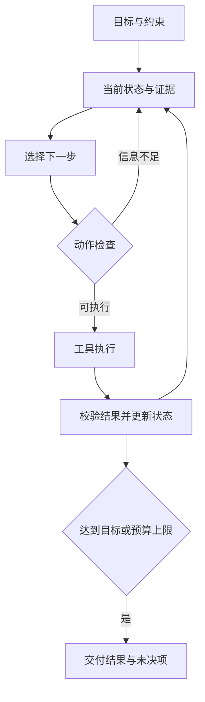

# 第 9 篇　语言、行动与世界模型

前沿资料核验日期：2026-09-26。这里先建立能够推导和实现的机制，再连接论文与当前课程。最新发布、最好结果、最值得学是三个不同判断；新工作只有给出问题、证据与限制，才进入知识体系。资源链接与访问情况见文末及资源附录。

## 50. 大语言模型：从条件概率到可运行系统

### 50.1 预测目标怎样产生语言模型

把文本编码为离散词元序列 x₁,…,xₜ。链式法则给出

$$
p(x_{1:T})=\prod_{t=1}^{T}p(x_t\mid x_{<t}).
$$

自回归语言模型参数化每一步条件分布，训练最小化 `-Σ log pθ(x_t|x_<t)`。训练通常同时计算多个位置的损失，因果掩码保证各位置只读过去；生成则先采样或选择下一个词元，把它加回上下文，再继续。

这个目标要求模型利用统计规律降低预测误差。数据中包含语法、事实、推理片段与社会互动，模型可能学到有用表示和能力，但训练目标并未直接保证回答真实、规划可靠或符合用户目的。这解释了为什么预训练之后仍需要后训练、检索、工具与评价。

### 50.2 分词、表示与上下文

词元不一定是自然语言单词，可能是字符、字节片段或子词。词表与分词规则影响序列长度、罕见词处理和多语言成本。字节对编码通过反复合并常见相邻单元构建子词表；不同具体实现还涉及预切分、特殊标记与字节处理。

嵌入表把词元编号映射为向量，但编号自身的大小没有语义距离。Transformer（以注意力和前馈层组织序列表示的神经网络架构） 根据上下文更新每个位置的表示，使同一词在不同语境中具有不同向量。长上下文只说明可接收较长输入，不保证模型会准确利用每一处信息。

位置机制决定模型如何感知顺序与相对距离。超出训练长度后的外推质量需要实测，不能由窗口上限直接推出。文档检索、内容去重、摘要和记忆仍有价值，因为它们同时影响成本、噪声与可追溯性。

### 50.3 从经典论文看问题如何变化

| 工作 | 解决的核心问题 | 应读出的区别 |
|---|---|---|
| Transformer（以注意力和前馈层组织序列表示的神经网络架构），2017 | 用注意力组织序列计算 | 原论文包含编码器与解码器，并非只讨论今天的聊天模型 |
| BERT（通过双向遮盖预测学习语言表示的模型），2018 | 利用双向上下文学习语言表示 | 遮盖预测与因果生成的可见信息不同 |
| GPT（生成式预训练语言模型系列，采用自回归预测） 路线 | 自回归预训练与任务迁移 | 规模、数据、后训练和系统共同影响结果 |
| LLaMA（Meta 发布的语言模型研究系列），2023 起 | 可研究的大模型训练与开放模型生态 | 不同版本的数据、授权、架构和能力不能混为一谈 |
| 稀疏专家模型 | 增加总容量而控制每词元激活计算 | 总参数、激活参数、通信和路由负载都影响成本 |

稀疏专家模型把部分层的输入路由到少数专家。路由器必须避免所有输入挤向少数专家，还要处理跨设备通信。激活参数少不意味着显存只需要那一部分，因为权重存储与执行调度另有成本。

### 50.4 后训练：三种信号不能混用解释

监督微调用高质量输入输出示例，让模型学习期望的任务形式与行为。它依赖示例覆盖，不能保证面对分布外输入仍遵循同样逻辑。

人类反馈强化学习通常先由偏好数据训练奖励模型，再优化策略，同时限制偏离参考模型过远。奖励是代理信号，策略可能利用奖励模型漏洞。验证器反馈强化学习则使用可检查的结果，例如数学答案或代码测试；检查器本身也可能不完整，过拟合测试并不等于程序普遍正确。

直接偏好优化以偏好对构造损失。设 y⁺ 是偏好答案、y⁻ 是较差答案，参考策略为 πref，一种标准目标为

$$
-\log\sigma\left(\beta\left[
\log\frac{\pi_\theta(y^+|x)}{\pi_{ref}(y^+|x)}-
\log\frac{\pi_\theta(y^-|x)}{\pi_{ref}(y^-|x)}
\right]\right).
$$

它提高偏好答案相对参考策略的优势，同时降低另一答案的相对优势。这里省去了显式在线奖励模型训练环节，但没有消除偏好数据噪声、分布偏移或评价困难。相关推导依赖特定偏好模型与正则化目标，不能说它与任意强化学习过程都相同。

### 50.5 推理成本与系统优化

生成通常分预填充与逐词元解码。预填充处理已有上下文；解码反复追加词元。键值缓存保存过去位置的键和值，避免每一步全部重算，但缓存体积随层数、序列长度、批量与数据精度增长。

量化以较低精度存储或计算参数，减少内存与带宽，但需评估不同层与任务对误差的敏感性。低秩适配把部分权重更新写成 ΔW=BA，用较少可训练参数适配任务；它减少的是适配参数与相关优化状态，不代表基础模型权重凭空消失。

批处理提高吞吐，可能增加等待时间；投机解码用小模型提出候选、大模型验证，在正确的接受规则下可保持目标采样分布；效果取决于候选接受率和硬件。长推理、工具调用与搜索增加测试时计算预算，比较模型时必须把预算一起报告。

### 50.6 一个能完成的语言模型项目

在公开许可的小文本上训练字符级语言模型，完成数据划分、因果预测、损失计算、采样和检查点。先用上下文计数基线，再加入小型神经网络。比较困惑度和实际生成，明确训练集记忆与未见组合。

下一步再进入 [Stanford CS336 2026](https://cs336.stanford.edu/)：其课程将分词、模型、训练系统、数据、规模规律与后训练放在同一实现链条中。不要一开始照着工业模型的参数规模追赶，先做到每个张量与目标都能解释。

## 51. 检索增强与智能体：知识来源和行动循环

### 51.1 检索增强为什么存在

参数知识更新昂贵，来源难追踪，私有文件也不应全部重新训练进模型。检索增强生成先寻找与问题有关的外部材料，再让模型在这些材料条件下回答。它把“存储知识”与“组织答案”部分分开。

完整流程包括读取、清洗、切分、索引、查询、召回、重排、上下文组合、生成与证据校验。切分必须保留标题、来源、页码和跨段指代，不能只按固定字符数机械切断论证。

倒排索引按词找文档，适合精确术语；向量检索按学习到的相似度找候选，适合表达不同但意思接近的查询。混合检索结合两者。向量内积高不是事实支持关系，重排器与生成模型也可能误判。

### 51.2 怎样定位检索系统的失败

把评估拆开：目标证据是否进入候选？重排后是否保留？模型是否正确使用？最终结论是否超出证据？若正确文件根本没召回，换更强生成模型未必有效；若已召回但引用错位，要修上下文组织与证据校验。

一个最小本地项目先用词集合或 TF-IDF（词频与逆文档频率加权，用于表示文本词项重要性） 检索十份文档，为每条结果返回文件名和片段位置。人工标注十个问题所需证据，分别测试同义改写、精确编号、无答案、相互矛盾来源。无答案时应允许明确拒绝推断，而不是每次都生成确定答案。

知识图谱把实体与关系显式表示，适合某些关系查询。但在无向图找到从“甲”到“乙”的路径，只能说明存在某种连接，不能证明任何自然语言命题。关系类型、方向、量词、时间与逻辑规则都影响推理有效性。

符号推理把规则也明确写出。例如事实“甲是哺乳动物”，规则“所有哺乳动物都是恒温动物”，可经变量匹配推出“甲是恒温动物”。前向链从已有事实不断应用规则，后向链从目标寻找能支持它的规则前提。系统没有记录某事实，不等于该事实为假，除非明确采用封闭世界假设。专家系统将领域规则与推理过程分开，优势是规则可追查，难点是规则获取、冲突处理与开放世界的不确定性。这条路线与学习方法可以组合，而非只能二选一。

### 51.3 智能体的最小闭环

智能体接收观测，选择动作，执行后读取反馈，再决定下一步。语言模型可以充当动作选择的一部分，外部程序负责执行、保存状态、限制权限和检查终止。工具调用输出的是请求，只有工具真的执行成功并返回证据，才算完成动作。

状态至少包括目标、已知事实、已做动作、结果、未解决问题与剩余预算。把全部聊天原样塞回模型不等于维护了可靠状态；压缩记忆也可能丢失约束。持久状态要能区分用户指令、检索数据、猜测和已验证事实。

### 51.4 可靠执行比多轮对话更难

工具需要明确输入输出结构、参数校验、错误类型与权限。给模型任意命令执行权并不能替代文件路径验证。网页与文档里可能包含诱导模型改变目标的文字，这些属于待处理数据，不应获得指令权限。

多步任务会累积错误。若每步成功率 0.95，且独立且每步都必须成功，20 步全成功概率只有约 0.36；现实错误还可能相关。需要中间检查、可恢复操作、重试上限、重复动作识别与人工介入点。扩大模型只能解决其中一部分。

规划可以先分解任务，但必须允许基于反馈修订。搜索多个方案能提高质量，也增加成本。多智能体只有在工作可拆分、沟通成本可控、结果可独立验证时才可能有优势；相互同意并不构成独立证据。

### 51.5 实验与当前课程

先做一个不接外网的文档助理：只允许检索、读指定文件、计算和生成回答四类动作，限制步数，并记录每步输入、输出与检查结果。构造失败工具、空检索结果、重复请求和文档中的伪指令，观察是否正确停止或恢复。

进一步学习 [CMU 11-768 AI（人工智能，研究感知、学习、推理与决策等能力） Agents（智能体，依据观测选择行动并利用反馈继续决策的系统）](https://www.cmu-agents.com/)。本次上传的第一讲由 Daniel Fried、Graham Neubig 讲授，已纳入工具接口、环境反馈和自主权限的教学映射；课程网站仍应按实际已发布内容获取，不能把教学计划视为完整可下载课程。

## 52. 强化学习：行动改变下一批数据

### 52.1 从路径规划到未知环境

已知图上最短路直接计算最佳路径；未知环境中，行动一方面争取收益，一方面收集信息。只选当前看起来最好的动作可能永远不知道另一条路更好，这就是探索与利用的冲突。

有限马尔可夫决策过程由状态 s、动作 a、转移概率 P(s'|s,a)、奖励 r 和折扣 γ 组成。马尔可夫性要求给定当前状态与动作后，下一步分布不再依赖更早历史。观测未必是状态：单张图片看不出速度，必须保留历史或估计隐藏状态。

回报 `G_t=Σ_{k≥0}γ^k r_{t+k}`，策略 π(a|s) 给出动作分布。奖励是每步信号，回报是跨时间累计，价值是给定状态或动作的期望回报；三者不可互换。

### 52.2 贝尔曼方程为何成立

把累计回报拆成第一步奖励与之后回报：Gₜ=rₜ+γGₜ₊₁。因此策略价值满足

$$
V^\pi(s)=\sum_a\pi(a|s)\sum_{s'}P(s'|s,a)
[r(s,a,s')+\gamma V^\pi(s')].
$$

最优价值将对动作的策略平均替换为最大值。状态充分且模型正确时，未来问题由下一个状态重新开始，这给出了动态规划结构。

在有限状态、有限奖励、0≤γ<1 下，贝尔曼最优算子在最大范数下满足 `||TV-TW||∞≤γ||V-W||∞`，是收缩映射。因此反复更新收敛到唯一不动点。γ=1 的一般无限时长任务不能直接沿用该结论，要增加终止或其他条件。

### 52.3 无模型价值学习

不知道 P 时，可用样本 `(s,a,r,s')` 更新

$$
Q(s,a)\leftarrow Q(s,a)+\alpha
[r+\gamma\max_{a'}Q(s',a')-Q(s,a)].
$$

终止状态不再加未来价值。括号内是当前估计与一步自举目标的差。表格 Q 学习在充分访问与合适步长等条件下有收敛结论，不能直接推广到任意深度网络、经验分布和有限训练预算。

深度 Q 网络用神经网络近似 Q，经验回放减轻相邻样本相关性，目标网络缓和目标随参数同时剧变。函数近似、自举和离策略学习结合可能不稳定，这是实现与理论都必须面对的问题。

### 52.4 策略梯度与连续动作

连续控制不便枚举每个动作。直接参数化 πθ，用高回报轨迹提高其动作概率。对轨迹分布求导并用 `∇p=p∇log p`，得到形如

$$
\nabla J(\theta)=\mathbb E[\sum_t\nabla\log\pi_\theta(a_t|s_t)\,G_t]
$$

的估计。减去不依赖当前动作的基线可以降低方差而不改变期望；优势函数 A=Q-V 描述该动作比状态下平均水平好多少。

行动者—评论者方法由策略选择动作，价值模型估计回报或优势。PPO（近端策略优化，用受约束的更新目标训练策略） 用新旧策略概率比与裁剪目标限制过大更新倾向，但裁剪不等于所有情形下都有严格信赖域保证。SAC（软行动者—评论者方法，结合收益与熵训练策略） 在最大化收益外加入熵奖励，鼓励策略保留随机性，常用于连续控制；奖励尺度与温度选择会影响行为。

### 52.5 离线数据、模仿学习与奖励设计

行为克隆用专家 `(观测,动作)` 做监督学习，简单有效，但策略偏离专家轨迹后可能进入训练集没覆盖的状态，误差逐步累积。收集策略实际遇到状态上的专家反馈可以缓解分布偏移，不过会引入交互成本。

离线强化学习只能使用固定数据，策略可能偏好数据中未出现、价值被高估的动作。保守估计或约束策略靠近数据支持范围是重要思路。在线试错可纠正错误估计，但真实机器人试错昂贵，甚至会损坏设备。

奖励设计必须检查目标是否被钻空子。奖励“距离杯子更近”，可能鼓励碰撞而不是抓起；奖励“任务快速结束”，可能诱导提前报完成。应检查实际任务成功、违规动作、恢复能力与不同初始状态表现。

### 52.6 一个可验证的实验

配套实验在五格链环境中做价值迭代，先由已知模型得到最优策略，再用表格 Q 学习从交互采样近似它。改变步长、探索概率、奖励和终止定义，比较学到的动作。你应能解释每个差异来自目标变化、采样不足还是实现错误。

进一步主修 [Berkeley CS285](https://rail.eecs.berkeley.edu/deeprlcourse/)，配合 Sutton 与 Barto 的公开教材。研究型课程中的神经网络方法应建立在你能独立写出贝尔曼更新之后。

## 53. 世界模型：在预测里试行动，再承担预测误差

### 53.1 什么模型才对决策有用

世界模型预测行动后会发生什么，可以建模下一状态、观测、奖励、终止或潜在表示。最简单例子是小车动力学 `x_{t+1}=Ax_t+Bu_t`。复杂环境可学习 `pθ(z_{t+1}|z_t,a_t)`，再预测奖励和观测。

只生成视觉连贯的视频，不足以说明模型能帮助控制。决策需要区分不同动作的后果、保持与任务有关的隐藏变量，并在关键罕见事件上足够准确。图像误差很小，也可能把接触位置或速度预测错，导致行动失败。

### 53.2 部分可观测与信念状态

机器人看见杯子，可能不知道杯子多重；屏幕截图也未必显示任务是否已在后台完成。需要根据历史观测与动作推断隐藏状态。概率信念 bₜ(s) 表示当前对状态的分布，更新分为动作后的预测与新观测后的校正。

学习潜在状态时，可以用循环确定性状态保存历史，再用随机潜变量表示不确定性。先验依据过去预测当前潜变量，后验再结合当前观测修正。训练约束重构、奖励预测与先验后验分布的关系，防止潜变量只记与任务无关的像素细节。

### 53.3 PlaNet（在学习到的潜在动力学中规划动作的世界模型方法） 与 Dreamer（基于世界模型想象轨迹进行策略学习的方法系列） 的分界

[PlaNet（在学习到的潜在动力学中规划动作的世界模型方法）](https://arxiv.org/abs/1811.04551) 在潜在动力学中评估候选动作序列，用规划选择动作。[DreamerV3（利用世界模型中的想象轨迹学习策略的方法）](https://arxiv.org/abs/2301.04104) 则在学习到的模型中产生想象轨迹，训练行动策略与价值估计。一个主要在模型里搜行动序列，一个还在模型里学习可直接执行的策略；两者都依赖模型能保留影响决策的信息。

这不意味着模型准确后策略自然正确。模型可能只在训练数据覆盖的区域准确，策略优化却主动寻找模型高估的区域。仿真中的高收益可能只是模型漏洞，必须返回真实环境验证。

### 53.4 模型预测控制的完整逻辑

在当前估计状态下，优化未来 H 步动作序列，使预测成本最小；只执行第一个动作；读取新观测；重新估计与规划。这是模型预测控制。反复反馈能修正预测偏差，比一次规划后盲走到底稳健，但计算必须赶上控制周期。

设系统 `x_{t+1}=x_t+u_t`，目标 x*=0，成本 `Σ(x_t²+λu_t²)`，动作限制 |u|≤1。当前位置 x=3 时，规划应逐步靠近目标，同时避免过大控制代价。若模型误以为动作效力是现实的两倍，每次预测都会过于乐观；每步重规划可以部分修正，长期盲执行则偏差更大。

候选序列可以穷举、随机采样、用交叉熵法迭代集中候选分布，或在可微模型上优化。随机射击法最简单但高维长时域效率低；梯度法受局部极值与模型可微性限制。缩短规划时域减轻模型误差，却可能看不到长期收益。

### 53.5 误差、分布与不确定性

一步误差不直接决定多步误差。若动力学对状态扰动放大，递推误差可能迅速增长。认知不确定性来自数据不足，偶然不确定性来自环境随机性；集成模型分歧可作为前者的一种近似，但不是完美置信度。

评估至少比较一步预测、多步滚动、不同动作下的预测、任务收益和真实环境迁移。与无模型基线比较时，要计入真实交互次数、计算预算和数据。漂亮视频、单个任务成功和广泛可控预测之间存在明显证据差距。

### 53.6 当前前沿怎样读

Google 于 2026 年发布的 [Project Genie（交互式环境生成的研究实验项目） 介绍](https://deepmind.google/blog/project-genie-experimenting-with-infinite-interactive-worlds/) 展示交互式环境生成的产品实验。它可用于观察行动条件生成、持续性与交互延迟问题；官方演示本身不能证明精确物理建模或机器人迁移成功。

前沿阅读应围绕可检验问题：模型记住哪些状态？动作条件是否真正影响结果？滚动多久后失真？是否给出代码和可重复评估？与更简单模型相比，任务收益是否值得额外计算？把这些问题写进实验表，才能避免只记模型名字。

## 54. 机器人学习与具身智能：从预测正确到行动可行

### 54.1 控制链条不能省略

一个机器人系统要感知环境、估计自身与物体状态、规划路径或动作、控制执行器，再用传感器检查结果。语言理解只覆盖其中一部分。动作必须符合关节限制、速度、力矩、碰撞、时延和接触条件。

坐标系是首要契约。相机看到的点、机器人基座中的点和夹爪局部坐标不同，需要旋转和平移变换。齐次矩阵 T 把旋转 R 和平移 t 组合，连续变换通过矩阵乘法连接；顺序错了，数值仍可能看起来合理，但动作会落在错误位置。

### 54.2 运动学、动力学与反馈

正运动学由关节角 q 计算末端位置 x=f(q)，逆运动学反求能达到目标的 q，可能多解、无解或接近奇异。雅可比 J(q) 连接小变化 `Δx≈JΔq`，也连接关节速度与末端速度。奇异附近某方向难以实现，不能盲目求逆。

动力学还考虑质量、惯量、重力与接触。常见形式 `M(q)q̈+C(q,q̇)q̇+g(q)=τ+外力项`。运动学路径可行不代表动力学可执行。高层每秒更新几次的计划，需要低层更快反馈控制来处理扰动。

比例控制 `u=k(x*-x)` 根据误差行动；比例过大在有时延和惯性的系统中可能振荡。积分补偿稳态偏差，但可能累积饱和；微分抑制变化但易受噪声影响。控制器稳定性与学习策略性能应共同检查。

### 54.3 模仿学习与多模态动作分布

遥操作数据包含图像、状态、动作及时间同步信息。一个图像对应什么时间的动作、控制频率是多少、动作是绝对位置还是增量，都决定训练语义。不同机器人数据直接拼接前，需处理动作空间、坐标系与执行频率差异。

动作分块一次预测未来一段动作，减少逐步调用开销并表达短期协调；执行时可采用滚动窗口与重叠动作融合。但块太长会降低反馈频率，环境变化后可能继续执行过时计划。

[Diffusion Policy（扩散策略，用条件去噪过程生成机器人动作）](https://arxiv.org/abs/2303.04137) 把动作生成作为条件去噪过程，可表示多个合理动作模式。它的价值不是“用了扩散所以先进”，而是避免单一均值回归在多峰动作分布中给出不合理折中；代价是采样与部署延迟需要优化。

### 54.4 视觉—语言—动作模型

VLA（视觉—语言—动作模型，将观测与语言目标关联到动作） 将视觉、语言目标与动作联系起来。视觉语言预训练提供物体与语义表示，机器人数据教模型怎样把这些表示转成可执行动作。输出动作可以离散化为词元，也可由连续动作头或生成过程给出。

[RT-2（研究视觉语言知识向机器人动作迁移的模型）](https://arxiv.org/abs/2307.15818) 研究视觉语言知识向机器人行动迁移；[OpenVLA（面向机器人操作的开放视觉语言动作模型项目）](https://arxiv.org/abs/2406.09246) 提供开放的视觉语言动作研究路径；[openpi（Physical Intelligence 发布的机器人策略代码项目）](https://github.com/Physical-Intelligence/openpi) 与 [LeRobot（用于机器人学习、数据采集与策略实践的开源工具）](https://github.com/huggingface/lerobot) 提供可检查实现与实践工具。不同项目的代码、权重和训练数据公开程度不同，要逐项看授权和说明。

Gato（探索同一序列模型处理多种任务的通用智能体研究） 探索同一序列模型处理多类任务，它提供通用表示的研究视角，却不能直接推出任意机器人无需适配即可工作。跨具身泛化需要面对不同运动学、动作尺度和传感器，语言一致不代表物理接口一致。

### 54.5 泛化到底指什么

应分别测试新物体、新位置、新背景、新任务组合、新机器人与新动力学。随机重新排列训练场景中的杯子，与换到新家庭、新夹爪和未知易碎物体，难度不同。只报一个平均成功率会掩盖这些维度。

仿真随机化改变质量、摩擦、光照和传感器噪声，帮助策略适应变化，但随机范围不覆盖真实关键因素时仍会失败。离线数据覆盖、在线适应、触觉与力反馈、失败恢复和长期记忆都是值得深入的方向。

Physical Intelligence 的 2026 年新页面在本次检索中出现了精细操作在线学习与更近期策略方向，但全文访问受限；资源附录保留入口并标“待全文复核”，这里不据搜索摘要编写性能结论。正式研究应优先选择能读完整论文、检查实验条件、获取代码的工作。

### 54.6 可执行的入门项目

先在二维模拟中控制一个点到达目标并避障：最初用已知动力学规划，再加入噪声和延迟，最后用数据拟合动力学并重规划。记录成功率、碰撞率、控制成本和规划耗时，而不是只画成功轨迹。

第二步在开源仿真里完成一个简单机械臂任务，比较固定脚本、行为克隆和学习策略；第三步再考虑真实硬件。每一步都保留简单基线与失败录像，区分感知错误、规划错误、控制错误和硬件问题。

对力学背景，运动学、稳定性、系统辨识与最优控制是进入机器人研究的直接连接点；不必先把全部电子硬件课程学完，软件与控制实验就能开始形成研究能力。

## 55. 从学习者走向研究与工程

### 55.1 让问题决定下一步知识

选一个贯穿项目，例如“可追溯的课程资料助手”或“有反馈的小车规划器”。先定义一个能验证的小目标，再按暴露的瓶颈补知识：查询太慢补索引，训练不稳定补优化，状态不充分补估计，任务长程失败补记忆与规划。

基础主线负责积累可迁移能力，前沿支线负责提出值得学习的问题。前沿阅读可以早开始，但不要求早期读者已经掌握所有推导；应明确哪些部分现在能验证，哪些要等前置知识到位再回读。

### 55.2 论文阅读要留下可验证的产物

第一次读，明确作者解决什么问题，与已有方法的差别是什么。第二次检查定义、目标、关键推导和算法。第三次查实验：数据划分、基线强度、预算、消融、方差、失败场景。第四次运行最小复现或独立构造反例。

读后写一页记录：问题与假设、机制、证据、限制、可以复现的部分、仍不理解的地方，以及它连接到本讲义哪几章。不要用“效果显著、具有潜力”代替具体指标与实验条件。综述用于建立地图，原论文用于判断具体证据，官方代码用于核对实现。

### 55.3 工程质量也是知识的一部分

一个可复现实验应提供入口命令、依赖、数据获取方法、配置、种子、日志与输出解释。资源有限时缩小模型和数据，但保留核心对照；不能只减少实验到剩下一个成功案例。

发布代码前明确数据与代码许可、隐藏密钥、记录已知限制。性能优化先测瓶颈，再选择数据布局、批处理、编译、并行或算法改进。系统设计应支持失败恢复与观察，不能依赖作者记住所有隐含状态。

### 55.4 阶段成果，而非按日打卡

| 阶段 | 可交付成果 | 独立验收 |
|---|---|---|
| Python | 命令行词频与文件统计器 | 换路径、空输入、坏编码时行为明确 |
| 算法 | 路径规划与预算分配 | 小规模对拍、复杂度、反例与结果恢复 |
| 系统 | SQLite（可嵌入应用程序的轻量关系数据库） 检索服务 | 重复导入、中途失败、索引效果可检查 |
| 数学与学习 | 回归与小神经网络 | 手推梯度、数值检验、训练/测试分离 |
| 语言与工具 | 可追溯资料助手 | 引用可回查、无答案可识别、动作有记录 |
| 决策与控制 | 模型预测控制实验 | 噪声、延迟、模型误差下仍有评价 |
| 研究 | 一个可复现的小问题 | 基线、消融、失败分析、适用边界完整 |

你真正要积累的是把“我觉得它应该能行”变成“在这些条件下，它为什么能行；条件变了，我怎样发现并修正”的能力。每个阶段都可以形成小而真实的成果，下一阶段再回过头来改善它。
