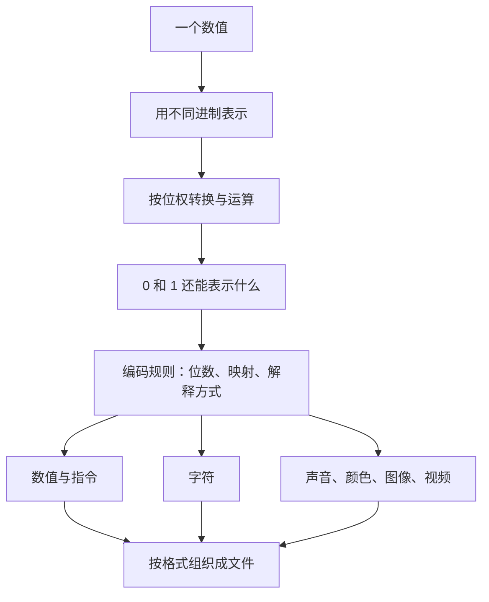
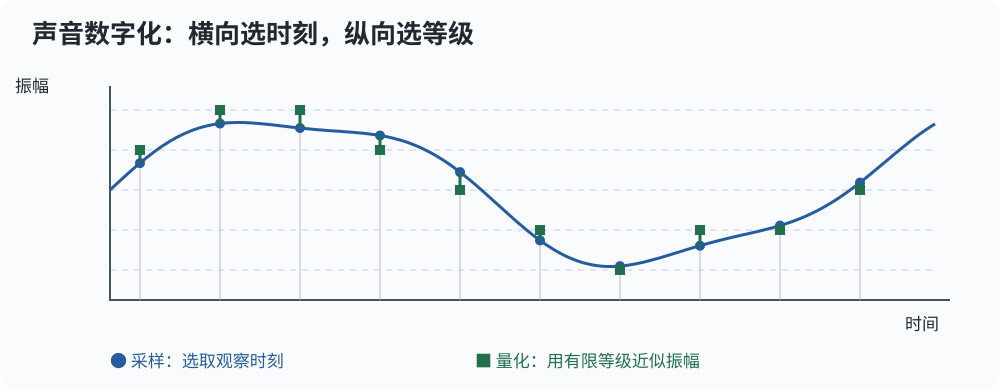

# 进制转换与信息编码、存储

> **这份笔记在解决什么问题？** 同一个数为什么能写成不同进制？计算机又怎样用一串 0 和 1 表示负数、文字、声音和图像？
>
> 来源：北京大学计算概论 B《Theory 2-信息编码、存储与管理》，教学小组资料，甘锐修改，共 57 页。页码均指 PDF 页序。
> 保留原文件名，便于继续使用原来的入口；正文覆盖整讲，而不只覆盖进制转换。
>
> **阅读标记**：`【课件 p. …】` 表示资料知识范围；`【讲解补充】` 是为了说明机制而添加的例子与推导；`【核对更正】` 指课件需要限定或修正的表述；`【进阶】` 可以暂时跳过。正文与代码均重新组织、用自己的话写。

**目录**

- [0、先看知识地图](#0、先看知识地图)
- [1、数的表示与进制转换](#1、数的表示与进制转换)
- [2、二进制数的运算](#2、二进制数的运算)
- [3、各种编码共同遵守的规则](#3、各种编码共同遵守的规则)
- [4、不同信息怎样编码](#4、不同信息怎样编码)
- [5、编码数据怎样组织成文件](#5、编码数据怎样组织成文件)
- [6、知识结构回收](#6、知识结构回收)
- [7、先自己做的自测](#7、先自己做的自测)
- [8、资料对照与验证记录](#8、资料对照与验证记录)

## 0、先看知识地图

只需要先会整数四则运算、商与余数，以及幂的含义。Python 示例需要一点变量、循环和函数知识；没学到函数时，可以先跟着执行表手算。



这里有两个不同的问题，先分清再学：

| 问题 | 具体例子 | 改变的是什么 |
|---|---|---|
| **数制转换**：同一个数怎样换一种写法？ | 十进制 13 → 二进制 1101 | 数字表示方式，数值不变 |
| **信息编码**：一个对象怎样用符号表示？ | 字符 `A` → 编号 65 → 字节 `01000001` | 表示规则；对象的意义由规则确定 |

进制转换是理解信息编码的起点。学完应能手算转换、解释二进制运算，并从“多少个对象／多少次采样 × 每份多少位”推导存储量。

## 1、数的表示与进制转换

### 1.1 数值与写法：先认识共同的位权规则

【课件 p. 3–4；讲解补充】桌上有 13 个小球。写成十进制 `13` 或二进制 `1101`，小球都没有增减。

十进制 `13` 的意思是“1 个十 + 3 个一”；二进制 `1101` 的意思是“1 个八 + 1 个四 + 0 个二 + 1 个一”。

| 二进制位置 | 从右往左第 4 位 | 第 3 位 | 第 2 位 | 第 1 位 |
|---|---:|---:|---:|---:|
| 位权 | $2^3=8$ | $2^2=4$ | $2^1=2$ | $2^0=1$ |
| 数码 | 1 | 1 | 0 | 1 |
| 对数值的贡献 | 8 | 4 | 0 | 1 |

因此 $(1101)_2=8+4+0+1=(13)_{10}$。下标标记进制，避免把 `1101` 误读成十进制一千一百零一。

<span class="note-blue-bold">进位计数制：</span>选定基数 $B\ge2$ 后，每一位使用 $0$ 到 $B-1$ 这些数码，某一位累计到 $B$ 就向左进一位。**位权**是某个位置上的一个单位所代表的数值。

| 进制 | 基数 | 合法数码 | “十进制 13”的写法 | Python 整数字面量 |
|---|---:|---|---|---|
| 二进制 | 2 | 0、1 | `1101` | `0b1101` |
| 八进制 | 8 | 0～7 | `15` | `0o15` |
| 十进制 | 10 | 0～9 | `13` | `13` |
| 十六进制 | 16 | 0～9、A～F | `D` | `0xD` |

十六进制中的 A～F 分别代表十进制 10～15，大小写均可。这里 `0b`、`0o`、`0x` 是 Python 标记基数的前缀，不是数值的一部分。

先把整数向左扩大，再看小数向右缩小：

$$
(13.25)_{10}=1\times10^1+3\times10^0+2\times10^{-1}+5\times10^{-2}
$$

小数点右边第一位的位权是 $B^{-1}=1/B$，第二位是 $B^{-2}=1/B^2$。于是一般形式为：

$$
(d_n\cdots d_1d_0.d_{-1}\cdots d_{-m})_B
=\sum_{i=-m}^{n}d_iB^i,\qquad 0\le d_i<B.
$$

这是所有转换方法的共同依据：**看位置，乘位权，求和。**

<span class="note-red-bold">坑：</span>八进制不能出现 `8`，二进制不能出现 `2`。数码必须小于基数；这不是“算错了”，而是写法本身不合法。

### 1.2 任意进制转十进制：按位权展开

【课件 p. 9】先做一个带小数的最小例子：

$$
(101.01)_2=1\times4+0\times2+1\times1+0\times\frac12+1\times\frac14=5.25.
$$

课件的例子用同一规则：

$$
(11111101.1011)_2=253+\frac12+\frac18+\frac1{16}=253.6875.
$$

注意小数位 `1011` 的贡献是 $1/2+0/4+1/8+1/16$，不是把 `1011` 当整数转换后再加小数点。

【讲解补充】整数部分还可以从左往右“乘基数，再加新的一位”。例如 `1101`：

| 读到的数码 | 旧结果 × 2 + 新数码 | 新结果 |
|---|---|---:|
| 1 | 0 × 2 + 1 | 1 |
| 1 | 1 × 2 + 1 | 3 |
| 0 | 3 × 2 + 0 | 6 |
| 1 | 6 × 2 + 1 | 13 |

每读入一位，原来的数码整体左移一位，原来的数值就乘了基数。这也解释了 Python 解析进制字符串时要完成的核心工作。

### 1.3 十进制整数转任意进制：除基数取余，倒序读

【课件 p. 5–7；讲解补充】先看 13 转二进制：

| 当前整数 | 除以 2 的商 | 余数 | 余数属于哪一位 |
|---:|---:|---:|---|
| 13 | 6 | 1 | 个位，最低位 |
| 6 | 3 | 0 | 二位 |
| 3 | 1 | 1 | 四位 |
| 1 | 0 | 1 | 八位，最高位 |

余数按产生顺序是 `1、0、1、1`；从最后一个往前读，才得到 `1101`。

**为什么余数是最低位？** 因为 $13=6\times2+1$：每两个凑成一组，剩下的 1 就是无法再凑成组的个位。继续处理商，等于继续拆更高的位置。

一般地，由整数除法：

$$
N=Bq+r,\qquad 0\le r<B.
$$

$r$ 正好是 $B$ 进制的最低位。把商 $q$ 当新整数继续除，直到商为 0；余数从低位到高位生成，所以最终倒序排列。

课件中的 $253$ 依次得到余数 `1、0、1、1、1、1、1、1`，倒序为 `11111101`。转八进制、十六进制只需要把除数改成 8、16。

【讲解补充：Python 实现】下面函数限定输入为整数，基数限定为 2～36；大于 9 的数码用 A～Z。负数先转换绝对值，再添加负号；这只是数学写法，不是补码。

```python
def to_base(n, base):
    if not 2 <= base <= 36:
        raise ValueError("base 必须在 2 到 36 之间")
    if n == 0:
        return "0"
    alphabet = "0123456789ABCDEFGHIJKLMNOPQRSTUVWXYZ"
    sign = "-" if n < 0 else ""
    n = abs(n)
    digits = []
    while n > 0:
        n, remainder = divmod(n, base)
        digits.append(alphabet[remainder])
    return sign + "".join(reversed(digits))

print(to_base(13, 2))
print(to_base(253, 2), to_base(253, 8), to_base(253, 16))
print(to_base(0, 2), to_base(-13, 2))
```

实跑输出：

```text
1101
11111101 375 FD
0 -1101
```

程序状态对应上面的除法表：`n` 保存尚未拆完的高位，`remainder` 保存刚拆出的低位，`digits` 保存已经产生的数码。`divmod(n, base)` 一次返回商与余数，左边两个名字分别接收它们。`alphabet[remainder]` 用索引把数值余数变成字符，`append()` 放到列表末尾；`reversed()` 倒序，`"".join(...)` 将字符拼成字符串。

**循环为什么能结束？** 对正整数且 $B\ge2$，新的商严格小于旧整数，最终变成 0。零要单独处理，否则循环一次都不进入，结果会成为空字符串。

### 1.4 十进制小数转任意进制：乘基数取整，顺序读

【课件 p. 5–6、8；讲解补充】整数、小数分别转换，再拼到同一个基数的小数点两侧。对负数，先取绝对值拆分，最后还原负号。

<span class="note-green-bold">最小例子：</span>先看能算完的 $0.625$：

| 当前小数 × 2 | 取出的整数部分 | 剩余小数 |
|---|---:|---:|
| 0.625 × 2 = 1.25 | 1 | 0.25 |
| 0.25 × 2 = 0.5 | 0 | 0.5 |
| 0.5 × 2 = 1.0 | 1 | 0 |

按产生顺序读整数部分，得到 $(0.625)_{10}=(0.101)_2$。

**为什么这次顺序读？** 把二进制小数乘 2，小数点右边第一位就移到整数部分：

$$
0.d_1d_2d_3\cdots\quad\xrightarrow{\times B}\quad d_1.d_2d_3\cdots
$$

取出 $d_1$ 后，只让剩下的小数继续参与下一轮。这一次先得到的是小数点后最靠左的一位，所以无需倒序。

课件用 $0.745$ 示范前 6 位：

| 轮次 | 当前小数 × 2 | 取整 | 留下的小数 |
|---:|---:|---:|---:|
| 1 | 1.490 | 1 | 0.490 |
| 2 | 0.980 | 0 | 0.980 |
| 3 | 1.960 | 1 | 0.960 |
| 4 | 1.920 | 1 | 0.920 |
| 5 | 1.840 | 1 | 0.840 |
| 6 | 1.680 | 1 | 0.680 |

所以截取前 6 位得到 $(0.745)_{10}\approx(0.101111)_2=0.734375$。这里是**截断近似**，不是精确相等，也不是默认做了四舍五入。

【讲解补充】为了不把 Python `float` 的舍入误差混进转换过程，用 `Fraction`（有理数）保存精确分数：

```python
from fractions import Fraction

def fraction_bits(text, count):
    x = Fraction(text)
    if not 0 <= x < 1:
        raise ValueError("这里只转换 0 到 1 之间的小数，不包含 1")
    digits = []
    for _ in range(count):
        x *= 2
        digit = int(x)
        digits.append(str(digit))
        x -= digit
        if x == 0:
            break
    return "0." + "".join(digits), x

print(fraction_bits("0.625", 6))
print(fraction_bits("0.745", 6))
```

实跑输出：

```text
('0.101', Fraction(0, 1))
('0.101111', Fraction(17, 25))
```

输入是字符串 `"0.745"`，因此先建立精确分数 $149/200$。`x *= 2` 将下一位移到整数部分；`int(x)` 在这里取出 0 或 1；`x -= digit` 留下剩余小数。循环在余数为 0 时提前结束，否则最多生成指定的 `count` 位。

最后返回的 `x` 是**经过多次放大后**剩下的分数，不是原数的误差。取 $k$ 位后，原数与截断值之差为 $x/B^k$；非负小数的截断误差满足 $0\le\text{误差}<B^{-k}$。

<span class="note-red-bold">坑：</span>不要把整数的“倒序读余数”套到小数上；也不要每轮都拿最初的小数重新乘基数，下一轮必须处理上一轮留下的部分。

【进阶：什么时候能有限结束？】将有理数约分为 $p/q$，它在 $B$ 进制下有有限小数表示，当且仅当存在整数 $k\ge0$，使 $q$ 整除 $B^k$。因为有限 $k$ 位小数总能写成整数除以 $B^k$。

所以二进制有限小数的约分后分母只能含质因子 2。$0.625=5/8$ 能结束；$0.1=1/10$、$0.745=149/200$ 的分母含 5，不能结束。**十进制有限，不保证二进制有限。**

### 1.5 二、八、十六进制互转：按组替换

【课件 p. 10–12】通用路线是“源进制 → 数值 → 目标进制”；手算常用十进制作中间桥梁。十进制不是数学上必须经过的步骤，也不是计算机内部必须先生成的文字。

二、八、十六进制存在更直接的关系：$8=2^3$、$16=2^4$，所以一位八进制正好对应三位二进制，一位十六进制正好对应四位二进制。

| 十进制数值 | 四位二进制 | 十六进制 | 三位二进制 | 八进制 |
|---:|---|---|---|---|
| 0 | 0000 | 0 | 000 | 0 |
| 1 | 0001 | 1 | 001 | 1 |
| 2 | 0010 | 2 | 010 | 2 |
| 3 | 0011 | 3 | 011 | 3 |
| 4 | 0100 | 4 | 100 | 4 |
| 5 | 0101 | 5 | 101 | 5 |
| 6 | 0110 | 6 | 110 | 6 |
| 7 | 0111 | 7 | 111 | 7 |
| 8 | 1000 | 8 | — | — |
| 9 | 1001 | 9 | — | — |
| 10 | 1010 | A | — | — |
| 11 | 1011 | B | — | — |
| 12 | 1100 | C | — | — |
| 13 | 1101 | D | — | — |
| 14 | 1110 | E | — | — |
| 15 | 1111 | F | — | — |

以课件的 $(11111101.1011)_2$ 为例，从小数点向两侧分组：

```text
转八进制：     11 111 101 . 101 1
补足每组三位：011 111 101 . 101 100
逐组替换：      3   7   5 .  5   4    → (375.54)₈

转十六进制：1111 1101 . 1011
逐组替换：    F    D .    B           → (FD.B)₁₆
```

<span class="note-blue">分组规则：</span>整数部分从右向左分组，不足时在最左侧补 0；小数部分从左向右分组，不足时在最右侧补 0。因为这些位置的零都不改变原数值。

反过来，将每位八进制／十六进制展开成固定的三位／四位二进制即可。**中间组的前导零不能随意删掉**：`(101)₈` 必须先展开成 `001 000 001`，再仅省略整个整数最左边的零。

### 1.6 Python 中的转换入口：解析数值与生成文本

【课件 p. 10；讲解补充】这些函数面对的输入、输出方向不同：

| 需求 | 入口 | 输入 → 输出 | 关键区别 |
|---|---|---|---|
| 读一个基数已知的整数字符串 | `int(text, base)` | `str` → `int` | 第二个参数说明如何解释输入 |
| 输出二／八／十六进制写法 | `bin(n)`／`oct(n)`／`hex(n)` | `int` → `str` | 输出含 `0b`／`0o`／`0x` 前缀 |
| 控制前缀、位数、大小写 | `format(n, spec)` 或 f-string | `int` → `str` | 格式规则控制显示 |

```python
n = int("FD", 16)
print(n, type(n).__name__)
print(bin(n), oct(n), hex(n))
print(format(n, "b"), format(n, "08b"), format(n, "X"))
print(int("0b1101", 0))
print(0b1101 == 0o15 == 13 == 0xD)
print(bin(-5), format(-5, "08b"))
```

实跑输出：

```text
253 int
0b11111101 0o375 0xfd
11111101 11111101 FD
13
True
-0b101 -0000101
```

`base=0` 表示让 `int()` 根据 `0b`、`0o`、`0x` 等前缀识别基数。`"08b"` 中，`b` 指二进制显示，`8` 是最小显示宽度，`0` 表示不足宽度时补零；它不会把 Python 整数变成“只能存 8 位”的整数。负号也占显示宽度。

<span class="note-red-bold">坑：</span>`int("10", 2)` 得到数值 2，`int("10", 16)` 得到数值 16；不是先读取同一个十进制 10 再转换。`int(text, base)` 只解析整数，不能直接读取 `"101.01"` 这种带小数点的进制字符串。

`bin(-5)` 会显示带负号的写法，**不会返回某个固定位宽的补码**。补码需要另外约定宽度，第 4.1 节再处理。

## 2、二进制数的运算

### 2.1 算术运算：仍然计算数值，有进位与借位

【课件 p. 13–14】进制改变的是写法，四则运算的数值关系不变。二进制加法中，$1+1=(10)_2$：本位写 0，向高位进 1。

| 加法 | 结果 | 减法 | 结果 |
|---|---|---|---|
| 0 + 0 | 0 | 0 − 0 | 0 |
| 0 + 1 或 1 + 0 | 1 | 1 − 0 | 1 |
| 1 + 1 | 10 | 1 − 1 | 0 |
| 1 + 1 + 1 | 11 | 0 − 1 | 本位借位后得 1，高位减 1 |

这里“0 − 1 得 1”只描述**借位后的本位结果**，不能脱离高位借位理解。借来的是两个本位单位，所以 $2-1=1$。

课件的四则例子：

```text
    1101             1101
  + 1011           - 1011
  ------           ------
   11000             0010
  13+11=24         13-11=2

       1101
  ×    1011
  ---------
       1101        ← 乘个位 1
      11010        ← 乘第二位 1，左移 1 位
     000000        ← 乘第三位 0
  + 1101000        ← 乘第四位 1，左移 3 位
  ---------
   10001111        ← 13×11=143
```

除法也逐位比较、相减并接下一个数码。课件例子为 $(100110)_2\div(110)_2$，也就是 $38\div6$，商 $(110)_2$、余数 $(10)_2$。验算 $38=6\times6+2$，且余数小于除数。

### 2.2 按位运算：各位置独立，没有进位

【课件 p. 15–17】先比较同一组输入：`1 + 1` 是数值相加，结果为二进制 `10`；`1 ^ 1` 是比较两个位是否不同，结果是 `0`。

| 位 a | 位 b | AND（与）`&` | OR（或） | XOR（异或）`^` |
|---:|---:|---:|---:|---:|
| 0 | 0 | 0 | 0 | 0 |
| 0 | 1 | 0 | 1 | 1 |
| 1 | 0 | 0 | 1 | 1 |
| 1 | 1 | 1 | 1 | 0 |

与：两个都是 1 才是 1；或：至少一个为 1 就是 1；异或：不同为 1、相同为 0。单个位的 NOT（非）把 0、1 互换。

```python
a, b = 0b11001, 0b01101
print(f"与：{a & b:05b}")
print(f"或：{a | b:05b}")
print(f"异或：{a ^ b:05b}")
print(1 + 1, 1 ^ 1)
```

实跑输出：

```text
与：01001
或：11101
异或：10100
2 0
```

这里 f-string 中 `{表达式:05b}` 的冒号分开“计算什么”和“怎样显示”，`05b` 表示至少五位、补零的二进制文本。

<span class="note-red-bold">坑：</span>Python 的 `^` 是按位异或；乘方使用 `**`。按位或写作竖线 `|`。

### 2.3 移位与取反：先约定整数模型

【课件 p. 17；核对更正】对 Python 整数，且移位数 $k\ge0$：

| 操作 | 数值关系 | 例子 |
|---|---|---|
| `x << k` | $x\times2^k$ | `0b1101 << 1` 是 `0b11010` |
| `x >> k` | $x\mathbin{//}2^k$，向负无穷取整 | `13 >> 1` 是 6；`-3 >> 1` 是 -2 |
| `~x` | $-(x+1)$ | `~0` 是 -1；`~1` 是 -2 |

正整数左移相当于低位补零；右移相当于舍去低位。对于负整数，不能用“随便删掉负号后面的几位”推断，直接按向下整除理解。

```python
print(13 << 1, 13 >> 1, -3 >> 1)
print(~0, ~1, ~0b11010)
print(f"{(~0b11010) & 0b11111:05b}")
```

实跑输出：

```text
26 6 -2
-1 -2 -27
00101
```

课件 p. 15 的 `~1=0` 是**限于一个位的取反**；Python 的 `~1` 操作整个整数，结果是 -2。[Python 官方整数规则](https://docs.python.org/3/library/stdtypes.html#bitwise-operations-on-integer-types)将其语义描述为具有无限符号扩展的补码运算；这不意味着实际内存里存了无限个位。

如果明确只取反五位，就先算 `~x`，再用五个 1 的 mask（位掩码）保留低五位，即 `(~x) & 0b11111`。**位宽是题目给定的规则，不是 `~` 自动猜出的规则。**

### 2.4 按位操作的用途：提取、修改与拼接

【课件 p. 16；讲解补充】掩码的 1 表示保留的位置，0 表示清零的位置。例如 `10110110 & 00001111 = 00000110`，这就在提取低四位。

| 目的 | 写法 | 为什么成立 |
|---|---|---|
| 提取某些位 | `x & mask` | 与 1 保留，与 0 清零 |
| 将某些位置 1 | `x \| mask` | 或 1 强制为 1，或 0 不变 |
| 翻转某些位 | `x ^ mask` | 异或 1 翻转，异或 0 不变 |
| 将某些位清零 | `x & ~mask` | 原 mask 中的 1 变成清零位置 |
| 拼接两个四位字段 | `(high << 4) \| low` | 先让高字段移开，再填入低字段 |

```python
x = 0b10110110
print(f"{x & 0b1111:04b}")
high, low = 0b1011, 0b1101
packed = (high << 4) | low
print(f"{packed:08b}")
print(packed >> 4, packed & 0b1111)
print(5 and 3, 5 & 3)
```

实跑输出：

```text
0110
10111101
11 13
3 1
```

拼接的前提是 `high`、`low` 都在 0～15，彼此占不同的四位区域；不满足时要先检查范围。课件中已对齐的 `10110000` 和 `00001101` 可以直接按位或。

<span class="note-red-bold">坑：</span>`and`、`or`、`not` 判断对象的真值，`and`／`or` 还会短路并返回某个操作数；`&`、`|`、`^` 这里操作整数的每个位。`5 and 3` 返回 3，`5 & 3` 返回 1，它们不能随意替换。

## 3、各种编码共同遵守的规则

### 3.1 编码与解码：符号本身不携带唯一意义

【课件 p. 18–21、24–27；讲解补充】只给你 `01000001`，不能唯一判断它是什么。按无符号整数读，它是 65；按 ASCII 字符读，它是 `A`；在某种图像格式里，它也可能是一个颜色通道值。

<span class="note-blue-bold">Encoding（编码）</span>是按约定把对象表示成符号的过程；decoding（解码）是按约定恢复其表示对象的过程。**正确理解一串位，需要数据和解释规则。**

课件用 `1→a、2→b、…、9→i、0→j` 展示替换规则，例如十进制写法 `120` 可以编码成 `abj`，再按同一张表解码回来。它说明编码可以人为约定，不说明这种方法适合保密。

【核对更正】p. 19 将“规则不公开”直接称为密码，过于简化。编码解决表示问题；加密解决保密问题，通常由算法和密钥共同定义，不能仅凭“别人不知道替换表”判断安全性。[NIST 加密术语](https://csrc.nist.gov/glossary/term/encryption)可用于区分这两种目的。

计算机采用二值符号，一方面因为长度为 $n$ 的二值串已有 $2^n$ 种组合，另一方面因为电子器件容易可靠地区分两种状态。0、1 是状态的抽象标签，不必理解成真实器件里“有一个数字 0 或 1”。

如果有 $S$ 种符号，长度 $n$ 可表示 $S^n$ 种组合。表示 $C$ 种对象大约需要 $\log_S C$ 个符号；增加固定的符号种类，主要改变长度的常数比例。这里的“任意复杂信息”指能用有限描述表达的信息，不能把无限连续细节完整塞进有限位串。

### 3.2 位数与容量：先数状态，再选长度

【课件 p. 20–25】两位二进制只有 `00、01、10、11` 四种组合。如果有五个不同对象，两位一定不够，三位的八种组合才够。

<span class="note-blue">固定长度 $k$ 位可区分 $2^k$ 种状态，因此给 $C\ge1$ 个对象分配互不冲突的编码，最少需要：</span>

$$
k=\lceil\log_2 C\rceil.
$$

例如 26 个大写字母：$2^4<26\le2^5$，至少需要五位。可以约定 A→00000，B→00001，…，Z→11001，剩下六种位串留作未分配或特殊用途。

【核对更正】课件说“一一对应、不多不少”，应理解为**对象与选中的有效编码之间一一对应**，不是要求用满全部 $2^k$ 种位串。课件示例按字母顺序编号；**保持顺序是这种规则的额外性质，不是所有编码必须满足的性质**。

位数还决定定长整数范围：$k$ 位无符号整数有 $2^k$ 个值，从 0 开始，所以最大值为 $2^k-1$。

| 无符号整数位数 | 最小值 | 最大值 |
|---:|---:|---:|
| 8 | 0 | 255 |
| 16 | 0 | 65,535 |
| 32 | 0 | 4,294,967,295 |
| 64 | 0 | 18,446,744,073,709,551,615 |

超出约定范围叫 overflow（溢出）；具体是报错、回绕还是采取其他处理，取决于系统和数据类型。Python `int` 不限定为这里的 32／64 位，大小主要受可用资源限制。

### 3.3 存储量单位：位、字节与两套前缀

【课件 p. 22–23；核对更正】bit（位）表示一个二值位置；byte（字节，记作 B）通常是八位，本笔记统一按 **1 B = 8 bit** 计算。

| 十进制单位 | 字节数 | 二进制单位 | 字节数 |
|---|---:|---|---:|
| kB | $10^3$ | KiB | $2^{10}$ |
| MB | $10^6$ | MiB | $2^{20}$ |
| GB | $10^9$ | GiB | $2^{30}$ |
| TB | $10^{12}$ | TiB | $2^{40}$ |
| PB | $10^{15}$ | PiB | $2^{50}$ |
| EB | $10^{18}$ | EiB | $2^{60}$ |
| ZB | $10^{21}$ | ZiB | $2^{70}$ |
| YB | $10^{24}$ | YiB | $2^{80}$ |

课件把 KB、MB 等按 1024 倍计算，这是旧材料中常见的用法。本笔记按 [NIST 的二进制前缀说明](https://physics.nist.gov/cuu/Units/binary.html)区分 MB 与 MiB；课件计算出来的数值可以保留，但单位要匹配。p. 22 的 NB、DB 不作为本笔记的单位使用。

速率也要看清位与字节：`128 kbit/s` 是每秒 128,000 位，不是每秒 128,000 字节；先除以 8 才得到 B/s。

课件 p. 23 的 Word=16 位、Doubleword=32 位、Quadword=64 位、Double Quadword=128 位，是特定体系中的命名。**word（字）的宽度依赖体系，不能把 16 位当作所有计算机的普遍定义。**

“数据总用固定长度表示”也要限定：某些机器数据类型有固定宽度，但文本、图像、Python 整数和文件整体可以有可变长度。

### 3.4 离散对象与连续现象：哪些信息会丢失

【课件 p. 24、26、39、57】有限字符集合可以为每个字符分配编号；声音、颜色和现实图像则有连续变化，有限位数不能逐一精确标记所有可能的物理细节。

先看共同处理链：

```text
物理现象 → 传感器与电信号 → 采样 → 量化 → 编码位串
编码位串 → 解码 → 驱动输出设备 → 声音、图像等物理输出
```

<span class="note-blue">Sampling（采样）</span>决定“在哪些时间／空间位置观察”；<span class="note-blue">quantization（量化）</span>决定“观察值用哪几个离散等级近似”。课件有时把两者统称离散化，本笔记区分这两个动作。

| 对象 | 采样发生在哪里 | 量化发生在哪里 |
|---|---|---|
| 声音 | 时间轴：每隔多久记录一次 | 振幅轴：每次记录哪个等级 |
| 点阵图像 | 空间：用多少网格点观察画面 | 每个像素的颜色／亮度 |
| 视频 | 时间：每秒多少帧；每帧还有空间采样 | 各帧像素值；声音另行编码 |

数字化因此通常保留了任务需要的近似信息，丢掉了部分连续细节。解码可以恢复数字记录所表达的信号，不能承诺恢复所有原始物理细节。

## 4、不同信息怎样编码

这一节的分类轴是**被表示的信息类型**。先看区别，再分别展开：

| 信息类型 | 要额外约定什么 | 一个典型表示 |
|---|---|---|
| 数值 | 有无符号、位宽、整数／浮点规则 | 八位补码、binary64 |
| 指令 | 指令集及各字段含义 | 操作码、操作数等字段 |
| 字符 | 字符编号与编号到字节的规则 | Unicode + UTF-8 |
| 声音 | 采样率、每样本位数、声道数 | 按时间排列的样本 |
| 颜色 | 颜色模型、通道及精度 | RGB／RGBA |
| 图像 | 网格或几何描述、颜色规则 | 点阵／矢量 |
| 视频 | 帧、帧率、声音与同步规则 | 随时间排列的图像与音频 |

### 4.1 数值编码：位串怎样表示整数与实数

#### 4.1.1 有符号整数：原码、反码、补码先比较

【课件 p. 28–30】如果只是写正整数，八位 `00000101` 可以直接表示 5；要表示 -5，就必须约定负号怎样进入这八个位。

以下统一约定八位，先看三种规则的区别：

| 八位表示规则 | +5 | -5 | 零的表示 | 数值范围 |
|---|---|---|---|---|
| 原码 sign-magnitude（符号与绝对值） | `00000101` | `10000101` | 正零、负零 | -127～127 |
| 反码 one's complement | `00000101` | `11111010` | 正零、负零 | -127～127 |
| 补码 two's complement | `00000101` | `11111011` | 一个零 | -128～127 |

原码把最高位留给符号，余下七位写绝对值。反码的正数不变，负数由对应正数的**全部八位**取反得到。补码的正数不变，负数由对应正数全部取反后加 1 得到，结果保留八位。

<span class="note-red-bold">坑：</span>不能拿已经带符号位的 `10000101` 再全部取反来求 -5 的反码；这里取反的起点是 **+5 的八位表示 `00000101`**。这是课件 p. 29 括号表述容易混淆的地方。

为什么补码恰好多出一个负数？八位共有 256 种状态，补码只用一种表示零，于是可分给 128 个负数和 128 个非负数；最高位为 1 的 `10000000` 表示 -128。

对于 $n$ 位补码，先把位串当无符号整数读成 $u$，再解释：

$$
x=\begin{cases}
u,&u<2^{n-1},\\
u-2^n,&u\ge2^{n-1}.
\end{cases}
$$

因此 `11111011` 作为无符号数是 251，作为八位补码是 $251-256=-5$。这再次说明：**相同位串，不同规则，可以得到不同意义。**

#### 4.1.2 补码为什么便于加减：模 $2^n$ 的统一计算

【课件 p. 30；讲解补充】八位系统只保留低八位，相当于对 256 取模。-5 编成 $256-5=251$，恰好满足 $5+251=256\equiv0\pmod{256}$。

课件的 $13-11$ 可以改成 $13+(-11)$：

```text
     00001101        13
   + 11110101       -11 的八位补码
   ----------
   1 00000010        舍去超出八位的进位 → 2
```

减法于是能转成加法，正负数可以共用加法机制，而不必对每一种符号组合分别设计原码加减规则。

但“舍去进位”不意味着永远没有溢出。$127+1$ 的八位结果为 `10000000`，按有符号补码读成 -128，已经超出了 -128～127 的表示范围。**有无最高位进位与有无有符号溢出，不是一回事。**

```python
def signed8(bits):
    return bits if bits < 128 else bits - 256

encoded = (-5) & 0xff
print(f"{encoded:08b}", signed8(encoded))
total = (13 + ((-11) & 0xff)) & 0xff
print(f"{total:08b}", signed8(total))
overflow = (127 + 1) & 0xff
print(127 + 1, f"{overflow:08b}", signed8(overflow))
```

实跑输出：

```text
11111011 -5
00000010 2
128 10000000 -128
```

这里 `0xff` 是十六进制 255，也就是八个 1；`& 0xff` 只保留低八位。函数 `signed8` 的输入限定为 0～255，它模拟解释规则。Python 自己的 `127 + 1` 仍是 128，发生回绕的是我们**主动施加的八位模型**。

【进阶】课件 p. 28 还提到移码：给一个数加固定偏置后存储；浮点指数使用偏置编码就是相邻例子。移码与原码、反码、补码都是表示规则，不是“另一种进制”。

#### 4.1.3 浮点数：二进制科学记数法与有限精度

【课件 p. 31–32；讲解补充】先看能精确表示的 $5.25$：

$$
(5.25)_{10}=(101.01)_2=(1.0101)_2\times2^2.
$$

移动小数点后，一个数被拆成“符号 × 有效数字 × 基数的幂”。这与十进制科学记数法是同一种结构，浮点数则给这些部分分配有限位数。

| IEEE 754 格式 | 总位数 | 符号位 | 指数字段 | 小数字段 | 规格化有效二进制位数 |
|---|---:|---:|---:|---:|---:|
| binary32（单精度） | 32 | 1 | 8 | 23 | 24 |
| binary64（双精度） | 64 | 1 | 11 | 52 | 53 |

规格化二进制数的最高有效位总是 1，因此无需在小数字段中重复存储。上表最后一列把这个隐含的 1 也计算在内。

【核对更正】课件先用“指数符号与绝对值”说明科学记数法，这是直觉模型，**不是 IEEE 754 实际指数布局**。对 binary64，设符号位为 $s$，存储的指数字段为 $E$，52 位小数字段读成整数 $F$：

$$
x=(-1)^s\left(1+\frac{F}{2^{52}}\right)2^{E-1023},\qquad1\le E\le2046.
$$

这里 1023 是指数偏置；规格化指数范围为 -1022～1023。`E=0` 与 `E=2047` 留作特殊解释：

| 条件 | 意义 |
|---|---|
| `E=0, F=0` | 正零或负零，取决于符号位 |
| `E=0, F≠0` | subnormal（次正规数），使用 $(-1)^s(F/2^{52})2^{-1022}$ |
| `E=2047, F=0` | 正／负无穷 |
| `E=2047, F≠0` | NaN（非数值） |

binary64 最小正规正数约为 $2.225\times10^{-308}$，最大有限正数约为 $1.798\times10^{308}$；借助次正规数，最小正数可到 $2^{-1074}\approx4.94\times10^{-324}$。**范围很大不等于每一个实数都能表示，次正规数也没有完整的 53 位有效精度。**

单精度通常可粗略理解为约 7 位十进制有效数字，双精度约 15～17 位；不是固定保留这么多位“小数”。更精确地，binary64 的 `sys.float_info.dig` 为 15，而保存任意 binary64 值并做十进制文本往返，至多需要 17 位有效数字。[Oracle 的 IEEE 运算说明](https://docs.oracle.com/cd/E19957-01/806-3568/ncg_math.html)给出了布局、范围与精度的区别。

```python
import sys

print(sys.float_info.radix, sys.float_info.mant_dig, sys.float_info.dig)
print(sys.float_info.min, sys.float_info.max)
print(float.fromhex("0x0.0000000000001p-1022"))
print(0.1 + 0.2, 0.1 + 0.2 == 0.3)
print(1.23e20 + 2.33 == 1.23e20)
```

实跑输出：

```text
2 53 15
2.2250738585072014e-308 1.7976931348623157e+308
5e-324
0.30000000000000004 False
True
```

前面已知道 $0.1$ 不是有限二进制小数，因此机器先存近似值，再计算与舍入，结果可能与十进制直觉略有差别。大的浮点数附近，相邻可表示数的间隔也更大；最后一行说明较小的加数可能在舍入后消失，课件 p. 32 也演示了这个现象。

当前必须理解“有限精度 + 舍入”，不必现在背下所有特殊指数规则。需要精确十进制运算时再学习 `Decimal`，需要精确有理数时可用 `Fraction`；它们解决的问题不同。

### 4.2 指令编码：同样是位串，处理器按指令集解释

【课件 p. 33】存储程序的基本思想是：程序和数据都先放入存储器，处理器取出指令、解释并执行。

课件列出的五个功能部分是运算器、控制器、存储器、输入设备和输出设备。现代系统的实际组织更复杂，但这张功能地图可以帮助区分“计算”“控制”“保存”“交互”。

一条机器指令的编码要能表达操作种类，以及所需的寄存器、地址或立即数等信息，具体字段由 instruction set architecture（指令集体系结构，ISA）约定。仅看一串二进制，没有 ISA 就不能可靠判断它表示什么指令。

【核对更正】课件说每条指令都固定长度，只适合某些指令集；也存在变长指令。“顺序执行”是基本流程，分支指令会改变下一条指令的位置。Python 源代码文本也不是直接给 CPU 执行的机器指令，语言运行环境还要参与处理。

### 4.3 字符编码：字符、码位、字节与字形分层

#### 4.3.1 先分清四个层次

【课件 p. 34–38、52；讲解补充】屏幕上的一个“中”至少涉及这些不同问题：

```text
字符“中”
  → Unicode 码位 U+4E2D             回答：它是哪个字符？
  → UTF-8 字节 E4 B8 AD             回答：怎样存储、传输这个编号？
  → 某种字体中的字形                回答：怎样画出来？
  → 屏幕像素                        回答：设备怎样显示？
```

| 层次 | 说明 | 对应的 Python 操作 |
|---|---|---|
| 字符 | 文本中的对象，如 `"中"` | `str` 中的内容 |
| code point（码位） | Unicode 为字符分配的整数编号 | `ord()`、`chr()` |
| 编码后的字节序列 | 根据 UTF-8 等规则保存编号 | `encode()`、`decode()` |
| glyph（字形） | 具体画出的形状，受字体影响 | 由字体与显示系统处理 |

`ord()` 不是“求 UTF-8 编码”，它取得码位；`chr()` 也不是读取一个 UTF-8 字节。真正连接字符串与字节的是编码／解码操作。

#### 4.3.2 ASCII 与 GB2312：不同对象集合需要不同容量

【课件 p. 34–37】ASCII（American Standard Code for Information Interchange，美国信息交换标准码）用七位编号表示 128 个控制字符与常用英文字符，常放在一个八位字节中。

| 字符 | 十进制编号 | 十六进制编号 | 八位二进制写法 |
|---|---:|---|---|
| 空格 | 32 | 20 | 00100000 |
| `0` | 48 | 30 | 00110000 |
| `A` | 65 | 41 | 01000001 |
| `Z` | 90 | 5A | 01011010 |
| `a` | 97 | 61 | 01100001 |
| `x` | 120 | 78 | 01111000 |

课件 p. 35 的表用高位作列、低位作行；查 `x` 得到高四位 `0111`、低四位 `1000`，合成 `01111000`。字母与数字连续编号，因此能用 `ord(c)-ord("A")+1` 得到大写字母序号，但输入必须确实属于 A～Z。

<details>
<summary>ASCII 128 项速查：高四位选列、低四位选行</summary>

控制字符以名称显示；SP 是空格，DEL 是删除控制字符。普通可见字符直接显示。编号 = 列号 × 16 + 行号。

| 低四位 \ 高四位 | 0 | 1 | 2 | 3 | 4 | 5 | 6 | 7 |
|---|---|---|---|---|---|---|---|---|
| 0 | NUL | DLE | SP | &#48; | &#64; | &#80; | &#96; | &#112; |
| 1 | SOH | DC1 | &#33; | &#49; | &#65; | &#81; | &#97; | &#113; |
| 2 | STX | DC2 | &#34; | &#50; | &#66; | &#82; | &#98; | &#114; |
| 3 | ETX | DC3 | &#35; | &#51; | &#67; | &#83; | &#99; | &#115; |
| 4 | EOT | DC4 | &#36; | &#52; | &#68; | &#84; | &#100; | &#116; |
| 5 | ENQ | NAK | &#37; | &#53; | &#69; | &#85; | &#101; | &#117; |
| 6 | ACK | SYN | &#38; | &#54; | &#70; | &#86; | &#102; | &#118; |
| 7 | BEL | ETB | &#39; | &#55; | &#71; | &#87; | &#103; | &#119; |
| 8 | BS | CAN | &#40; | &#56; | &#72; | &#88; | &#104; | &#120; |
| 9 | HT | EM | &#41; | &#57; | &#73; | &#89; | &#105; | &#121; |
| A | LF | SUB | &#42; | &#58; | &#74; | &#90; | &#106; | &#122; |
| B | VT | ESC | &#43; | &#59; | &#75; | &#91; | &#107; | &#123; |
| C | FF | FS | &#44; | &#60; | &#76; | &#92; | &#108; | &#124; |
| D | CR | GS | &#45; | &#61; | &#77; | &#93; | &#109; | &#125; |
| E | SO | RS | &#46; | &#62; | &#78; | &#94; | &#110; | &#126; |
| F | SI | US | &#47; | &#63; | &#79; | &#95; | &#111; | DEL |

</details>

【核对更正】ASCII 定义的是七位字符编码；普通八位字节保存 ASCII 时最高位为 0。某些通信场景可另加奇偶校验，但不能断言所有存储中的第八位都是校验位。

中文字符远多于 256，单字节不能逐一容纳。课件介绍的 GB2312 包含 6,763 个汉字；这些不是它包含的全部字符，还包括符号等。课件示例“啊”的国标码为十六进制 `30 21`，常用存储形式将两字节各加 `80`，得到 `B0 A1`。

这张对应关系属于 GB2312 的语境，**不能把“最高位置 1”当成所有汉字编码的通用算法**。下面用实际编码操作核对这个例子：

```python
print(ord("A"), chr(65), ord("x"))
print(ord("E") - ord("A") + 1)
print("啊".encode("gb2312").hex(" "))
```

实跑输出：

```text
65 A 120
5
b0 a1
```

#### 4.3.3 Unicode 与 UTF：统一编号，再选择保存方式

【课件 p. 38；核对更正】Unicode 建立跨语言的字符编号体系。码位范围为 U+0000～U+10FFFF，共 1,114,112 个位置；**这不是已分配字符的数量**，其中还包括保留位置、代理码位等。

UTF-8、UTF-16、UTF-32 是将 Unicode 标量值组织成编码单元的不同方案。Unicode 本身不是“每个字符固定两个字节”。

| 编码方案 | 编码单元 | 一个 Unicode 标量值所需字节 | 认识到什么程度 |
|---|---|---|---|
| UTF-8 | 8 位 | 1～4 B | ASCII 范围保持单字节；常见汉字通常 3 B |
| UTF-16 | 16 位 | 2 或 4 B | 较大码位需要代理对 |
| UTF-32 | 32 位 | 4 B | 固定单元，空间成本通常更高 |

这里说的是标量值的编码长度，不包括 BOM 等附加信息；人看到的一个完整字形还可能由多个码位共同组成。[Unicode 官方 FAQ](https://www.unicode.org/faq/utf_bom.html)说明这些编码的单位和相互关系。

```python
text = "A中"
data = text.encode("utf-8")
print(hex(ord("中")))
print(data.hex(" "), len(text), len(data))
print(data.decode("utf-8"))
print("A".encode("utf-8").hex())
print(len("中".encode("utf-16-le")), len("中".encode("utf-32-le")))
```

实跑输出：

```text
0x4e2d
41 e4 b8 ad 2 4
A中
41
2 4
```

`"A中"` 是两个码位，UTF-8 编码后共四个字节。`.hex()` 只是把已有字节显示成十六进制文本，便于人查看；它没有把内容“改成另一种字符编码”。

<span class="note-red-bold">坑：</span>课件“Python 默认 UTF-8”不能涵盖所有场景。Python 3 的 `str` 按 Unicode 处理；源文件默认 UTF-8，`str.encode()` 默认 UTF-8；但文本文件 `open()` 的默认编码受版本、平台与配置影响。为跨机器保持明确行为，读取 UTF-8 文件时写明 `encoding="utf-8"`。[Python Unicode 指南](https://docs.python.org/3/howto/unicode.html)区分了这些层次。

解码时选错编码，就可能乱码或报错。改变显示字体只能改变字形，不能修好错误解码出的字符。

### 4.4 声音编码：时间采样与振幅量化

【课件 p. 39–44】想象每隔一段时间记录一次麦克风信号。每一次不仅要记录“什么时候”，还要用有限精度记录“振幅多大”。



图中曲线只是教学用的假想信号；圆点表示选中的采样时刻，横线表示有限量化等级。它不是课件截图，也不是“必须四舍五入”的标准规定。

| 参数 | 回答的问题 | 提高它通常增加什么 |
|---|---|---|
| sampling rate（采样率）$f_s$ | 每秒记录多少次？单位 Hz | 时间方向的表示能力与样本数 |
| bit depth（量化位数）$b$ | 每次振幅用多少位？ | 可区分的振幅等级 $2^b$ |
| 声道数 $c$ | 同时保存几路声音？ | 需要记录的样本总量 |

解码后还需要数模转换及扬声器等设备，把样本序列变回可听的物理信号。采样率、量化位数提高能改善表示能力，但实际音质还受原始信号、噪声、设备、处理与压缩等限制，并非数字越大就必然听出提升。

#### 4.4.1 未压缩声音：从一个样本推导存储量

【课件 p. 42–43】一声道一秒有 $f_s$ 个样本，每个 $b$ 位，再乘声道数和秒数：

$$
S_{\rm bit}=t f_s b c,\qquad S_{\rm byte}=\frac{t f_s b c}{8}.
$$

这是未压缩、固定每样本位数的 PCM（脉冲编码调制）数据量，不含文件头和元数据。

按课件题目给定的 **44,000 Hz、16 bit、双声道、4 分钟**：

$$
S=\frac{240\times44000\times16\times2}{8}
=42,240,000\ {\rm B}=42.24\ {\rm MB}\approx40.28\ {\rm MiB}.
$$

【核对更正】音乐 CD 的采样率是 44,100 Hz，课件把它简写成 44 kHz；做题仍应遵守题目明确给定的 44,000 Hz。若改用 44,100 Hz，则这段声音为 42,336,000 B，约 40.37 MiB。NIST 的[单位示例](https://physics.nist.gov/cuu/Units/binary.html)也采用 CD 的 44,100 Hz 与 16 bit 双声道参数。

#### 4.4.2 压缩声音：改用码率估计

【课件 p. 44】MP3 等压缩方式减少保存声音所需的数据。对恒定码率文件，可以估计：

$$
S_{\rm byte}\approx\frac{t\times r_{\rm bit/s}}8.
$$

四分钟、128 kbit/s，音频编码数据约为 $240\times128000/8=3,840,000$ B，即 3.84 MB；额外标签、封装和可变码率会影响实际文件大小。

课件说 16G U 盘能存约 4,000 首这种歌，是粗估。若按十进制 16 GB 且每首 3.84 MB，理论商约 4,166；实际还要扣除其他文件、文件系统开销，并考虑歌曲时长与码率。压缩后大小不能继续机械套用“采样率 × 量化位数”公式。

### 4.5 颜色编码：模型与每个通道的精度

【课件 p. 45–46】先想一个具体颜色：RGB `(255, 0, 0)` 表示红通道最大、绿蓝通道为零。在指定的 RGB 色彩空间下，这对应一种红色。

RGB（Red、Green、Blue，红绿蓝）以加色方式组合光的三个通道；常见 RGB8 表示每通道八位，三通道共 24 位，能有 $256^3=2^{24}$ 种通道组合。RGBA 多一个 alpha（不透明度）通道，常见 RGBA8 共 32 位；额外八位不是新增一种基本颜色。

HSV 则使用 hue（色相）、saturation（饱和度）、value（明度）描述颜色；这是另一组坐标，不是单纯“比 RGB 更多颜色”。模型之外还需要精度、色彩空间等约定，才足以解释具体颜色。

```python
import colorsys

print(colorsys.rgb_to_hsv(0, 1, 1))
print(256 ** 3, 3 * 8, 4 * 8)
```

实跑输出：

```text
(0.5, 1.0, 1)
16777216 24 32
```

`colorsys` 的 RGB、HSV 通道通常用 0～1 的浮点数表示；不能把上面的 0～255 通道数直接原样代入。青色 `(0,1,1)` 的色相在这个归一化坐标里为 0.5。

颜色位数还可能表示灰度或调色板索引：

| 每像素编码 | 可区分的情况 | 怎样解释 |
|---|---:|---|
| 1 bit | 2 | 常用来区分黑白 |
| 4 bit | 16 | 可以指向 16 色调色板 |
| 8 bit | 256 | 可以是 256 级灰度或 256 色索引，规则不同 |
| 24 bit RGB8 | $2^{24}$ | 三个八位颜色通道 |
| 32 bit RGBA8 | $2^{32}$ 种四通道组合 | 包含 alpha，不等于 $2^{32}$ 种可见颜色 |

课件还列出 16 位彩色表示。需要明确各通道的分配规则，不能只看“16 位真彩色”就推出具体布局。当前先掌握 24 位 RGB 与 32 位 RGBA 的区别。

### 4.6 图像编码：点阵与矢量解决不同的表示问题

【课件 p. 47–52】同样画一个圆，可以记录“每个像素是什么颜色”，也可以记录“圆心在哪里、半径是多少”。两者都能显示成图，保存的中间信息不同。

| 比较维度 | raster／bitmap（点阵图） | vector graphics（矢量图） |
|---|---|---|
| 记录什么 | 网格中每个 pixel（像素）的值 | 几何对象、坐标、曲线、填充等 |
| 显示过程 | 根据样本显示像素 | 按目标尺寸计算并栅格化 |
| 放大时 | 新像素需插值，可能模糊或出现方块 | 几何形状可按新尺寸重绘 |
| 典型适用内容 | 照片、扫描图、渲染结果 | 图标、示意图、几何图形 |
| 存储成本主要随什么变 | 像素数、通道精度与压缩 | 对象数量与描述复杂度 |

点阵中保存的像素通常没有明确说明“这些像素共同是一栋建筑”；这正是从图像到物体识别还需要额外推理的原因。矢量中虽有几何对象，也不必然含有“建筑”这样的语义。

#### 4.6.1 点阵：空间位置 × 每位置的颜色


图里同一个小网格可以用黑白、调色板索引或 RGB 等方式编码。**分辨率**回答宽高各有多少像素；**颜色精度**回答每个像素用多少位。两个维度不能混成一个“清晰度数字”。

若宽 $W$、高 $H$，每像素 $b$ 位，忽略头部、调色板、行对齐等开销，未压缩有效数据量为：

$$
S_{\rm bit}=WHb,\qquad S_{\rm byte}=\frac{WHb}{8}.
$$

课件 p. 48 的图注明“4-Bit Color (8×8 pixels = 32 bytes)”：共有 64 像素，每个四位，所以 $64\times4=256$ bit，也就是 32 B。旁边的 **256 bit 是整张小图的数据量，不是 256 位颜色**。

课件 p. 49 比较相同分辨率下 1、4、8、24 位的效果，是在展示每像素编码精度的差异；增加位数可以减少颜色量化损失，不会凭空增加原图没有的细节。

课件 p. 50 的 $4000\times3000$、24 位 RGB 图像：

$$
S=4000\times3000\times3=36,000,000\ {\rm B}
=36\ {\rm MB}\approx34.33\ {\rm MiB}.
$$

文件压缩后多大取决于内容和编码参数；课件给出的 JPG 约 2.9 MB 是特定例子，不能从分辨率固定推算出该值。

#### 4.6.2 矢量与字体：保存形状，显示时再生成像素

一条线段可用两个端点表示，一个圆可用圆心与半径表示；曲线还可以保存控制点等参数。绘制时根据目标尺寸计算屏幕上的像素，这就是从几何描述到显示图像的栅格化过程。

对简单几何图形，矢量描述常比完整像素表节省空间；对复杂照片，不能承诺矢量表示总更小。保存的对象越复杂，描述成本也可能越高。

字符也有“编号”和“外形”两层：宋体、楷体等是字体风格；字形可用点阵或轮廓／矢量方式描述。相同 Unicode 字符换字体后形状会变，码位仍可不变。缺字形时可能显示方框，不等于字符没有正确存入文件。

### 4.7 视频编码：图像序列、时间与音频的组合

【课件 p. 53–54】一帧 frame 是某一时刻的图像。视频在时间上采样成一系列帧，各帧还包含空间采样与颜色量化；常见有声视频还需音频及同步信息。

frame rate（帧率）表示每秒多少帧，常写 fps。与单张图像相比，视频多了“每秒有几张”和“持续多少秒”两个因子。

对于未压缩、每帧同样大小的 RGB 数据，不含声音和封装：

$$
S_{\rm byte}=W\times H\times\frac{b}{8}\times f\times t.
$$

课件例子：$640\times480$、24 位、25 fps、10 分钟：

$$
S=640\times480\times3\times25\times600
=13,824,000,000\ {\rm B}
=13.824\ {\rm GB}\approx12.87\ {\rm GiB}.
$$

课件的“约 13 GB（13184 M）”是近似且混用单位；这里将两套单位分开。若题目给的是压缩视频总码率，应改用“时间 × 码率 ÷ 8”；若只给视频流码率，音频还需另加。

【核对更正】“超过 30 fps 人眼难以察觉”不能作为普遍规律；帧率、运动速度、曝光／运动模糊与显示设备等共同影响连续感和清晰度。24／25／30 fps 是常见选择，不是人类视觉的统一上限。[MDN 的视频概念说明](https://developer.mozilla.org/en-US/docs/Web/Media/Guides/Formats/Video_concepts)将帧率与运动、带宽等因素联系起来。

“动画每帧都存成矢量”也不成立。动画可用矢量场景生成，但最终视频仍可编码为点阵帧序列；动画并不天然拥有更小的文件体积。

```python
audio = 240 * 44000 * 16 * 2 // 8
audio_cd = 240 * 44100 * 16 * 2 // 8
mp3 = 240 * 128000 // 8
image = 4000 * 3000 * 3
video = 640 * 480 * 3 * 25 * 600
for name, size in [("PCM", audio), ("CD PCM", audio_cd),
                   ("128kbit/s", mp3), ("RGB image", image),
                   ("RGB video", video)]:
    print(f"{name}: {size} B, {size / 10**6:.3f} MB, {size / 2**20:.3f} MiB")
print(f"video: {video / 10**9:.3f} GB, {video / 2**30:.3f} GiB")
```

实跑输出：

```text
PCM: 42240000 B, 42.240 MB, 40.283 MiB
CD PCM: 42336000 B, 42.336 MB, 40.375 MiB
128kbit/s: 3840000 B, 3.840 MB, 3.662 MiB
RGB image: 36000000 B, 36.000 MB, 34.332 MiB
RGB video: 13824000000 B, 13824.000 MB, 13183.594 MiB
video: 13.824 GB, 12.875 GiB
```

## 5、编码数据怎样组织成文件

【课件 p. 55–56；讲解补充】如果一个文件同时包含文字、图片、声音，只把这些字节连起来通常不够；读取者还得知道各部分从哪里开始、有多长、用什么规则解释。

file format（文件格式）就是对这些组织规则的约定，可包括头部、长度、类型、元数据、压缩内容等。扩展名是帮助人和软件选择解释程序的线索，**改后缀不会自动转换内部编码**。

| 课件中的类别 | 扩展名举例 | 解释时要注意什么 |
|---|---|---|
| 程序与二进制模块 | `.exe`、`.com`、`.dll`、`.lib` | 可含指令、数据与元信息；库不都能独立运行 |
| 文本与脚本 | `.txt`、`.html`、`.py`、`.sh` | 字节先按字符编码解码；脚本再由语言环境解释 |
| 声音 | `.wav`、`.mp3`、`.flac` | 不能只按后缀推断全部编码参数；WAV 也不等于永远未压缩 |
| 图像 | `.bmp`、`.jpg`、`.png`、`.tif`、`.gif` | 分辨率、通道与压缩方式由内部格式决定 |
| 视频 | `.mp4`、`.avi`、`.mpg`、`.mkv` | 容器组织音视频流；容器名称不等于唯一压缩算法 |
| 复合文档 | `.doc`、`.ppt` 等 | 多类数据按文档结构组合 |

三种容易混淆的转换，现在可以放到同一张关系表里：

| 操作 | 输入与输出 | 目的 | 例子 |
|---|---|---|---|
| 进制转换 | 一种数的表示 → 另一种表示 | 换写法，数值不变 | `13` ↔ `1101` |
| 信息编码／解码 | 对象或信号 ↔ 符号表示 | 约定机器怎样表示信息 | `"中"` ↔ UTF-8 字节 |
| 压缩／解压 | 数据 → 更紧凑的表示 → 重建数据 | 减少存储与传输成本 | 音频样本 → 压缩音频 |

无损压缩可恢复原始数字数据；有损压缩允许舍弃部分信息。即使数字化之后用无损压缩，也不代表采样、量化阶段没有损失。

## 6、知识结构回收

现在回看起点，“计算机里都是 0 和 1”只说明基本符号，并没有说明信息含义。完整关系是：

```text
数值不变 → 基数与位权决定写法 → 进制转换
位串参与计算 → 算术有进位，按位逻辑各位独立
位数有限 → 状态数有限 → 范围、精度与存储成本有限
同一位串 → 按不同规则解释 → 数值／字符／颜色／指令
连续现象 → 采样 + 量化 → 有限数字描述
不同编码数据 → 按格式组合 → 文件与传输内容
```

当前核心能力是：会按位权读数；会解释除基数取余与乘基数取整；会分组互转二、八、十六进制；分清数值与显示字符串、逻辑判断与按位操作、字符编号与字节、采样与量化；会从样本数量推导数据量。

补码模运算、IEEE 特殊指数、UTF-16 代理对当前理解其存在与用途即可。后续最自然的两条路线是：

- **编程路线**：二进制 → 位掩码 → 字段提取与拼接 → 二进制文件和协议。因为这些工作都在指定宽度与布局下解释位串。可接到 [文件与 IO 笔记](../笔记本/10_文件与IO.md)。
- **AI／机器人路线**：采样与量化 → 图像／声音数组 → 传感器数据 → 模型输入。因为模型处理的并非现实本身，而是传感器、编码与预处理后保留下来的信息。

## 7、先自己做的自测

先做题，再展开答案；至少将第 2、3、6 题的理由用自己的话说一遍。

1. 将 $(45)_{10}$ 转为二、八、十六进制，再按位权验算。
2. 整数取余为什么倒序读，小数取整为什么顺序读？不要只背口诀。
3. $0.2$ 能否写成有限二进制小数？$0.375$ 呢？
4. 把 $(101101.101)_2$ 转成八进制和十六进制，在哪侧补零？
5. 计算 `0b1010 & 0b0110`、`0b1010 ^ 0b0110`；Python 的 `~1` 是多少？若只保留低四位呢？
6. 八位 `11111111` 可表示什么无符号数、什么补码数？为什么不能只看位串判断？
7. `"中"` 的 Unicode 码位与 UTF-8 字节有什么区别？一个字形是否一定只有一个码位？
8. 五秒、8,000 Hz、单声道、16 bit 的未压缩声音有多少 B？再算 $100\times100$ 的 RGB8 图像，两者的公式有什么共同结构？
9. 把 `.jpg` 改名为 `.png`，为什么不等于格式转换？

<details>
<summary>答案与理由：先尝试，再展开</summary>

1. `101101`、`55`、`2D`。二进制验算 $32+8+4+1=45$；八进制 $5\times8+5=45$；十六进制 $2\times16+13=45$。
2. 除法先拆出最低位，剩下高位在商中；乘法先把小数点后第一位移到整数部分，后续小数位留在余下的小数中。
3. $0.2=1/5$，分母含 5，不能；$0.375=3/8$，可以，写成 `0.011`。
4. 八进制 `55.5`；十六进制 `2D.A`。整数在左侧补零、小数在右侧补零：`0010 1101 . 1010`。
5. 与为 `0010`，异或为 `1100`；Python `~1=-2`，只保留低四位为 `1110`，即 14。
6. 无符号为 255，八位补码为 -1；区别由解释规则决定。
7. 码位是整数编号 U+4E2D；UTF-8 字节为 `E4 B8 AD`，是保存该编号的一种方案。一个完整字形可由多个码位组合形成。
8. 声音 $5\times8000\times1\times16/8=80,000$ B；图像 $100\times100\times3=30,000$ B。共同结构为“有多少份 × 每份多少位 ÷ 8”。
9. 后缀改变了文件名线索，文件内部的 JPEG 编码字节没有自动重新编码成 PNG。

</details>

## 8、资料对照与验证记录

### 8.1 课件知识落点

这张表按 PDF 的内容块对照本文，便于检查是否遗漏。它是本次课堂材料对照，不改变正式 Python 笔记的覆盖表编号。

| PDF 页序 | 课件内容 | 本文落点 |
|---|---|---|
| 1–2 | 来源与课程范围 | 开头与第 0 节 |
| 3–4 | 数制、进位、常见基数与数码 | 1.1 |
| 5–8 | 整数／小数分开转换，除基数取余与乘基数取整 | 1.3–1.4 |
| 9 | 位权展开求和，253.6875 示例 | 1.2 |
| 10–12 | 通用转换、Python 入口、二八十六分组互转 | 1.5–1.6 |
| 13–14 | 二进制四则运算 | 2.1 |
| 15–17 | 非／或／与／异或、移位、提取与拼接 | 2.2–2.4 |
| 18–21 | 编码双向映射、符号数、选择二值符号的理由 | 3.1–3.2 |
| 22–23 | 容量单位、机器数据宽度 | 3.3 |
| 24–27 | 对象数与位数、编码规则、输入输出、信息类型 | 3.2、3.4、第 4 节开头 |
| 28–30 | 数值范围，原码／反码／补码与加减；移码提及 | 3.2、4.1.1–4.1.2 |
| 31–32 | 单双精度、浮点范围与精度、丢失小量的例子 | 4.1.3 |
| 33 | 存储程序与指令编码 | 4.2 |
| 34–38 | ASCII 表、汉字 GB2312、Unicode 与 Python | 4.3 |
| 39–44 | 连续信号、声音采样、播放、容量与压缩 | 3.4、4.4 |
| 45–46 | 颜色位数、RGB／RGBA／HSV | 4.5 |
| 47–52 | 点阵、分辨率、色深、容量、矢量与字体 | 4.3.1、4.6 |
| 53–54 | 视频帧、帧率与数据量、动画说明 | 4.7 |
| 55–57 | 数据解释、结构化数据、文件扩展名与数字化关系 | 第 5–6 节 |

### 8.2 讲解补充与进阶的边界

循环状态表、两个自写转换函数、小数终止条件的证明、位掩码的小例子、模运算解释、两幅 SVG 教学图及自测是本笔记补充，不是课件逐字内容。IEEE 754 的准确字段公式、码位与字形分层，以及更正处的官方说明用于避免误解；更深的浮点舍入算法、信息论、采样定理和压缩算法本次不展开。

图像均为可编辑 SVG；知识地图为 Mermaid。支持这些格式的 Markdown 阅读器可直接显示，正文表格仍保留核心关系。

### 8.3 诚实标注与复验方法

验证日期：2026-10-08。以下是针对本文件的检查，不沿用正式章节的历史基线。

| 检查对象 | 本次结果 | 范围与复验方式 |
|---|---|---|
| Python 示例 | **12 块全部正常退出，12 份输出逐一匹配** | 系统 CPython **3.13.15**，使用 `-X utf8`；各代码块可独立复制运行 |
| 数值与自测 | 转换示例、分数误差、除法商余、位运算和容量计算核对通过 | 分数使用 `Fraction` 核对，容量以整数 B 为基准计算 |
| GB2312 示例 | “啊”编码为 `B0 A1`；枚举解码得到 7,445 个双字节字符，其中汉字 6,763 个 | 使用当前 Python 的 `gb2312` 编解码器，不把汉字数当成总字符数 |
| 目录与版式结构 | **9 个二级标题与目录逐项一致；31 张表格列数一致** | 代码围栏闭合，显示公式分隔符配对，Markdown 使用 LF |
| 资料覆盖 | **57／57 页均有内容落点** | 见 8.1 的逐块对照；不表示把所有原句照抄下来 |
| 图片与链接 | **2 幅 SVG 解析通过并渲染检查；3 个正文相对资源链接存在** | 包括两幅教学图和文件／IO 笔记入口；Mermaid 地图未在 Obsidian 本体预览 |

本机复验脚本为工作区 `tmp/audit_theory2_note.py`（临时工具，不入库）；换机器时，正文中的独立代码块及本表的检查范围是复验依据。仓库 `.venv` 的 Python 3.14.7 本次没有用于运行这些示例。

容量公式计算的是题设中的原始有效数据或指定码率数据，没有测量真实音视频文件大小，也不包含所有格式开销。颜色图与声音图是机制示意，没有录制真实信号、测量显示器或验证听觉／视觉阈值。正文数学关系由推导及数值核对支持，不把运行一个例子当成一般证明。

参考链接指向本次实际读取的官方说明；后续若更改示例，应再次实跑并更新紧随代码块的输出。源 PDF 留在原位置，不复制进仓库。
